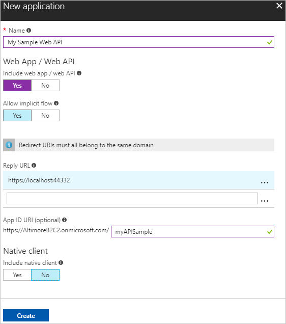
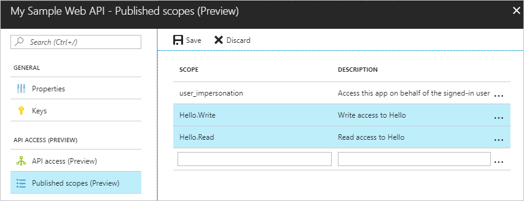
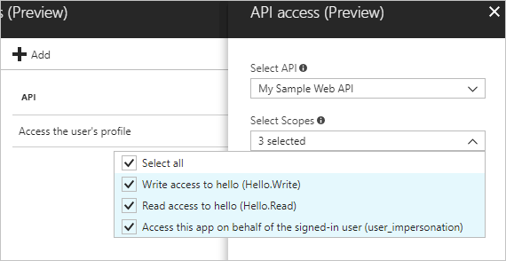

# Tutorial: Grant access to an ASP.NET web API from a web app using Azure Active Directory B2C

This tutorial shows you how to call an Azure Active Directory (Azure AD) B2C protected web API resource from an ASP.NET web app.

In this tutorial, you learn how to:

> [!div class="checklist"]
> * Register a web API in your Azure AD B2C tenant
> * Define and configure scopes for a web API
> * Grant app permissions to the web API
> * Update sample code to use Azure AD B2C to protect a web API

[!INCLUDE [quickstarts-free-trial-note](../../includes/quickstarts-free-trial-note.md)]

## Prerequisites

* Complete the [Use Azure Active Directory B2C for User Authentication in an ASP.NET Web App tutorial](active-directory-b2c-tutorials-web-app.md).
* Install [Visual Studio 2017](https://www.visualstudio.com/downloads/) with the **ASP.NET and web development** workload.

## Register web API

Web API resources need to be registered in your tenant before they can accept and respond to [protected resource requests](../active-directory/develop/developer-glossary.md#resource-server) by [client applications](../active-directory/develop/developer-glossary.md#client-application) that present an [access token](../active-directory/develop/developer-glossary.md#access-token) from Azure Active Directory. Registration establishes the [application and service principal object](../active-directory/develop/developer-glossary.md#application-object) in your tenant. 

Sign in to the [Azure portal](https://portal.azure.com/) as the global administrator of your Azure AD B2C tenant.

[!INCLUDE [active-directory-b2c-switch-b2c-tenant](../../includes/active-directory-b2c-switch-b2c-tenant.md)]

1. Choose **All services** in the top-left corner of the Azure portal, search for and select **Azure AD B2C**. You should now be using the tenant that you created in the previous tutorial.

2. Select **Applications** and then select **Add**.

    To register the sample web API in your tenant, use the following settings.
    
    
    
    | Setting      | Suggested value  | Description                                        |
    | ------------ | ------- | -------------------------------------------------- |
    | **Name** | My Sample Web API | Enter a **Name** that describes your web API to developers. |
    | **Include web app / web API** | Yes | Select **Yes** for a web API. |
    | **Allow implicit flow** | Yes | Select **Yes** since the API uses [OpenID Connect sign-in](active-directory-b2c-reference-oidc.md). |
    | **Reply URL** | `https://localhost:44332` | Reply URLs are endpoints where Azure AD B2C returns any tokens that your API requests. In this tutorial, the sample web API runs locally (localhost) and listens on port 44332. |
    | **App ID URI** | myAPISample | The URI uniquely identifies the API in the tenant. This allows you to register multiple APIs per tenant. [Scopes](../active-directory/develop/developer-glossary.md#scopes) govern access to the protected API resource and are defined per App ID URI. |
    | **Native client** | No | Since this is a web API and not a native client, select No. |
    
3. Click **Create** to register your API.

Registered APIs are displayed in the applications list for the Azure AD B2C tenant. Select your web API from the list. The web API's property pane is displayed.


Make note of the **Application Client ID**. The ID uniquely identifies the API and is needed when configuring the API later in the tutorial.

Registering your web API with Azure AD B2C defines a trust relationship. Since the API is registered with B2C, the API can now trust the B2C access tokens it receives from other applications.

## Define and configure scopes

[Scopes](../active-directory/develop/developer-glossary.md#scopes) provide a way to govern access to protected resources. Scopes are used by the web API to implement scope-based access control. For example, users of the web API could have both read and write access, or users of the web API might have only read access. In this tutorial, you use scopes to define read and write permissions for the web API.

### Define scopes for the web API

Registered APIs are displayed in the applications list for the Azure AD B2C tenant. Select your web API from the list. The web API's property pane is displayed.

Click **Published scopes (Preview)**.

To configure scopes for the API, add the following entries. 



| Setting      | Suggested value  | Description                                        |
| ------------ | ------- | -------------------------------------------------- |
| **Scope** | Hello.Read | Read access to hello |
| **Scope** | Hello.Write | Write access to hello |

Click **Save**.

The published scopes can be used to grant a client app permission to the web API.

### Grant app permissions to web API

To call a protected web API from an app, you need to grant your app permissions to the API. In this tutorial, use the web app created in [Use Azure Active Directory B2C for User Authentication in an ASP.NET Web App tutorial](active-directory-b2c-tutorials-web-app.md). 

1. In the Azure portal, select **Azure AD B2C** from the services list and click **Applications** to view the registered app list.

2. Select **My Sample Web App** from the app list and click **API access (Preview)** then **Add**.

3. In the **Select API** dropdown, select your registered web API **My Sample Web API**.

4. In the **Select Scopes** dropdown, select the scopes you defined in the web API registration.

    

5. Click **OK**.

Your **My Sample Web App** is registered to call the protected **My Sample Web API**. A user [authenticates](../active-directory/develop/developer-glossary.md#authentication) with Azure AD B2C to use the web app. The web app obtains an [authorization grant](../active-directory/develop/developer-glossary.md#authorization-grant) from Azure AD B2C to access the protected web API.

## Update code

Now that the web API is registered and you have scopes defined, you need to configure the web API code to use your Azure AD B2C tenant. In this tutorial, you configure a sample web API. 

The sample web API is included in the project you downloaded in the prerequisite tutorial: [Use Azure Active Directory B2C for User Authentication in an ASP.NET Web App tutorial](active-directory-b2c-tutorials-web-app.md). If you haven't completed the prerequisite tutorial, complete it before continuing.

There are two projects in the sample solution:

**Web app sample app (TaskWebApp):** Web app to create and edit a task list. The web app uses the **sign-up or sign-in** user flow to sign up or sign in users with an email address.

**Web API sample app (TaskService):** Web API that supports the create, read,  update, and delete task list functionality. The web API is secured by Azure AD B2C and called by the web app.

The sample web app and web API define the configuration values as app settings in each project's Web.config file.

Open the **B2C-WebAPI-DotNet** solution in Visual Studio.

### Configure the web app

1. Open **Web.config** in the **TaskWebApp** project.

2. To run the API locally, use the localhost setting for **api:TaskServiceUrl**. Change the Web.config as follows: 

    ```C#
    <add key="api:TaskServiceUrl" value="https://localhost:44332/"/>
    ```

3. Configure the URI of the API. This is the URI the web app uses to make the API request. Also, configure the requested permissions.

    ```C#
    <add key="api:ApiIdentifier" value="https://<Your tenant name>.onmicrosoft.com/myAPISample/" />
    <add key="api:ReadScope" value="Hello.Read" />
    <add key="api:WriteScope" value="Hello.Write" />
    ```

### Configure the web API

1. Open **Web.config** in the **TaskService** project.

2. Configure the API to use your tenant.

    ```C#
    <add key="ida:Tenant" value="<Your tenant name>.onmicrosoft.com" />
    ```

3. Set the client ID to the registered Application ID for your API.

    ```C#
    <add key="ida:ClientId" value="<The Application ID for your web API obtained from the Azure portal>"/>
    ```

4. Update the user flow setting with the name generated when you created your sign up and sign-in user flow.

    ```C#
    <add key="ida:SignUpSignInUserFlowId" value="B2C_1_SiUpIn" />
    ```

5. Configure the scopes setting to match what you created in the portal.

    ```C#
    <add key="api:ReadScope" value="Hello.Read" />
    <add key="api:WriteScope" value="Hello.Write" />
    ```

## Run the sample

You need to run both the **TaskWebApp** and **TaskService** projects. 

1. In Solution Explorer, right-click on the solution and select **Set StartUp Projects...**. 
2. Select **Multiple startup projects** radio button.
3. Change the **Action** for both projects to **Start**.
4. Click OK to save the configuration.
5. Press **F5** to run both applications. Each application opens in its own browser tab.
    `https://localhost:44316/` is the web app.
    `https://localhost:44332/` is the web API.

6. In the web app, click the sign-up / sign-in link in the menu banner to sign up for the web application. Use the account you created in the [web app tutorial](active-directory-b2c-tutorials-web-app.md). 
7. Once signed in, click the **To-do list** link and create a to-do list item.

When you create a to-do list item, the web app makes a request to the web API to generate the to-do list item. You're protected web app is calling the protected web API in your Azure AD B2C tenant.

## Clean up resources

You can use your Azure AD B2C tenant if you plan to try other Azure AD B2C tutorials. When no longer needed, you can [delete your Azure AD B2C tenant](active-directory-b2c-faqs.md#how-do-i-delete-my-azure-ad-b2c-tenant).

## Next steps

This article walked you through protecting a ASP.NET web API by registering and defining scopes in Azure AD B2C. To learn more details about developing this scenario including code walkthroughs, continue to the next tutorial.

> [!div class="nextstepaction"]
> [Create an ASP.NET web app with Azure Active Directory B2C sign-up, sign-in, profile edit, and password reset](active-directory-b2c-devquickstarts-web-dotnet-susi.md)