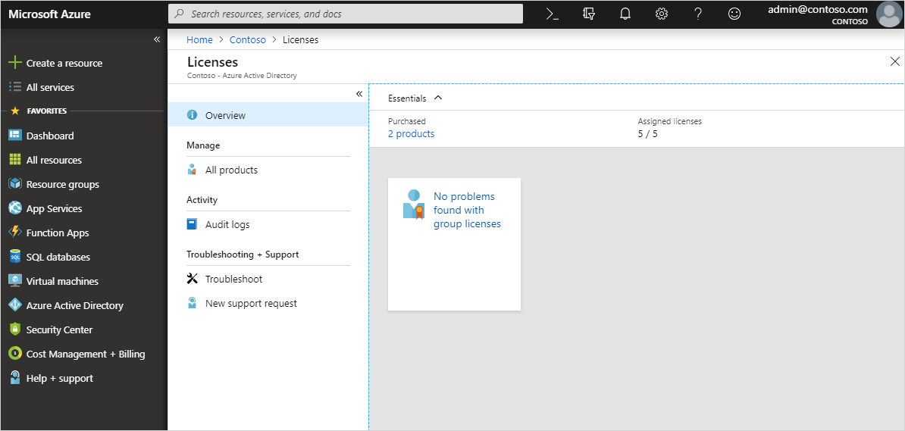
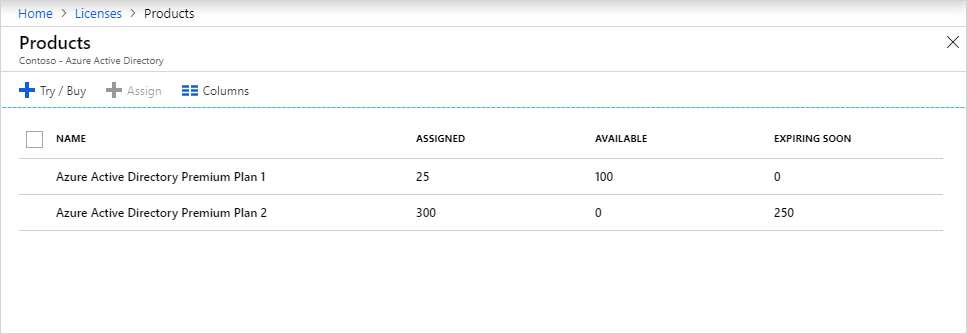
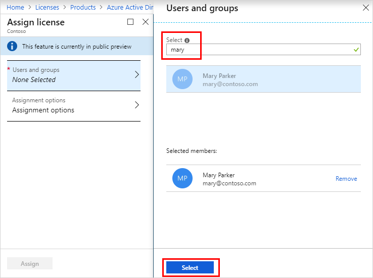
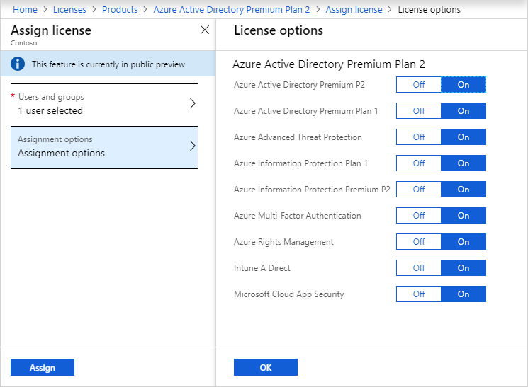
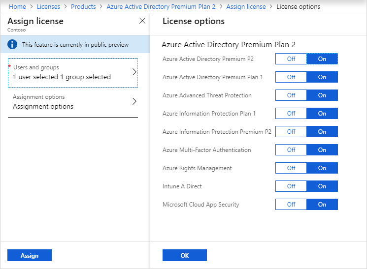
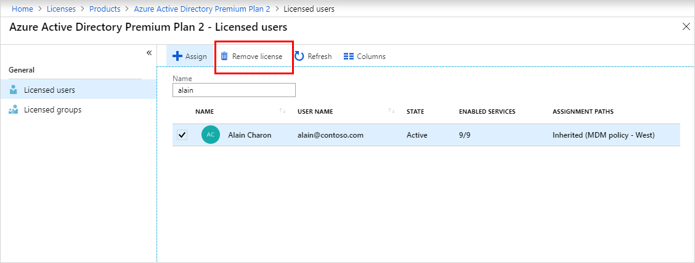
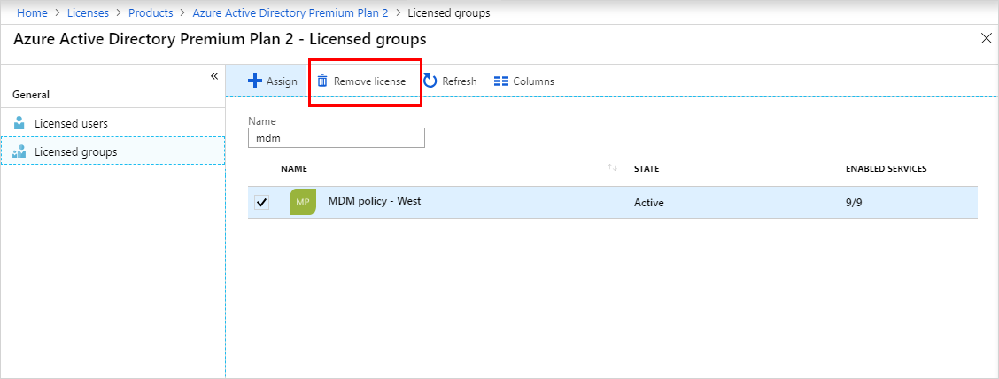

# Assign or remove licenses using the Azure Active Directory portal
Many Azure Active Directory (Azure AD) services require you to activate an Azure AD product and to license each of your users or groups (and associated members) for that product. Only users with active licenses will be able to access and use the licensed Azure AD services.

## Available product editions
There are several editions available for the Azure AD product.

- Azure AD Free

- Azure AD Basic

- Azure AD Premium 1 (Azure AD P1)

- Azure AD Premium 2 (Azure AD P2)

For specific information about each product edition and the associated licensing details, see [What license do I need?](../authentication/concept-sspr-licensing.md).

## View your product edition and license details
You can view your available products, including the individual licenses, checking for any pending expiration dates and the number of assignments available.

### To find your product and license details
1. Sign in to the [Azure portal](https://portal.azure.com/) using a Global administrator account for the directory.

2. Select **Azure Active Directory**, and then select **Licenses**.

    The **Licenses** page appears.

    
    
3. Select the **Purchased products** link to view the **Products** page and to see the **Assigned**, **Available**, and **Expiring soon** details for each specific product edition.

    

4. Select a product edition name to see its licensed users and groups.

## Assign licenses to users or groups
Make sure that anyone needing to use a licensed Azure AD service has the appropriate license. It's up to you whether you want to add the licensing rights to individual users or to an entire group.

>[!Note]
>Group-based licensing is a public preview feature of Azure AD and is available with any paid Azure AD license plan. For more information about previews, see [Supplemental Terms of Use for Microsoft Azure Previews](https://azure.microsoft.com/support/legal/preview-supplemental-terms/).  For detailed information about how to add users, see [How to add or delete users in Azure Active Directory](add-users-azure-active-directory.md). For detailed information about how to create groups and add members, see [Create a basic group and add members](active-directory-groups-create-azure-portal.md).

### To assign a license to a specific user
1. On the **Products** page, select the name of the edition you want to assign to the user. For example, _Azure Active Directory Premium Plan 2_.

    

2. On the **Azure Active Directory Premium Plan 2** page, select **Assign**.

    

3. On the **Assign** page, select **Users and groups**, and then search for and select the user you're assigning the license. For example, _Mary Parker_.

    

4. Select **Assignment options**, make sure you have the appropriate license options turned on, and then select **OK**.

    

    The **Assign license** page updates to show that a user is selected and that the assignments are configured.

    >[!NOTE]
    >Not all Microsoft services are available in all locations. Before a license can be assigned to a user, you must specify the **Usage location**. You can set this value in the **Azure Active Directory &gt; Users &gt; Profile &gt; Settings** area in Azure AD.

5. Select **Assign**.

    The user is added to the list of licensed users and has access to the included Azure AD services.

### To assign a license to an entire group
1. On the **Products** page, select the name of the edition you want to assign to the user. For example, _Azure Active Directory Premium Plan 2_.

    

2. On the **Azure Active Directory Premium Plan 2** page, select **Assign**.

    

3. On the **Assign** page, select **Users and groups**, and then search for and select the group you're assigning the license. For example, _MDM policy - West_.

    

4. Select **Assignment options**, make sure you have the appropriate license options turned on, and then select **OK**.

    

    The **Assign license** page updates to show that a user is selected and that the assignments are configured.

    >[!NOTE]
    >Not all Microsoft services are available in all locations. Before a license can be assigned to a group, you must specify the **Usage location** for all members. You can set this value in the **Azure Active Directory &gt; Users &gt; Profile &gt; Settings** area in Azure AD. Any user whose usage location is not specified inherits the location of the tenant.

5. Select **Assign**.

    The group is added to the list of licensed groups and all of the members have access to the included Azure AD services.

## Remove a license
You can remove a license from either a user or a group from the **Licenses** page.

### To remove a license from a specific user
1. On the **Licensed users** page for the product edition, select the user that should no longer have the license. For example, _Alain Charon_.

2. Select **Remove license**.

    

### To remove a license from a group
1. On the **Licensed groups** page for the product edition, select the group that should no longer have the license. For example, _MDM policy - West_.

2. Select **Remove license**.

    

>[!Important]
>Licenses inherited by a user from a group can't be removed directly. Instead, you have to remove the user from the group from which they're inheriting the license.

## Next steps
After you've assigned your licenses, you can perform the following processes:

- [Identify and resolve license assignment problems](../users-groups-roles/licensing-groups-resolve-problems.md)

- [Add licensed users to a group for licensing](../users-groups-roles/licensing-groups-migrate-users.md)

- [Scenarios, limitations, and known issues using groups to manage licensing in Azure Active Directory](../users-groups-roles/licensing-group-advanced.md)

- [Add or change profile information](active-directory-users-profile-azure-portal.md)
