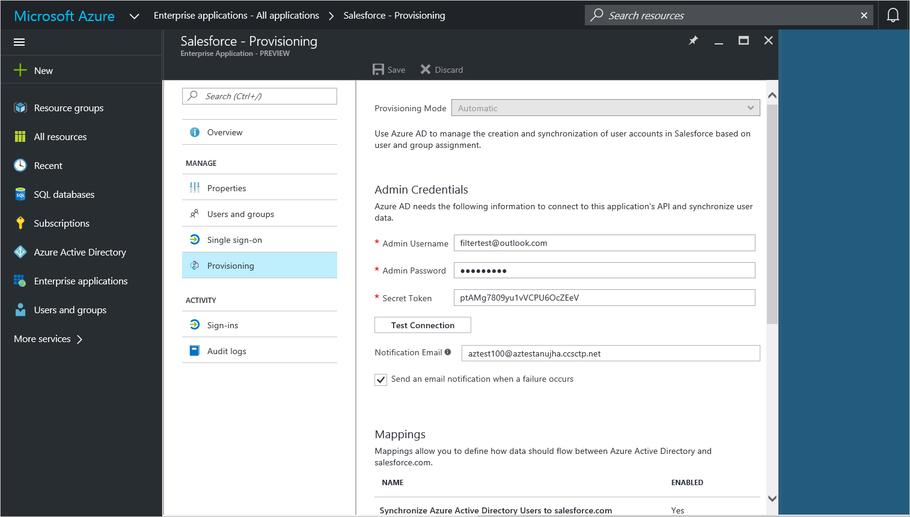
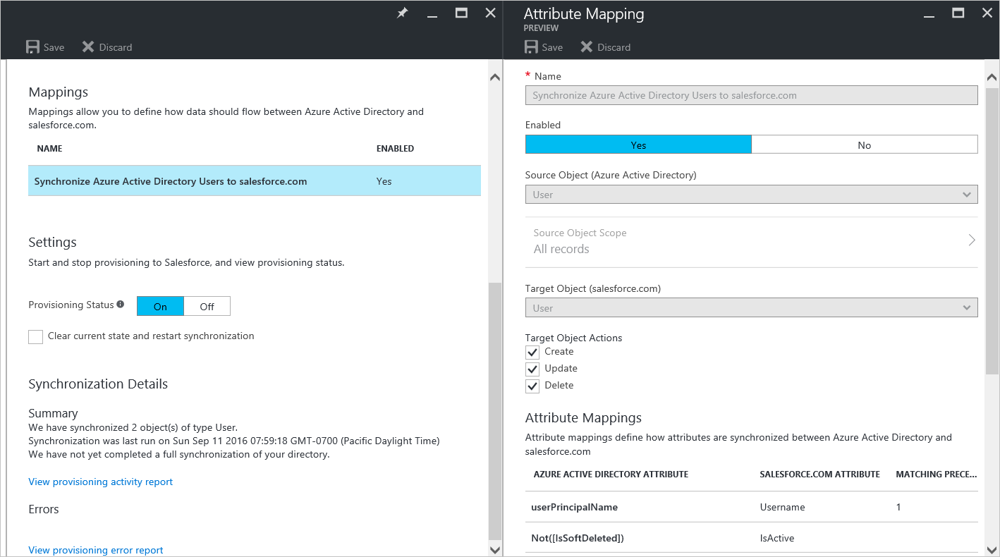

# Managing user account provisioning for enterprise apps in the Azure portal
This article describes how to use the [Azure portal](https://portal.azure.com) to manage automatic user account provisioning and de-provisioning for applications that support it. To learn more about automatic user account provisioning and how it works, see [Automate User Provisioning and Deprovisioning to SaaS Applications with Azure Active Directory](user-provisioning.md).

## Finding your apps in the portal
All applications that are configured for single sign-on in a directory can be viewed and managed in the [Azure portal](https://portal.azure.com). The applications can be found in the **All Services** &gt; **Enterprise Applications** section of the portal. Enterprise apps are apps that are deployed and used within your organization.

Selecting the **All applications** link on the left shows a list of all apps that have been configured, including apps that had been added from the gallery. Selecting an app loads the resource pane for that app, where reports can be viewed for that app and a variety of settings can be managed.

User account provisioning settings can be managed by selecting **Provisioning** on the left.

## Provisioning modes
The **Provisioning** pane begins with a **Mode** menu, which shows what provisioning modes are supported for an enterprise application, and allows them to be configured. The available options include:

* **Automatic** - This option appears if Azure AD supports automatic API-based provisioning and/or de-provisioning of user accounts to this application. Selecting this mode displays an interface that guides administrators through configuring Azure AD to connect to the application's user management API, creating account mappings and workflows that define how user account data should flow between Azure AD and the app, and managing the Azure AD provisioning service.
* **Manual** - This option is shown if Azure AD does not support automatic provisioning of user accounts to this application. This option means that user account records stored in the application must be managed using an external process, based on the user management and provisioning capabilities provided by that application (which can include SAML Just-In-Time provisioning).

## Configuring automatic user account provisioning
Selecting the **Automatic** option displays a screen that is divided in four sections:

### Admin Credentials
This section is where the credentials required for Azure AD to connect to the application's user management API are entered. The input required varies depending on the application. To learn about the credential types and requirements for specific applications, see the [configuration tutorial for that specific application](user-provisioning.md).

Selecting the **Test Connection** button allows you to test the credentials by having Azure AD attempt to connect to the app's provisioning app using the supplied credentials.

### Mappings
This section is where admins can view and edit what user attributes flow between Azure AD and the target application, when user accounts are provisioned or updated.

There is a preconfigured set of mappings between Azure AD user objects and each SaaS app’s user objects. Some apps manage other types of objects, such as Groups or Contacts. Selecting one of these mappings in the table shows the mapping editor to the right, where they can be viewed and customized.

Supported customizations include:

* Enabling and disabling mappings for specific objects, such as the Azure AD user object to the SaaS app's user object.
* Editing the attributes that flow from the Azure AD user object to the app's user object. For more information on attribute mapping, see [Understanding attribute mapping types](customize-application-attributes.md#understanding-attribute-mapping-types).
* Filter the provisioning actions that Azure AD performs on the targeted application. Instead of having Azure AD fully synchronize objects, you can limit the actions performed. For example, by only selecting **Update**, Azure AD only updates existing user accounts in an application and does not create new ones. By only selecting **Create**, Azure only creates new user accounts but does not update existing ones. This feature allows admins to create different mappings for account creation and update workflows.

### Settings
This section allows admins to start and stop the Azure AD provisioning service for the selected application, as well as optionally clear the provisioning cache and restart the service.

If provisioning is being enabled for the first time for an application, turn on the service by changing the **Provisioning Status** to **On**. This change causes the Azure AD provisioning service to perform an initial sync, where it reads the users assigned in the **Users and groups** section, queries the target application for them, and then performs the provisioning actions defined in the Azure AD **Mappings** section. During this process, the provisioning service stores cached data about what user accounts it is managing, so non-managed accounts inside the target applications that were never in scope for assignment aren't affected by de-provisioning operations. After the initial sync, the provisioning service automatically synchronizes user and group objects on a ten-minute interval.

Changing the **Provisioning Status** to **Off** simply pauses the provisioning service. In this state, Azure does not create, update, or remove any user or group objects in the app. Changing the state back to on causes the service to pick up where it left off.

Selecting the **Clear current state and restart synchronization** checkbox and saving stops the provisioning service, dumps the cached data about what accounts Azure AD is managing, restarts the services and performs the initial synchronization again. This option allows admins to start the provisioning deployment process over again.

### Synchronization Details
This section provides addition details about the operation of the provisioning service, including the first and last times the provisioning service ran against the application, and how many user and group objects are being managed.

Links are provided to the **Provisioning activity report** that provides a log of all users and groups created, updated, and removed between Azure AD and the target application, and to the **Provisioning error report** that provides more detailed error messages for user and group objects that failed to be read, created, updated, or removed. 

