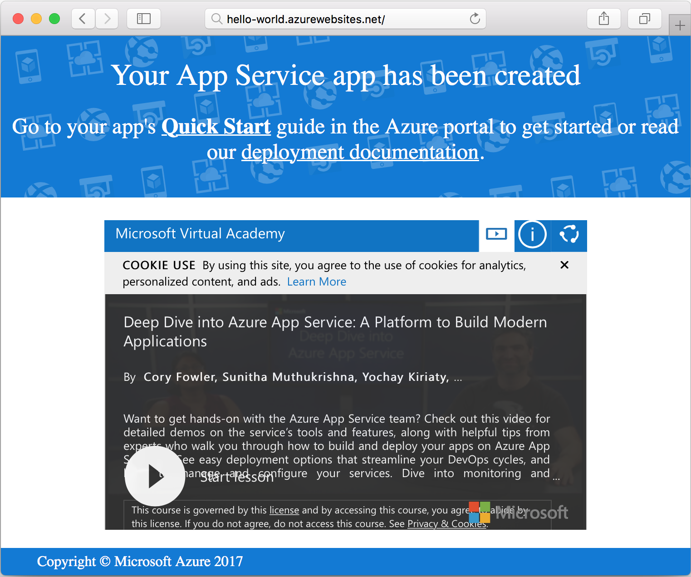

# Create a Ruby on Rails App in App Service on Linux

[Azure App Service on Linux](app-service-linux-intro.md) provides a highly scalable, self-patching web hosting service. This quickstart shows you how to create a basic [Ruby on Rails](https://rubyonrails.org/) application that can then be deployed to Azure as a Web App on Linux.

> [!NOTE]
> The Ruby development stack only supports Ruby on Rails at this time. If you want to use a different platform, such as Sinatra, please see the quickstart for [Web App for Containers](https://docs.microsoft.com/azure/app-service/containers/).


[!INCLUDE [quickstarts-free-trial-note](../../../includes/quickstarts-free-trial-note.md)]

## Prerequisites

* <a href="https://www.ruby-lang.org/en/documentation/installation/#rubyinstaller" target="_blank">Install Ruby 2.3 or higher</a>
* <a href="https://git-scm.com/" target="_blank">Install Git</a>

## Download the sample

In a terminal window, run the following command to clone the sample app repository to your local machine:

```bash
git clone https://github.com/Azure-Samples/ruby-docs-hello-world
```

## Run the application locally

Run the application locally so that you see how it should look when you deploy it to Azure. Open a terminal window, change to the `hello-world` directory, and use the `rails server` command to start the server.

The first step is to install the required gems. There's a `Gemfile` included in the sample so you don't need to specify the gems to install. We'll use bundler for this:

```
bundle install
```

Once the gems are installed, we'll use bundler to start the app:

```bash
bundle exec rails server
```

Using your web browser, navigate to `http://localhost:3000` to test the app locally.


[!INCLUDE [Try Cloud Shell](../../../includes/cloud-shell-try-it.md)]

[!INCLUDE [Configure deployment user](../../../includes/configure-deployment-user.md)]

[!INCLUDE [Create resource group](../../../includes/app-service-web-create-resource-group-linux.md)]

[!INCLUDE [Create app service plan](../../../includes/app-service-web-create-app-service-plan-linux.md)]

## Create a web app

[!INCLUDE [Create web app](../../../includes/app-service-web-create-web-app-ruby-linux-no-h.md)] 

Browse to the site to see your newly created web app with built-in image. Replace _&lt;app name>_ with your web app name.

```bash
http://<app_name>.azurewebsites.net
```

Here is what your new web app should look like:



## Deploy your application

Run the following commands to deploy the local application to your Azure website:

```bash
git remote add azure <Git deployment URL from above>
git add -A
git commit -m "Initial deployment commit"
git push azure master
```

Confirm that the remote deployment operations report success. The commands produce output similar to the following text:

```bash
remote: Using sass-rails 5.0.6
remote: Updating files in vendor/cache
remote: Bundle gems are installed into ./vendor/bundle
remote: Updating files in vendor/cache
remote: ~site/repository
remote: Finished successfully.
remote: Running post deployment command(s)...
remote: Deployment successful.
To https://<your web app name>.scm.azurewebsites.net/<your web app name>.git
  579ccb....2ca5f31  master -> master
myuser@ubuntu1234:~workspace/<app name>$
```

Once the deployment has completed, restart your web app for the deployment to take effect by using the [`az webapp restart`](/cli/azure/webapp?view=azure-cli-latest#az-webapp-restart) command, as shown here:

```azurecli-interactive
az webapp restart --name <app name> --resource-group myResourceGroup
```

Navigate to your site and verify the results.

```bash
http://<app name>.azurewebsites.net
```


> [!NOTE]
> While the app is restarting, attempting to browse the site results in an HTTP status code `Error 503 Server unavailable`. It may take a few minutes to fully restart.
>

[!INCLUDE [Clean-up section](../../../includes/cli-script-clean-up.md)]

## Next steps

> [!div class="nextstepaction"]
> [Ruby on Rails with MySQL](tutorial-ruby-postgres-app.md)
