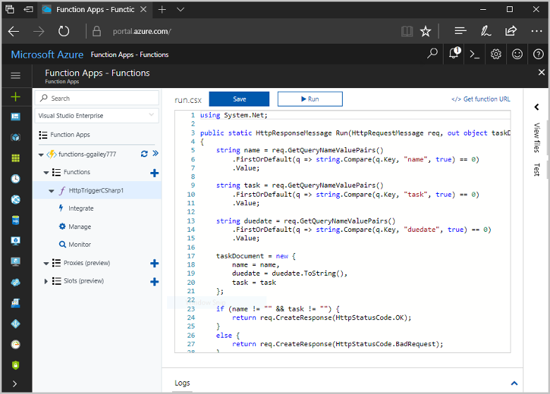
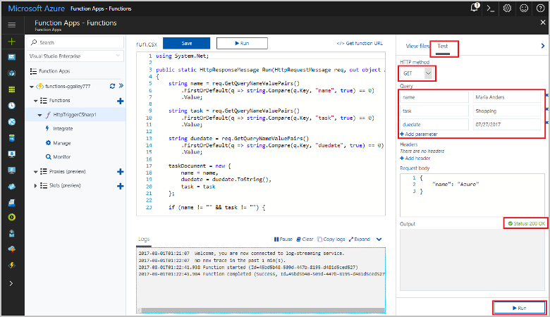
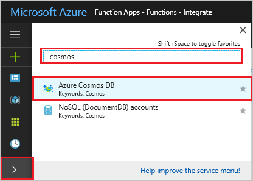

# Store unstructured data using Azure Functions and Azure Cosmos DB

[Azure Cosmos DB](https://azure.microsoft.com/services/cosmos-db/) is a great way to store unstructured and JSON data. Combined with Azure Functions, Cosmos DB makes storing data quick and easy with much less code than required for storing data in a relational database.

> [!NOTE]
> At this time, the Azure Cosmos DB trigger, input bindings, and output bindings work with SQL API and Graph API accounts only.

In Azure Functions, input and output bindings provide a declarative way to connect to external service data from your function. In this article, learn how to update an existing function to add an output binding that stores unstructured data in an Azure Cosmos DB document.



## Prerequisites

To complete this tutorial:

[!INCLUDE [Previous quickstart note](../../includes/functions-quickstart-previous-topics.md)]

## Create an Azure Cosmos DB account

You must have an Azure Cosmos DB account that uses the SQL API before you create the output binding.

[!INCLUDE [cosmos-db-create-dbaccount](../../includes/cosmos-db-create-dbaccount.md)]

## Add an output binding

1. In the portal, navigate to the function app you created previously and expand both your function app and your function.

1. Select **Integrate** and **+ New Output**, which is at the top right of the page. Choose **Azure Cosmos DB**, and click **Select**.

    

1. If you get an **Extensions not installed** message, choose **Install** to install the Azure Cosmos DB bindings extension in the function app. Installation may take a minute or two.

    

1. Use the **Azure Cosmos DB output** settings as specified in the table:

    

    | Setting      | Suggested value  | Description                                |
    | ------------ | ---------------- | ------------------------------------------ |
    | **Document parameter name** | taskDocument | Name that refers to the Cosmos DB object in code. |
    | **Database name** | taskDatabase | Name of database to save documents. |
    | **Collection name** | TaskCollection | Name of the database collection. |
    | **If true, creates the Cosmos DB database and collection** | Checked | The collection doesn't already exist, so create it. |
    | **Azure Cosmos DB account connection** | New setting | Select **New**, then choose your **Subscription**, the **Database account** you created earlier, and **Select**. Creates an application setting for your account connection. This setting is used by the binding to connection to the database. |
    | **Collection throughput** |400 RU| If you want to reduce latency, you can scale up the throughput later. |

1. Select **Save** to create the binding.

## Update the function code

Replace the existing function code with the following code, in your chosen language:

# [C#](#tab/csharp)

Replace the existing C# function with the following code:

```csharp
#r "Newtonsoft.Json"

using Microsoft.AspNetCore.Mvc;
using Microsoft.AspNetCore.Http;
using Microsoft.Extensions.Logging;

public static IActionResult Run(HttpRequest req, out object taskDocument, ILogger log)
{
    string name = req.Query["name"];
    string task = req.Query["task"];
    string duedate = req.Query["duedate"];

    // We need both name and task parameters.
    if (!string.IsNullOrEmpty(name) && !string.IsNullOrEmpty(task))
    {
        taskDocument = new
        {
            name,
            duedate,
            task
        };

        return (ActionResult)new OkResult();
    }
    else
    {
        taskDocument = null;
        return (ActionResult)new BadRequestResult();
    }
}
```

# [JavaScript](#tab/javascript)

Replace the existing JavaScript function with the following code:

```js
module.exports = async function (context, req) {

    // We need both name and task parameters.
    if (req.query.name && req.query.task) {

        // Set the output binding data from the query object.
        context.bindings.taskDocument = req.query;

        // Success.
        context.res = {
            status: 200
        };
    }
    else {
        context.res = {
            status: 400,
            body: "The query options 'name' and 'task' are required."
        };
    }
};
```
---

This code sample reads the HTTP Request query strings and assigns them to fields in the `taskDocument` object. The `taskDocument` binding sends the object data from this binding parameter to be stored in the bound document database. The database is created the first time the function runs.

## Test the function and database

1. Expand the right window and select **Test**. Under **Query**, click **+ Add parameter** and add the following parameters to the query string:

    + `name`
    + `task`
    + `duedate`

1. Click **Run** and verify that a 200 status is returned.

    

1. On the left side of the Azure portal, expand the icon bar, type `cosmos` in the search field, and select **Azure Cosmos DB**.

    

1. Choose your Azure Cosmos DB account, then select the **Data Explorer**.

1. Expand the **Collections** nodes, select the new document, and confirm that the document contains your query string values, along with some additional metadata.

    

You've successfully added a binding to your HTTP trigger to store unstructured data in an Azure Cosmos DB.

[!INCLUDE [Clean-up section](../../includes/clean-up-section-portal.md)]

## Next steps

[!INCLUDE [functions-quickstart-next-steps](../../includes/functions-quickstart-next-steps.md)]

For more information about binding to a Cosmos DB database, see [Azure Functions Cosmos DB bindings](functions-bindings-cosmosdb.md).
