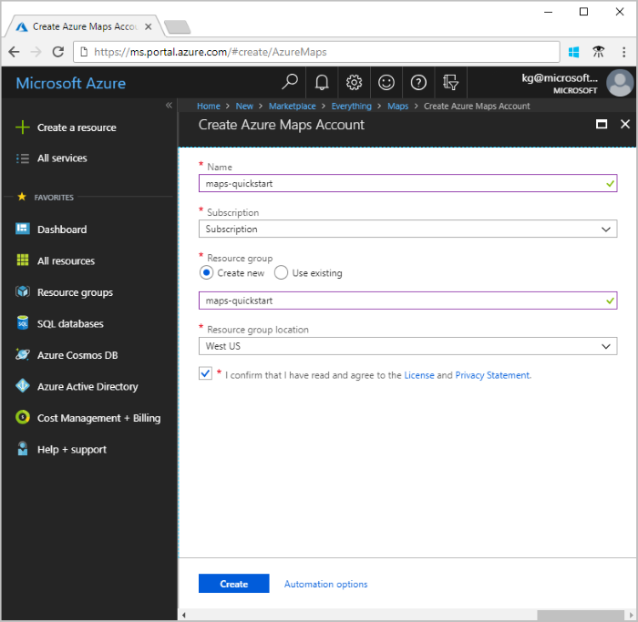
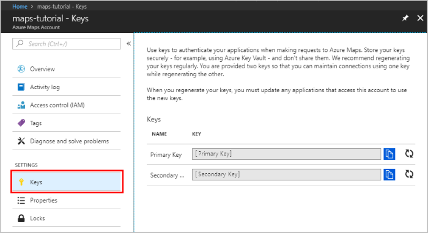
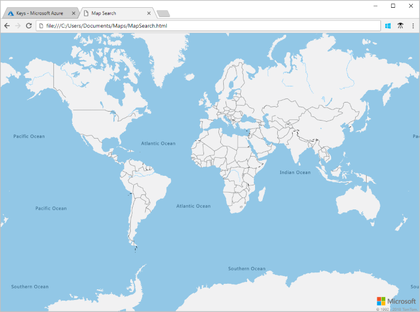
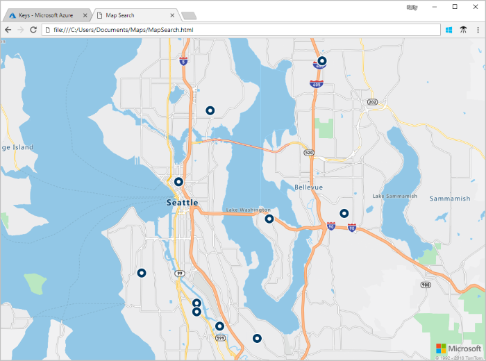
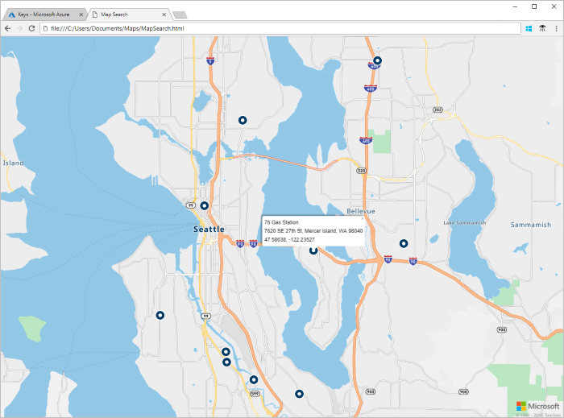

# Search nearby points of interest using Azure Maps

This tutorial shows how to set up an account with Azure Maps, then use the Maps APIs to search for a point of interest. In this tutorial, you learn how to:

> [!div class="checklist"]
> * Create an Azure Maps account
> * Retrieve the primary key for your Maps account
> * Create a new web page using the map control API
> * Use the Maps search service to find a nearby point of interest

If you don't have an Azure subscription, create a [free account](https://azure.microsoft.com/free/) before you begin.

## Sign in to the Azure portal

Sign in to the [Azure portal](https://portal.azure.com).

<a id="createaccount"></a>

## Create an account with Azure Maps

Create a new Maps account with the following steps:

1. In the upper left-hand corner of the [Azure portal](https://portal.azure.com), click **Create a resource**.
2. In the *Search the Marketplace* box, type **Maps**.
3. From the *Results*, select **Maps**. Click **Create** button that appears below the map.
4. On the **Create Maps Account** page, enter the following values:
    * The *Name* of your new account.
    * The *Subscription* that you want to use for this account.
    * The *Resource group* name for this account. You may choose to *Create new* or *Use existing* resource group.
    * Select the *Resource group location*.
    * Read the *License* and *Privacy Statement*, and check the checkbox to accept the terms.
    * Click the **Create** button.

    

<a id="getkey"></a>

## Get the primary key for your account

Once your Maps account is successfully created, retrieve the key that enables you to query the Maps APIs.

1. Open your Maps account in the portal.
2. In the settings section, select **Keys**.
3. Copy the **Primary Key** to your clipboard. Save it locally to use later in this tutorial.

    

<a id="createmap"></a>

## Create a new map

The Map Control API is a convenient client library that allows you to easily integrate Maps into your web application. It hides the complexity of the bare REST service calls and boosts your productivity with styleable and customizable components. The following steps show you how to create a static HTML page embedded with the Map Control API.

1. On your local machine, create a new file and name it **MapSearch.html**.
2. Add the following HTML components to the file:

   ```HTML
   <!DOCTYPE html>
   <html>
   <head>
      <title>Map Search</title>
      <meta charset="utf-8" />
      <meta name="viewport" content="width=device-width, initial-scale=1, shrink-to-fit=no" />

      <!-- Add references to the Azure Maps Map control JavaScript and CSS files. -->
      <link rel="stylesheet" href="https://atlas.microsoft.com/sdk/css/atlas.min.css?api-version=1" type="text/css" />
      <script src="https://atlas.microsoft.com/sdk/js/atlas.min.js?api-version=1"></script>

      <!-- Add a reference to the Azure Maps Services Module JavaScript file. -->
      <script src="https://atlas.microsoft.com/sdk/js/atlas-service.js?api-version=1"></script>

      <script>		
         var map, datasource, client, popup;

         function GetMap(){
            //Add Map Control JavaScript code here.
         }
      </script>
      <style>
      html,
      body {
         width: 100%;
         height: 100%;
         padding: 0;
         margin: 0;
      }

      #myMap {
         width: 100%;
         height: 100%;
      }
      </style>
   </head>
   <body onload="GetMap()">
      <div id="myMap"></div>
   </body>
   </html>
   ```

   Notice that the HTML header includes the CSS and JavaScript resource files hosted by the Azure Map Control library. Note the `onload` event on the body of the page, which will call the `GetMap` function when the body of the page has loaded. This function will contain the inline JavaScript code to access the Azure Maps APIs.

3. Add the following JavaScript code to the `GetMap` function of the HTML file. Replace the string **\<Your Azure Maps Key\>** with the primary key that you copied from your Maps account.

   ```JavaScript
   //Add your Azure Maps subscription key to the map SDK. Get an Azure Maps key at https://azure.com/maps
   atlas.setSubscriptionKey('<Your Azure Maps Key>');

   //Initialize a map instance.
   map = new atlas.Map('myMap');
   ```

   This segment initializes the Map Control API for your Azure Maps account key. **atlas** is the namespace that contains the API and related visual components. **atlas.Map** provides the control for a visual and interactive web map. 

4. Save your changes to the file and open the HTML page in a browser. This is the most basic map that you can make by calling **atlas.map** using your account key.

   

5. In the `GetMap` function, after initializing the map, add the following JavaScript code. 

   ```JavaScript
   //Wait until the map resources have fully loaded.
   map.events.add('load', function () {

      //Create a data source and add it to the map.
      datasource = new atlas.source.DataSource();
      map.sources.add(datasource);

      //Add a layer for rendering point data.
      var resultLayer = new atlas.layer.SymbolLayer(datasource, null, {
         iconOptions: {
            iconImage: 'pin-round-darkblue',
            anchor: 'center',
            allowOverlap: true
         }
      });
      map.layers.add(resultLayer);

      //Create a popup but leave it closed so we can update it and display it later.
      popup = new atlas.Popup();

      //Add a mouse over event to the result layer and display a popup when this event fires.
      map.events.add('mouseover', resultLayer, showPopup);
   });
   ```

   A load event is added to the map, which will fire when the map resources have been fully loaded. In the map load event handler, a data source is created to store result data. A symbol layer is created and attached to the data source. This layer specifies how the result data in the data source should be rendered, in this case with a dark blue round pin icon that is centered over the results coordinate and which allows other icons to overlap. 

<a id="usesearch"></a>

## Add search capabilities

This section shows how to use the Maps Search API to find a point of interest on your map. It's a RESTful API designed for developers to search for addresses, points of interest, and other geographical information. The Search service assigns a latitude and longitude information to a specified address. The **Service Module** explained below can be used to search for a location using the Maps Search API.

### Service Module

1. In the map load event handler, instantiate the client service by add the following Javascript code.

    ```JavaScript
    //Create an instance of the services client.
	 client = new atlas.service.Client(atlas.getSubscriptionKey());
    ```

2. Next add the following script block to build the search query. It uses the Fuzzy Search Service, which is a basic search API of the Search Service. Fuzzy Search Service handles most fuzzy inputs like addresses, places, and points of interest (POI). This code searches for nearby Gasoline Stations within the specified radius. The response is then parsed into GeoJSON format and added to the data source, which automatically results in the data being rendered on the map via the symbol layer. The last part of the script sets the maps camera view using the bounding box of the results using the Map's [setCamera](/javascript/api/azure-maps-control/atlas.map#setcamera-cameraoptions---cameraboundsoptions---animationoptions-) property. A padding is added to compensate for the pixel dimensions of the symbol icons as the bounding box is calculated based on the coordinates. 
 
   ```JavaScript
   //Execute a POI search query then add the results to the map.
	client.search.getSearchPOI('gasoline station', {
		lat: 47.6292,
		lon: -122.2337,
		radius: 100000
	}).then(response => {
		//Parse the response into GeoJSON so that the map can understand.
		var geojsonResponse = new atlas.service.geojson.GeoJsonSearchResponse(response);
		var results = geojsonResponse.getGeoJsonResults();

		//Add the results to the data source so they can be rendered. 
		datasource.add(results);

		// Set the camera bounds
		map.setCamera({
			bounds: results.bbox,
			padding: 50
		});
	});
   ```
 
3. Save the **MapSearch.html** file and refresh your browser. You should now see that the map is centered on Seattle with blue pins marking the locations of gasoline stations in the area.

   

4. You can see the raw data that the map is rendering by entering the following HTTPRequest in your browser. Replace \<Your Azure Maps Key\> with your primary key.

   ```http
   https://atlas.microsoft.com/search/fuzzy/json?api-version=1.0&query=gasoline%20station&subscription-key=<Your Azure Maps Key>&lat=47.6292&lon=-122.2337&radius=100000
   ```

At this point, the MapSearch page can display the locations of points of interest that are returned from a fuzzy search query. Let's add some interactive capabilities and more information about the locations.

## Add interactive data

The map that we've made so far only looks at the longitude/latitude data for the search results. If you look at the raw JSON that the Maps Search service returns, however, you see that it contains additional information about each gas station, including the name and street address. You can incorporate that data into the map with interactive popup boxes.

1. Add the following lines of code in the map load event handler after the code to query the fuzzy search service. This will create an instance of a Popup and add a mouseover event to the symbol layer.

    ```JavaScript
   //Create a popup but leave it closed so we can update it and display it later.
    popup = new atlas.Popup();

    //Add a mouse over event to the result layer and display a popup when this event fires.
    map.events.add('mouseover', resultLayer, showPopup);
    ```
    
    The API **atlas.Popup** provides an information window anchored at the required position on the map. 
      
2. In the *script* tag, after the `GetMap` function add the following code to show the moused over result information in the popup. 

   ```JavaScript
   function showPopup(e) {
        //Get the properties and coordinates of the first shape that the event occurred on.
        var p = e.shapes[0].getProperties();
        var position = e.shapes[0].getCoordinates();

        //Create HTML from properties of the selected result.
        var html = ['<div style="padding:5px"><div><b>', p.poi.name,
            '</b></div><div>', p.address.freeformAddress,
            '</div><div>', position[1], ', ', position[0], '</div></div>'];

        //Update the content and position of the popup.
        popup.setPopupOptions({
            content: html.join(''),
            position: position
        });

        //Open the popup.
        popup.open(map);
   }
   ```

2. Save the file and refresh your browser. Now the map in the browser shows information pop-ups when you hover over any of the search pins.

    

## Next steps

In this tutorial, you learned how to:

> [!div class="checklist"]
> * Create an account with Azure Maps
> * Get the primary key for your account
> * Create new web page using Map Control API
> * Use Search Service to find nearby point of interest

You can access the code sample for this tutorial here:

> [Search location with Azure Maps](https://github.com/Azure-Samples/AzureMapsCodeSamples/blob/master/AzureMapsCodeSamples/Tutorials/search.html)

[See the sample live here](https://azuremapscodesamples.azurewebsites.net/?sample=Search%20for%20points%20of%20interest)

The next tutorial demonstrates how to display a route between two locations.

> [!div class="nextstepaction"]
> [Route to a destination](./tutorial-route-location.md)
