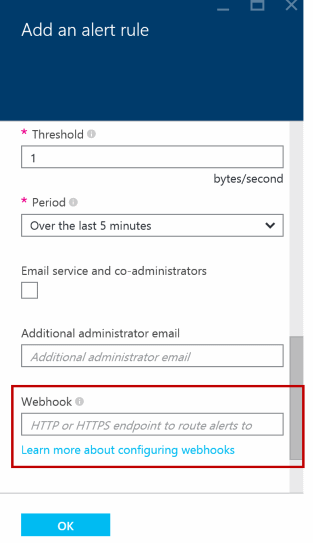

# Have a classic metric alert notify a non-Azure system using a webhook
You can use webhooks to route an Azure alert notification to other systems for post-processing or custom actions. You can use a webhook on an alert to route it to services that send SMS messages, to log bugs, to notify a team via chat or messaging services, or for various other actions. 

This article describes how to set a webhook on an Azure metric alert. It also shows you what the payload for the HTTP POST to a webhook looks like. For information about the setup and schema for an Azure activity log alert (alert on events), see [Call a webhook on an Azure activity log alert](alerts-log-webhook.md).

Azure alerts use HTTP POST to send the alert contents in JSON format to a webhook URI that you provide when you create the alert. The schema is defined later in this article. The URI must be a valid HTTP or HTTPS endpoint. Azure posts one entry per request when an alert is activated.

## Configure webhooks via the Azure portal
To add or update the webhook URI, in the [Azure portal](https://portal.azure.com/), go to **Create/Update Alerts**.



You can also configure an alert to post to a webhook URI by using [Azure PowerShell cmdlets](../../azure-monitor/platform/powershell-quickstart-samples.md#create-metric-alerts), a [cross-platform CLI](../../azure-monitor/platform/cli-samples.md#work-with-alerts), or [Azure Monitor REST APIs](https://msdn.microsoft.com/library/azure/dn933805.aspx).

## Authenticate the webhook
The webhook can authenticate by using token-based authorization. The webhook URI is saved with a token ID. For example: `https://mysamplealert/webcallback?tokenid=sometokenid&someparameter=somevalue`

## Payload schema
The POST operation contains the following JSON payload and schema for all metric-based alerts:

```JSON
{
    "status": "Activated",
    "context": {
        "timestamp": "2015-08-14T22:26:41.9975398Z",
        "id": "/subscriptions/s1/resourceGroups/useast/providers/microsoft.insights/alertrules/ruleName1",
        "name": "ruleName1",
        "description": "some description",
        "conditionType": "Metric",
        "condition": {
            "metricName": "Requests",
            "metricUnit": "Count",
            "metricValue": "10",
            "threshold": "10",
            "windowSize": "15",
            "timeAggregation": "Average",
            "operator": "GreaterThanOrEqual"
        },
        "subscriptionId": "s1",
        "resourceGroupName": "useast",
        "resourceName": "mysite1",
        "resourceType": "microsoft.foo/sites",
        "resourceId": "/subscriptions/s1/resourceGroups/useast/providers/microsoft.foo/sites/mysite1",
        "resourceRegion": "centralus",
        "portalLink": "https://portal.azure.com/#resource/subscriptions/s1/resourceGroups/useast/providers/microsoft.foo/sites/mysite1"
    },
    "properties": {
        "key1": "value1",
        "key2": "value2"
    }
}
```


| Field | Mandatory | Fixed set of values | Notes |
|:--- |:--- |:--- |:--- |
| status |Y |Activated, Resolved |The status for the alert based on the conditions you set. |
| context |Y | |The alert context. |
| timestamp |Y | |The time at which the alert was triggered. |
| id |Y | |Every alert rule has a unique ID. |
| name |Y | |The alert name. |
| description |Y | |A description of the alert. |
| conditionType |Y |Metric, Event |Two types of alerts are supported: metric and event. Metric alerts are based on a metric condition. Event alerts are based on an event in the activity log. Use this value to check whether the alert is based on a metric or on an event. |
| condition |Y | |The specific fields to check based on the **conditionType** value. |
| metricName |For metric alerts | |The name of the metric that defines what the rule monitors. |
| metricUnit |For metric alerts |Bytes, BytesPerSecond, Count, CountPerSecond, Percent, Seconds |The unit allowed in the metric. See [allowed values](https://msdn.microsoft.com/library/microsoft.azure.insights.models.unit.aspx). |
| metricValue |For metric alerts | |The actual value of the metric that caused the alert. |
| threshold |For metric alerts | |The threshold value at which the alert is activated. |
| windowSize |For metric alerts | |The period of time that's used to monitor alert activity based on the threshold. The value must be between 5 minutes and 1 day. The value must be in ISO 8601 duration format. |
| timeAggregation |For metric alerts |Average, Last, Maximum, Minimum, None, Total |How the data that's collected should be combined over time. The default value is Average. See [allowed values](https://msdn.microsoft.com/library/microsoft.azure.insights.models.aggregationtype.aspx). |
| operator |For metric alerts | |The operator that's used to compare the current metric data to the set threshold. |
| subscriptionId |Y | |The Azure subscription ID. |
| resourceGroupName |Y | |The name of the resource group for the affected resource. |
| resourceName |Y | |The resource name of the affected resource. |
| resourceType |Y | |The resource type of the affected resource. |
| resourceId |Y | |The resource ID of the affected resource. |
| resourceRegion |Y | |The region or location of the affected resource. |
| portalLink |Y | |A direct link to the portal resource summary page. |
| properties |N |Optional |A set of key/value pairs that has details about the event. For example, `Dictionary<String, String>`. The properties field is optional. In a custom UI or logic app-based workflow, users can enter key/value pairs that can be passed via the payload. An alternate way to pass custom properties back to the webhook is via the webhook URI itself (as query parameters). |

> [!NOTE]
> You can set the **properties** field only by using [Azure Monitor REST APIs](https://msdn.microsoft.com/library/azure/dn933805.aspx).
>
>

## Next steps
* Learn more about Azure alerts and webhooks in the video [Integrate Azure alerts with PagerDuty](https://go.microsoft.com/fwlink/?LinkId=627080).
* Learn how to [execute Azure Automation scripts (runbooks) on Azure alerts](https://go.microsoft.com/fwlink/?LinkId=627081).
* Learn how to [use a logic app to send an SMS message via Twilio from an Azure alert](https://github.com/Azure/azure-quickstart-templates/tree/master/201-alert-to-text-message-with-logic-app).
* Learn how to [use a logic app to send a Slack message from an Azure alert](https://github.com/Azure/azure-quickstart-templates/tree/master/201-alert-to-slack-with-logic-app).
* Learn how to [use a logic app to send a message to an Azure queue from an Azure alert](https://github.com/Azure/azure-quickstart-templates/tree/master/201-alert-to-queue-with-logic-app).
