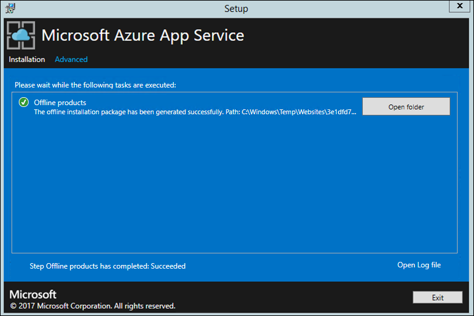
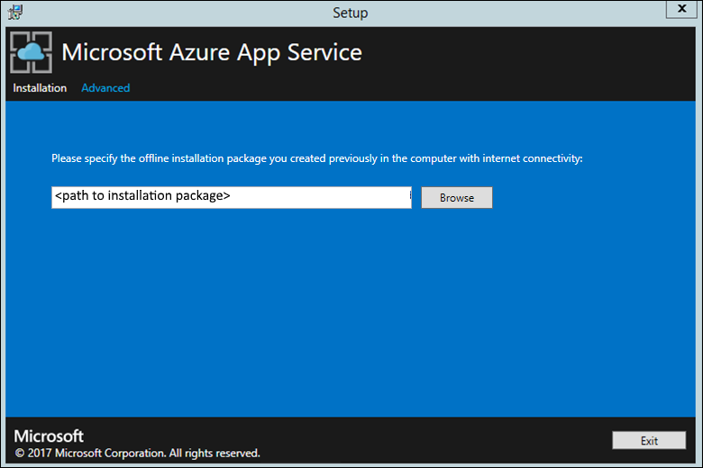
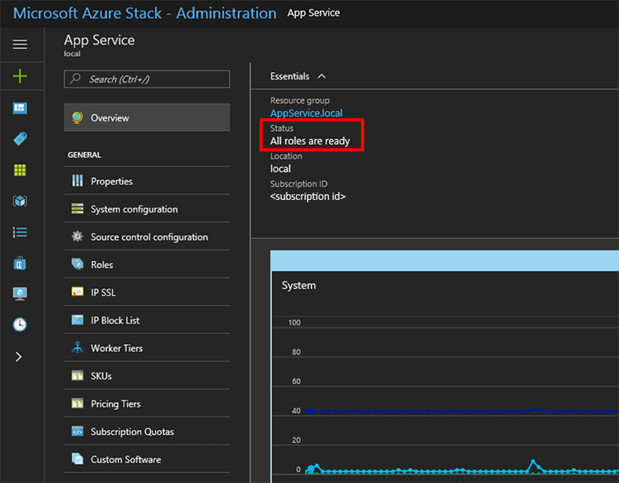

# Add an App Service resource provider to a disconnected Azure Stack environment secured by AD FS

*Applies to: Azure Stack integrated systems and Azure Stack Development Kit*

> [!IMPORTANT]
> Apply the 1809 update to your Azure Stack integrated system or deploy the latest Azure Stack development kit before deploying Azure App Service 1.4.

By following the instructions in this article, you can install the [App Service resource provider](azure-stack-app-service-overview.md) to an Azure Stack environment that is:

- not connected to the Internet
- secured by Active Directory Federation Services (AD FS).

 > [!IMPORTANT]
 > Before deploying the resource provider, review the release notes to learn about new functionality, fixes, and any known issues that could affect your deployment.
 
To add the App Service resource provider to your offline Azure Stack deployment, you must complete these top-level tasks:

1. Complete the [prerequisite steps](azure-stack-app-service-before-you-get-started.md) (like purchasing certificates, which can take a few days to receive).
2. [Download and extract the installation and helper files](azure-stack-app-service-before-you-get-started.md) to a machine connected to the Internet.
3. Create an offline installation package.
4. Run the appservice.exe installer file.

## Create an offline installation package

To deploy App Service in a disconnected environment, you must first create an offline installation package on a machine that's connected to the Internet.

1. Run the AppService.exe installer on a machine that's connected to the Internet.

2. Click  **Advanced** > **Create offline installation package**.

    ![App Service Installer][1]

3. The App Service installer creates an offline installation package and displays the path to it. You can click **Open folder** to open the folder in your file explorer.

    

4. Copy the installer (AppService.exe) and the offline installation package to your Azure Stack host machine.

## Complete the offline installation of App Service on Azure Stack

1. Run appservice.exe as an administrator from a computer that can reach the Azure Stack Admin Azure Resource Management endpoint.

2. Click **Advanced** > **Complete offline installation**.

    ![App Service Installer][2]

3. Browse to the location of the offline installation package you previously created, and then click **Next**.

    

4. Review and accept the Microsoft Software License Terms, and then click **Next**.

5. Review and accept the third-party license terms, and then click **Next**.

6. Make sure that the App Service cloud configuration information is correct. If you used the default settings during Azure Stack Development Kit deployment, you can accept the default values here. However, if you customized the options when you deployed Azure Stack or are deploying on an integrated system, you must edit the values in this window to reflect that. For example, if you use the domain suffix mycloud.com, your Azure Stack Tenant Azure Resource Manager endpoint must change to management.<region>.mycloud.com. After you confirm your information, click **Next**.

    ![App Service Installer][3]

7. On the next page:
    1. Click the **Connect** button next to the **Azure Stack Subscriptions** box.
        - Provide your admin account. For example, cloudadmin@azurestack.local. Enter your password, and click **Sign In**.
    2. In the **Azure Stack Subscriptions** box, select the **Default Provider Subscription**.
    
    > [!NOTE]
    > App Service can only be deployed into the **Default Provider Subscription**.
    >
    
    3. In the **Azure Stack Locations** box, select the location that corresponds to the region you're deploying to. For example, select **local** if your deploying to the Azure Stack Development Kit.
    4. Click **Next**.

    ![App Service Installer][4]

8. You now have the option to deploy into an existing Virtual Network as configured through the steps [here](azure-stack-app-service-before-you-get-started.md#virtual-network), or allow the App Service installer to create a Virtual Network and associated Subnets.
    1. Select **Create VNet with default settings**, accept the defaults, and then click **Next**, or;
    2. Select **Use existing VNet and Subnets**.
        1. Select the **Resource Group** that contains your Virtual Network;
        2. Choose the correct **Virtual Network** name you wish to deploy into;
        3. Select the correct **Subnet** values for each of the required role subnets;
        4. Click **Next**

    ![App Service Installer][5]

9. Enter the information for your file share and then click **Next**. The address of the file share must use the Fully Qualified Domain Name, or IP Address of your File Server. For example, \\\appservicefileserver.local.cloudapp.azurestack.external\websites, or \\\10.0.0.1\websites

    > [!NOTE]
    > The installer attempts to test connectivity to the fileshare before proceeding.  However, if you chose to deploy in an existing   Virtual Network, the installer might not be able to connect to the fileshare and displays a warning, asking whether you want to continue.  Verify the fileshare information and continue if they are correct.
    >
    >

   ![App Service Installer][8]

10. On the next page:
    1. In the **Identity Application ID** box, enter the GUID for the application you’re using for identity (from Azure AD).
    2. In the **Identity Application certificate file** box, enter (or browse to) the location of the certificate file.
    3. In the **Identity Application certificate password** box, enter the password for the certificate. This password is the one that you made note of when you used the script to create the certificates.
    4. In the **Azure Resource Manager root certificate file** box, enter (or browse to) the location of the certificate file.
    5. Click **Next**.

    ![App Service Installer][10]

11. For each of the three certificate file boxes, click **Browse** and then navigate to the appropriate certificate file. You must provide the password for each certificate. These certificates are the ones that you created in the [Create required certificates step](azure-stack-app-service-before-you-get-started.md#get-certificates). Click **Next** after entering all the information.

    | Box | Certificate file name example |
    | --- | --- |
    | **App Service default SSL certificate file** | \_.appservice.local.AzureStack.external.pfx |
    | **App Service API SSL certificate file** | api.appservice.local.AzureStack.external.pfx |
    | **App Service Publisher SSL certificate file** | ftp.appservice.local.AzureStack.external.pfx |

    If you used a different domain suffix when you created the certificates, your certificate file names don’t use *local.AzureStack.external*. Instead, use your custom domain information.

    ![App Service Installer][11]

12. Enter the SQL Server details for the server instance used to host the App Service resource provider databases, and then click **Next**. The installer validates the SQL connection properties. You **must** enter either the internal ip or fully qualified domain name for the SQL Server name.

    > [!NOTE]
    > The installer attempts to test connectivity to the SQl Server before proceeding.  However, if you chose to deploy in an existing Virtual Network, the installer might not be able to connect to the SQL Server and displays a warning asking whether you want to continue.  Verify the SQL Server information and continue if they are correct.
    >
    > From Azure App Service on Azure Stack 1.3 onwards, the installer will check that the SQL Server has database containment enabled at the SQL Server level.  If it is not, you will be prompted with the following exception:
    > ```sql
    >    Enable contained database authentication for SQL server by running below command on SQL server (Ctrl+C to copy)
    >    ***********************************************************
    >    sp_configure 'contained database authentication', 1;  
    >    GO  
    >    RECONFIGURE;  
    >    GO
    >    ***********************************************************
    > ```
    > Refer to the [release notes for Azure App Service on Azure Stack 1.3](azure-stack-app-service-release-notes-update-three.md) for more details.
   
   ![App Service Installer][12]

13. Review the role instance and SKU options. The defaults are populated with the minimum number of instances and the minimum SKU for each role in an ASDK Deployment. A summary of vCPU and memory requirements is provided to help plan your deployment. After you make your selections, click **Next**.

     > [!NOTE]
     > For production deployments, follow the guidance in [Capacity planning for Azure App Service server roles in Azure Stack](azure-stack-app-service-capacity-planning.md).
     >
     >

    | Role | Minimum instances | Minimum SKU | Notes |
    | --- | --- | --- | --- |
    | Controller | 1 | Standard_A2 - (2 vCPU, 3584 MB) | Manages and maintains the health of the App Service cloud. |
    | Management | 1 | Standard_A2 - (2 vCPUs, 3584 MB) | Manages the App Service Azure Resource Manager and API endpoints, portal extensions (admin, tenant, Functions portal), and the data service. To support failover, increased the recommended instances to 2. |
    | Publisher | 1 | Standard_A1 - (1 vCPU, 1792 MB) | Publishes content via FTP and web deployment. |
    | FrontEnd | 1 | Standard_A1 - (1 vCPU, 1792 MB) | Routes requests to App Service applications. |
    | Shared Worker | 1 | Standard_A1 - (1 vCPU, 1792 MB) | Hosts web or API applications and Azure Functions apps. You might want to add more instances. As an operator, you can define your offering and choose any SKU tier. The tiers must have a minimum of one vCPU. |

    ![App Service Installer][14]

    > [!NOTE]
    > **Windows Server 2016 Core is not a supported platform image for use with Azure App Service on Azure Stack.  Do not use evaluation images for production deployments.  Azure App Service on Azure Stack requires that Microsoft.Net 3.5.1 SP1 is activated on the image used for deployment.   Marketplace syndicated Windows Server 2016 images do not have this feature enabled, therefore you must create and use a Windows Server 2016 image with this pre-enabled.**

14. In the **Select Platform Image** box, choose your deployment Windows Server 2016 virtual machine image from those available in the compute resource provider for the App Service cloud. Click **Next**.

15. On the next page:
     1. Enter the Worker Role virtual machine administrator user name and password.
     2. Enter the Other Roles virtual machine administrator user name and password.
     3. Click **Next**.

    ![App Service Installer][16]

16. On the summary page:
    1. Verify the selections you made. To make changes, use the **Previous** buttons to visit previous pages.
    2. If the configurations are correct, select the check box.
    3. To start the deployment, click **Next**.

    ![App Service Installer][17]

17. On the next page:
    1. Track the installation progress. App Service on Azure Stack takes about 60 minutes to deploy based on the default selections.
    2. After the installer successfully finishes, click **Exit**.

    ![App Service Installer][18]

## Validate the App Service on Azure Stack installation

1. In the Azure Stack admin portal, go to **Administration - App Service**.

2. In the overview, under status, check to see that the **Status** displays **All roles are ready**.

    

> [!NOTE]
> If you chose to deploy into an existing virtual network and a internal IP address to connect to your fileserver, you must add an outbound security rule, enabling SMB traffic between the worker subnet and the fileserver.  To do this, go to the WorkersNsg in the Admin Portal and add an outbound security rule with the following properties:
> * Source: Any
> * Source port range: *
> * Destination: IP Addresses
> * Destination IP address range: Range of IPs for your fileserver
> * Destination port range: 445
> * Protocol: TCP
> * Action: Allow
> * Priority: 700
> * Name: Outbound_Allow_SMB445
>

## Test drive App Service on Azure Stack

After you deploy and register the App Service resource provider, test it to make sure that users can deploy web and API apps.

> [!NOTE]
> You need to create an offer that has the Microsoft.Web namespace within the plan. Then you need to have a tenant subscription that subscribes to this offer. For more information, see [Create offer](azure-stack-create-offer.md) and [Create plan](azure-stack-create-plan.md).
>
> You *must* have a tenant subscription to create applications that use App Service on Azure Stack. The only capabilities that a service admin can complete within the admin portal are related to the resource provider administration of App Service. These capabilities include adding capacity, configuring deployment sources, and adding Worker tiers and SKUs.
>
> As of the third technical preview, to create web, API, and Azure Functions apps, you must use the tenant portal and have a tenant subscription.

1. In the Azure Stack tenant portal, click **+ Create a resource** > **Web + Mobile** > **Web App**.

2. On the **Web App** blade, type a name in the **Web app** box.

3. Under **Resource Group**, click **New**. Type a name in the **Resource Group** box.

4. Click **App Service plan/Location** > **Create New**.

5. On the **App Service plan** blade, type a name in the **App Service plan** box.

6. Click **Pricing tier** > **Free-Shared** or **Shared-Shared** > **Select** > **OK** > **Create**.

7. In under a minute, a tile for the new web app appears on the dashboard. Click the tile.

8. On the **Web App** blade, click **Browse** to view the default website for this app.

## Deploy a WordPress, DNN, or Django website (optional)

1. In the Azure Stack tenant portal, click **+**, go to the Azure Marketplace, deploy a Django website, and wait for successful completion. The Django web platform uses a file system-based database. It doesn’t require any additional resource providers, such as SQL or MySQL.

2. If you also deployed a MySQL resource provider, you can deploy a WordPress website from the Marketplace. When you're prompted for database parameters, enter the user name as *User1@Server1*, with the user name and server name of your choice.

3. If you also deployed a SQL Server resource provider, you can deploy a DNN website from the Marketplace. When you're prompted for database parameters, choose a database in the computer running SQL Server that's connected to your resource provider.

## Next steps

You can also try out other [platform as a service (PaaS) services](azure-stack-tools-paas-services.md).

- [SQL Server resource provider](azure-stack-sql-resource-provider-deploy.md)
- [MySQL resource provider](azure-stack-mysql-resource-provider-deploy.md)

<!--Links-->
[Azure_Stack_App_Service_preview_installer]: https://go.microsoft.com/fwlink/?LinkID=717531
[App_Service_Deployment]: https://go.microsoft.com/fwlink/?LinkId=723982
[AppServiceHelperScripts]: https://go.microsoft.com/fwlink/?LinkId=733525

<!--Image references-->
[1]: ./media/azure-stack-app-service-deploy-offline/app-service-exe-advanced-create-package.png
[2]: ./media/azure-stack-app-service-deploy-offline/app-service-exe-advanced-complete-offline.png
[3]: ./media/azure-stack-app-service-deploy-offline/app-service-azure-stack-arm-endpoints.png
[4]: ./media/azure-stack-app-service-deploy-offline/app-service-azure-stack-subscription-information.png
[5]: ./media/azure-stack-app-service-deploy-offline/app-service-default-VNET-config.png
[6]: ./media/azure-stack-app-service-deploy-offline/app-service-custom-VNET-config.png
[7]: ./media/azure-stack-app-service-deploy-offline/app-service-custom-VNET-config-with-values.png
[8]: ./media/azure-stack-app-service-deploy-offline/app-service-fileshare-configuration.png
[9]: ./media/azure-stack-app-service-deploy-offline/app-service-fileshare-configuration-error.png
[10]: ./media/azure-stack-app-service-deploy-offline/app-service-identity-app.png
[11]: ./media/azure-stack-app-service-deploy-offline/app-service-certificates.png
[12]: ./media/azure-stack-app-service-deploy-offline/app-service-sql-configuration.png
[13]: ./media/azure-stack-app-service-deploy-offline/app-service-sql-configuration-error.png
[14]: ./media/azure-stack-app-service-deploy-offline/app-service-cloud-quantities.png
[15]: ./media/azure-stack-app-service-deploy-offline/app-service-windows-image-selection.png
[16]: ./media/azure-stack-app-service-deploy-offline/app-service-role-credentials.png
[17]: ./media/azure-stack-app-service-deploy-offline/app-service-azure-stack-deployment-summary.png
[18]: ./media/azure-stack-app-service-deploy-offline/app-service-deployment-progress.png
