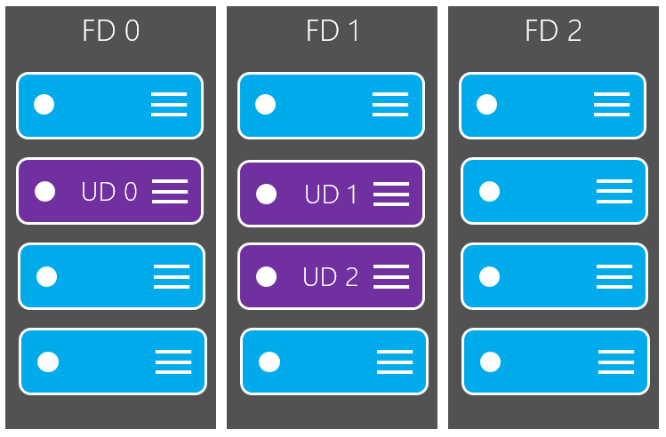

# Azure Stack compute capacity planning
The [VM sizes supported on Azure Stack](./user/azure-stack-vm-sizes.md) are a subset of those supported on Azure. Azure imposes resource limits along many vectors to avoid overconsumption of resources (server local and service-level). Without imposing some limits on tenant consumption, the tenant experiences will suffer when other tenants overconsume resources. For networking egress from the VM, there are bandwidth caps in place on Azure Stack that match Azure limitations. For storage resources, storage IOPs limits have been implemented on Azure Stack to avoid basic overconsumption of resources by tenants for storage access.  

## VM placement and virtual to physical core overprovisioning
In Azure Stack, there is no way for a tenant to specify a specific server to use for VM placement. The only consideration when placing VMs is whether there is enough memory on the host for that VM type. Azure Stack does not overcommit memory; however, an overcommit of the number of cores is allowed. Since placement algorithms do not look at the existing virtual to physical core overprovisioning ratio as a factor, each host could have a different ratio. 

In Azure, to achieve high availability of a multi-VM production system, VMs are placed in an availability set to be spread across multiple fault domains. This would mean that VMs placed in an availability set are physically isolated from each other at a rack to allow for failure resiliency as shown in the following diagram:

While the infrastructure of Azure Stack is resilient to failures, the underlying technology (failover clustering) still incurs some downtime for VMs on an impacted physical server in the event of a hardware failure. Currently, Azure Stack supports having an availability set with a maximum of three fault domains to be consistent with Azure. VMs placed in an availability set will be physically isolated from each other by spreading them as evenly as possible over multiple fault domains (Azure Stack nodes). If there is a hardware failure, VMs from the failed fault domain will be restarted in other nodes, but, if possible, kept in separate fault domains from the other VMs in the same availability set. When the hardware comes back online, VMs will be rebalanced to maintain high availability.

Another concept that is used by Azure to provide high availability is in the form of update domains in availability sets. An update domain is a logical group of underlying hardware that can undergo maintenance or be rebooted at the same time. In Azure Stack, VMs are live migrated across the other online hosts in the cluster before their underlying host is updated. Since there is no tenant downtime during a host update, the update domain feature on Azure Stack only exists for template compatibility with Azure.

## Azure Stack resiliency resources
To allow for patch and update of an Azure Stack integrated system, and to be resilient to physical hardware failures, a portion of the total server memory is reserved and unavailable for tenant virtual machine (VM) placement.

If a server fails, VMs hosted on the failed server will be restarted on remaining, available servers to provide for VM availability. Similarly, during the patch and update process, all VMs running on a server will be live migrated to other available, server. This VM management or movement can only be achieved if there is reserved capacity to allow for the restart or migration to occur.

The following calculation results in the total, available memory that can be used for tenant VM placement. This memory capacity is for the entirety of the Azure Stack Scale Unit.

  Available Memory for VM placement = Total Server Memory – Resiliency Reserve – Azure Stack Infrastructure Overhead 1

  Resiliency reserve = H + R * (N-1) + V * (N-2)

> Where:
> -	H = Size of single server memory
> - N = Size of Scale Unit (number of servers)
> -	R = Operating system reserve for OS overhead2
> -	V = Largest VM in the scale unit

  1 Azure Stack Infrastructure Overhead = 208 GB

  2 Operating system reserve for overhead = 15% of node memory. The operating system reserve value is an estimate and will vary based on the physical memory capacity of the server and general operating system overhead.

The value V, largest VM in the scale unit, is dynamically based on the largest tenant VM memory size. For example, the largest VM value could be 7 GB or 112 GB or any other supported VM memory size in the Azure Stack solution.

The above calculation is an estimate and subject to change based on the current version of Azure Stack. Ability to deploy tenant VMs and services is based on the specifics of the deployed solution. This example calculation is just a guide and not the absolute answer of the ability to deploy VMs.

## Next steps
[Storage capacity planning](capacity-planning-storage.md)
