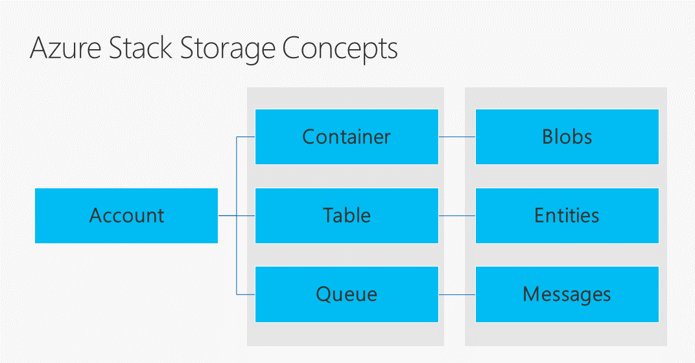

# Introduction to Azure Stack storage

*Applies to: Azure Stack integrated systems and Azure Stack Development Kit*

## Overview

Azure Stack Storage is a set of cloud storage services that includes Blobs, Tables and Queues which are consistent with Azure Storage services.

## Azure Stack Storage services

Azure Stack storage provides the following three services:

- **Blob Storage**

    Blob storage stores unstructured object data. A blob can be any type of text or binary data, such as a document, media file, or application installer.

- **Table Storage**

    Table storage stores structured datasets. Table storage is a NoSQL key-attribute data store, which allows for rapid development and fast access to large quantities of data.

- **Queue Storage**

    Queue storage provides reliable messaging for workflow processing and for communication between components of cloud services.

An Azure Stack storage account is a secure account that gives you access to services in Azure Stack Storage. Your storage account provides the unique namespace for your storage resources. The following diagram shows the relationships between the Azure Stack storage resources in a storage account:

### Blob storage

For users with a large amount of unstructured object data to store in the cloud, blob storage offers an effective and scalable solution. You can use blob storage to store content such as:

- Documents
- Social data such as photos, videos, music, and blogs
- Backups of files, computers, databases, and devices
- Images and text for web applications
- Configuration data for cloud applications
- Big data, such as logs and other large datasets

Every blob is organized into a container. Containers also provide a useful way to assign security policies to groups of objects. A storage account can contain any number of containers, and a container can contain any number of blobs, up to the limit of storage account.

Blob storage offers three types of blobs:

- **Block blobs**

    Block blobs are optimized for streaming and storing cloud objects, and are a good choice for storing documents, media files, backups, and etc.

- **Append blobs**

    Append blobs are similar to block blobs, but are optimized for append operations. An append blob can be updated only by adding a new block to the end. Append blobs are a good choice for scenarios such as logging, where new data needs to be written only to the end of the blob.

- **Page blobs**

    Page blobs are optimized for representing IaaS disks and supporting random writes that is up to 1 TB in size. An Azure Stack virtual machine attached IaaS disk is a VHD stored as a page blob.

### Table storage

Modern applications often demand data stores with greater scalability and flexibility than previous generations of software required. Table storage offers highly available, massively scalable storage, so that your application can automatically scale to meet user demand. Table storage is Microsoft's NoSQL key/attribute store -- it has a schemaless design, making it different from traditional relational databases. With a schemaless data store, it's easy to adapt your data as the needs of your application evolve. Table storage is easy to use, so developers can create applications quickly.

Table storage is a key-attribute store, which means that every value in a table is stored with a typed property name. The property name can be used for filtering and specifying selection criteria. A collection of properties and their values comprise an entity. Since table storage is schemaless, two entities in the same table can contain different collections of properties, and those properties can be of different types.

You can use table storage to store flexible datasets, such as user data for web applications, address books, device information, and any other type of metadata that your service requires. For today's Internet-based applications, NoSQL databases like table storage offer a popular alternative to traditional relational databases.

A storage account can contain any number of tables, and a table can contain any number of entities, up to the capacity limit of the storage account.

### Queue storage

In designing applications for scale, application components are often decoupled, so that they can scale independently. Queue storage provides a reliable messaging solution for asynchronous communication between application components, whether they're running in the cloud, on the desktop, on an on-premises server, or on a mobile device. Queue storage also supports managing asynchronous tasks and building process workflows.

A storage account can contain any number of queues, and a queue can contain any number of messages, up to the capacity limit of the storage account. Individual messages may be up to 64 KB in size.

## Next steps

- [Azure-consistent storage: differences and considerations](azure-stack-acs-differences.md)

- To learn more about Azure Storage, see [Introduction to Microsoft Azure Storage](../../storage/common/storage-introduction.md)
