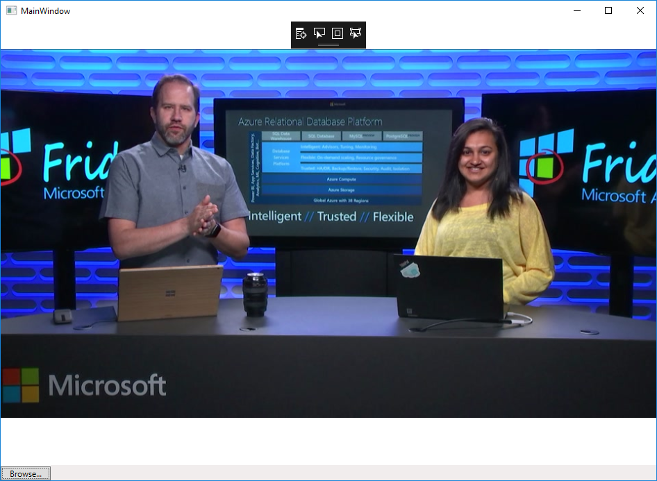

# Tutorial: Create a WPF app to display face data in an image

In this tutorial, you will learn how to use the Azure Face API, through the .NET client SDK, to detect faces in an image and then present that data in the UI. You'll create a simple Windows Presentation Framework (WPF) application that detects faces, draws a frame around each face, and displays a description of the face in the status bar. 

This tutorial shows you how to:

> [!div class="checklist"]
> - Create a WPF application
> - Install the Face API client library
> - Use the client library to detect faces in an image
> - Draw a frame around each detected face
> - Display a description of the highlighted face on the status bar

The complete sample code is available in the [Cognitive Face CSharp sample](https://github.com/Azure-Samples/Cognitive-Face-CSharp-sample) repository on GitHub.

If you don't have an Azure subscription, create a [free account](https://azure.microsoft.com/free/) before you begin. 

## Prerequisites

- A Face API subscription key. You can get a free trial subscription key from [Try Cognitive Services](https://azure.microsoft.com/try/cognitive-services/?api=face-api). Or, follow the instructions in [Create a Cognitive Services account](https://docs.microsoft.com/azure/cognitive-services/cognitive-services-apis-create-account) to subscribe to the Face API service and get your key.
- Any edition of [Visual Studio 2015 or 2017](https://www.visualstudio.com/downloads/).

## Create the Visual Studio project

Follow these steps to create a new WPF application project.

1. In Visual Studio, open the New Project dialog. Expand **Installed**, then **Visual C#**, then select **WPF App (.NET Framework)**.
1. Name the application **FaceTutorial**, then click **OK**.
1. Get the required NuGet packages. Right-click on your project in the Solution Explorer and select **Manage NuGet Packages**; then, find and install the following package:
    - Microsoft.Azure.CognitiveServices.Vision.Face 2.2.0-preview

## Add the initial code

In this section, you will add the basic framework of the app without its face-specific features.

### Create the UI

Open *MainWindow.xaml* and replace the contents with the following code&mdash;this creates the UI window. Note that `FacePhoto_MouseMove` and `BrowseButton_Click` are event handlers that you will define later on.

[!code-xaml]

### Create the main class

Open *MainWindow.xaml.cs* and add the client library namespaces, along with other necessary namespaces. 

[!code-csharp]

Next, insert the following code in the **MainWindow** class. This creates a **FaceClient** instance using the subscription key, which you must enter yourself. You must also set the region string in `faceEndpoint` to the correct region for your subscription (see the [Face API docs](https://westus.dev.cognitive.microsoft.com/docs/services/563879b61984550e40cbbe8d/operations/563879b61984550f30395236) for a list of all region endpoints).

[!code-csharp]

Next paste the following code into the **MainWindow** method.

[!code-csharp]

Finally, add the **BrowseButton_Click** and **FacePhoto_MouseMove** methods to the class. These correspond to the event handlers declared in *MainWindow.xaml*. The **BrowseButton_Click** method creates an **OpenFileDialog**, which allows the user to select a .jpg image. It then displays the image in the main window. You will insert the remaining code for **BrowseButton_Click** and **FacePhoto_MouseMove** in later steps. Also note the `faceList` reference&mdash;a list of **DetectedFace** objects. This is where your app will store and call the actual face data.

[!code-csharp]

[!code-csharp]

### Try the app

Press **Start** on the menu to test your app. When the app window opens, click **Browse** in the lower left corner. A **File Open** dialog should appear. Select an image from your filesystem and verify that it displays in the window. Then, close the app and advance to the next step.

## Upload image and detect faces

Your app will detect faces by calling the **FaceClient.Face.DetectWithStreamAsync** method, which wraps the [Detect](https://westus.dev.cognitive.microsoft.com/docs/services/563879b61984550e40cbbe8d/operations/563879b61984550f30395236) REST API for uploading a local image.

Insert the following method in the **MainWindow** class, below the **FacePhoto_MouseMove** method. This defines a list of face attributes to retrieve and reads the submitted image file into a **Stream**. Then it passes both of these objects to the **DetectWithStreamAsync** method call.

[!code-csharp]

## Draw rectangles around faces

Next, you will add the code to draw a rectangle around each detected face in the image. In the **MainWindow** class, insert the following code at the end of the **BrowseButton_Click** method, after the `FacePhoto.Source = bitmapSource` line. This populates a list of detected faces from the call to **UploadAndDetectFaces**. Then it draws a rectangle around each face and displays the modified image in the main window.

[!code-csharp]

## Describe the faces

Add the following method to the **MainWindow** class, below the **UploadAndDetectFaces** method. This converts the retrieved face attributes into a string describing the face.

[!code-csharp]

## Display the face description

Add the following code to the **FacePhoto_MouseMove** method. This event handler  displays the face description string in `faceDescriptionStatusBar` when the cursor hovers over a detected face rectangle.

[!code-csharp]

## Run the app

Run the application and browse for an image containing a face. Wait a few seconds to allow the Face service to respond. You should see a red rectangle on each of the faces in the image. If you move the mouse over a face rectangle, the description of that face should appear in the status bar.

## Next steps

In this tutorial, you learned the basic process for using the Face service .NET SDK and created an application to detect and frame faces in an image. Next, learn more about the details of face detection.

> [!div class="nextstepaction"]
> [How to Detect Faces in an Image](../Face-API-How-to-Topics/HowtoDetectFacesinImage.md)
