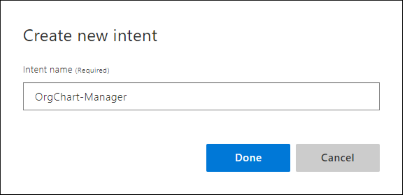
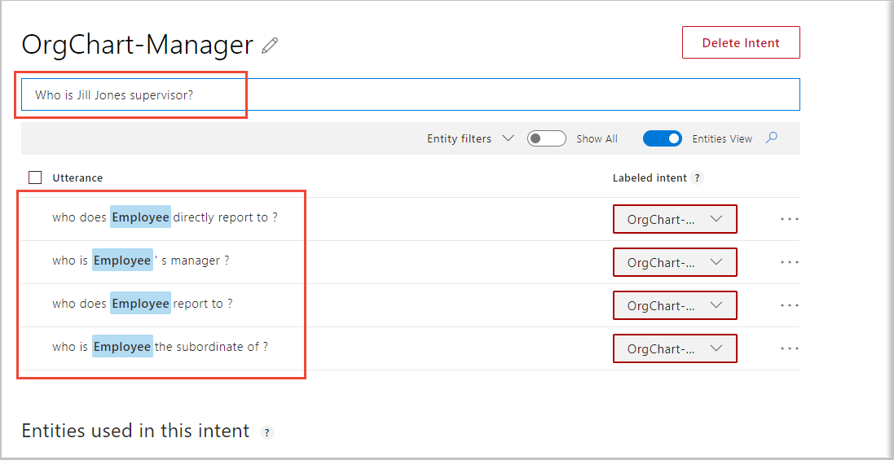
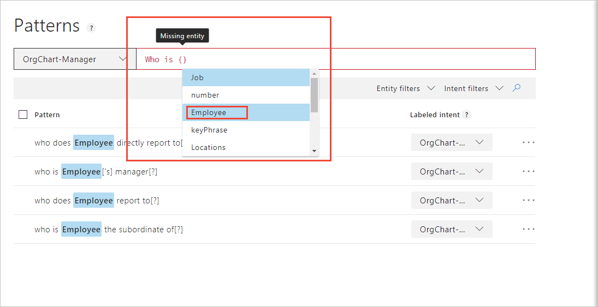

# Tutorial: Add common pattern template utterance formats

In this tutorial, use patterns to increase intent and entity prediction while providing fewer example utterances. The pattern is provided by way of a template utterance example, which includes syntax to identify entities and ignorable text. A pattern is a combination of expression matching and machine learning.  The template utterance example, along with the intent utterances, give LUIS a better understanding of what utterances fit the intent. 

**In this tutorial, you learn how to:**

> [!div class="checklist"]
> * Import example app 
> * Create intent
> * Train
> * Publish
> * Get intents and entities from endpoint
> * Create a pattern
> * Verify pattern prediction improvements
> * Mark text as ignorable and nest within pattern
> * Use test panel to verify pattern success

[!INCLUDE [LUIS Free account](../../../includes/cognitive-services-luis-free-key-short.md)]

## Import example app

Continue with the app created in the last tutorial, named **HumanResources**. 

Use the following steps:

1.  Download and save [app JSON file](https://github.com/Azure-Samples/cognitive-services-language-understanding/blob/master/documentation-samples/tutorials/custom-domain-batchtest-HumanResources.json).

2. Import the JSON into a new app.

3. From the **Manage** section, on the **Versions** tab, clone the version, and name it `patterns`. Cloning is a great way to play with various LUIS features without affecting the original version. Because the version name is used as part of the URL route, the name can't contain any characters that are not valid in a URL.

## Create new intents and their utterances

1. [!INCLUDE [Start in Build section](../../../includes/cognitive-services-luis-tutorial-build-section.md)]

2. On the **Intents** page, select **Create new intent**. 

3. Enter `OrgChart-Manager` in the pop-up dialog box then select **Done**.

    

4. Add example utterances to the intent.

    |Example utterances|
    |--|
    |Who is John W. Smith the subordinate of?|
    |Who does John W. Smith report to?|
    |Who is John W. Smith's manager?|
    |Who does Jill Jones directly report to?|
    |Who is Jill Jones supervisor?|

    [](media/luis-tutorial-pattern/hr-orgchart-manager-intent.png#lightbox)

    Don't worry if the keyPhrase entity is labeled in the utterances of the intent instead of the employee entity. Both are correctly predicted in the Test pane and at the endpoint. 

5. Select **Intents** in the left navigation.

6. Select **Create new intent**. 

7. Enter `OrgChart-Reports` in the pop-up dialog box then select **Done**.

8. Add example utterances to the intent.

    |Example utterances|
    |--|
    |Who are John W. Smith's subordinates?|
    |Who reports to John W. Smith?|
    |Who does John W. Smith manage?|
    |Who are Jill Jones direct reports?|
    |Who does Jill Jones supervise?|

## Caution about example utterance quantity

[!INCLUDE [Too few examples](../../../includes/cognitive-services-luis-too-few-example-utterances.md)]

## Train

[!INCLUDE [LUIS How to Train steps](../../../includes/cognitive-services-luis-tutorial-how-to-train.md)]

## Publish

[!INCLUDE [LUIS How to Publish steps](../../../includes/cognitive-services-luis-tutorial-how-to-publish.md)]

## Get intent and entities from endpoint

1. [!INCLUDE [LUIS How to get endpoint first step](../../../includes/cognitive-services-luis-tutorial-how-to-get-endpoint.md)]

2. Go to the end of the URL in the address and enter `Who is the boss of Jill Jones?`. The last querystring parameter is `q`, the utterance **query**. 

    ```json
    {
        "query": "who is the boss of jill jones?",
        "topScoringIntent": {
            "intent": "OrgChart-Manager",
            "score": 0.353984952
        },
        "intents": [
            {
                "intent": "OrgChart-Manager",
                "score": 0.353984952
            },
            {
                "intent": "OrgChart-Reports",
                "score": 0.214128986
            },
            {
                "intent": "EmployeeFeedback",
                "score": 0.08434003
            },
            {
                "intent": "MoveEmployee",
                "score": 0.019131
            },
            {
                "intent": "GetJobInformation",
                "score": 0.004819009
            },
            {
                "intent": "Utilities.Confirm",
                "score": 0.0043958663
            },
            {
                "intent": "Utilities.StartOver",
                "score": 0.00312064588
            },
            {
                "intent": "Utilities.Cancel",
                "score": 0.002265454
            },
            {
                "intent": "Utilities.Help",
                "score": 0.00133465114
            },
            {
                "intent": "None",
                "score": 0.0011388344
            },
            {
                "intent": "Utilities.Stop",
                "score": 0.00111166481
            },
            {
                "intent": "FindForm",
                "score": 0.0008900076
            },
            {
                "intent": "ApplyForJob",
                "score": 0.0007836131
            }
        ],
        "entities": [
            {
                "entity": "jill jones",
                "type": "Employee",
                "startIndex": 19,
                "endIndex": 28,
                "resolution": {
                    "values": [
                        "Employee-45612"
                    ]
                }
            },
            {
                "entity": "boss of jill jones",
                "type": "builtin.keyPhrase",
                "startIndex": 11,
                "endIndex": 28
            }
        ]
    }
    ```

Did this query succeed? For this training cycle it did succeed. The scores of the two top intents are close. Because LUIS training is not exactly the same each time, there is a bit of variation, these two scores could invert on the next training cycle. The result is that the wrong intent could be returned. 

Use patterns to make the correct intent's score significantly higher in percentage and farther from the next highest score. 

Leave this second browser window open. You use it again later in the tutorial. 

## Template utterances
Because of the nature of the Human Resource domain, there are a few common ways of asking about employee relationships in organizations. For example:

|Utterances|
|--|
|Who does Jill Jones report to?|
|Who reports to Jill Jones?|

These utterances are too close to determine the contextual uniqueness of each without providing many utterance examples. By adding a pattern for an intent, LUIS learns common utterance patterns for an intent without supplying many utterance examples. 

Template utterance examples for this intent include:

|Template utterances examples|syntax meaning|
|--|--|
|Who does {Employee} report to[?]|interchangeable {Employee}, ignore [?]}|
|Who reports to {Employee}[?]|interchangeable {Employee}, ignore [?]}|

The `{Employee}` syntax marks the entity location within the template utterance as well as which entity it is. The optional syntax, `[?]`, marks words, or punctuation that are optional. LUIS matches the utterance, ignoring the optional text inside the brackets.

While the syntax looks like regular expressions, it is not regular expressions. Only the curly bracket, `{}`, and square bracket, `[]`, syntax is supported. They can be nested up to two levels.

In order for a pattern to be matched to an utterance, the entities within the utterance have to match the entities in the template utterance first. However, the template doesn't help predict entities, only intents. 

**While patterns allow you to provide fewer example utterances, if the entities are not detected, the pattern does not match.**

In this tutorial, add two new intents: `OrgChart-Manager` and `OrgChart-Reports`. 

|Intent|Utterance|
|--|--|
|OrgChart-Manager|Who does Jill Jones report to?|
|OrgChart-Reports|Who reports to Jill Jones?|

Once LUIS returns a prediction to the client app, the intent name can be used as a function name in the client app and that the Employee entity could be used as a parameter to that function.

```nodejs
OrgChartManager(employee){
    ///
}
```

Remember that employees were created in the [list entity tutorial](luis-quickstart-intent-and-list-entity.md).

1. Select **Build** in the top menu.

2. In the left navigation, under **Improve app performance**, select **Patterns** from the left navigation.

3. Select the **OrgChart-Manager** intent, then enter the following template utterances:

    |Template utterances|
    |:--|
    |Who is {Employee} the subordinate of[?]|
    |Who does {Employee} report to[?]|
    |Who is {Employee}['s] manager[?]|
    |Who does {Employee} directly report to[?]|
    |Who is {Employee}['s] supervisor[?]|
    |Who is the boss of {Employee}[?]|

    Entities with roles use syntax that includes the role name, and are covered in a [separate tutorial for roles](luis-tutorial-pattern-roles.md). 

    If you type the template utterance, LUIS helps you fill in the entity when you enter the left curly bracket, `{`.

    [](./media/luis-tutorial-pattern/hr-pattern-missing-entity.png#lightbox)

4. Select the **OrgChart-Reports** intent, then enter the following template utterances:

    |Template utterances|
    |:--|
    |Who are {Employee}['s] subordinates[?]|
    |Who reports to {Employee}[?]|
    |Who does {Employee} manage[?]|
    |Who are {Employee} direct reports[?]|
    |Who does {Employee} supervise[?]|
    |Who does {Employee} boss[?]|

## Query endpoint when patterns are used

1. Train and publish the app again.

2. Switch browser tabs back to the endpoint URL tab.

3. Go to the end of the URL in the address and enter `Who is the boss of Jill Jones?` as the utterance. The last querystring parameter is `q`, the utterance **query**. 

    ```json
    {
        "query": "who is the boss of jill jones?",
        "topScoringIntent": {
            "intent": "OrgChart-Manager",
            "score": 0.9999989
        },
        "intents": [
            {
                "intent": "OrgChart-Manager",
                "score": 0.9999989
            },
            {
                "intent": "OrgChart-Reports",
                "score": 7.616303E-05
            },
            {
                "intent": "EmployeeFeedback",
                "score": 7.84204349E-06
            },
            {
                "intent": "GetJobInformation",
                "score": 1.20674213E-06
            },
            {
                "intent": "MoveEmployee",
                "score": 7.91245157E-07
            },
            {
                "intent": "None",
                "score": 3.875E-09
            },
            {
                "intent": "Utilities.StartOver",
                "score": 1.49E-09
            },
            {
                "intent": "Utilities.Confirm",
                "score": 1.34545453E-09
            },
            {
                "intent": "Utilities.Help",
                "score": 1.34545453E-09
            },
            {
                "intent": "Utilities.Stop",
                "score": 1.34545453E-09
            },
            {
                "intent": "Utilities.Cancel",
                "score": 1.225E-09
            },
            {
                "intent": "FindForm",
                "score": 1.123077E-09
            },
            {
                "intent": "ApplyForJob",
                "score": 5.625E-10
            }
        ],
        "entities": [
            {
                "entity": "jill jones",
                "type": "Employee",
                "startIndex": 19,
                "endIndex": 28,
                "resolution": {
                    "values": [
                        "Employee-45612"
                    ]
                },
                "role": ""
            },
            {
                "entity": "boss of jill jones",
                "type": "builtin.keyPhrase",
                "startIndex": 11,
                "endIndex": 28
            }
        ]
    }
    ```

The intent prediction is now significantly higher.

## Working with optional text and prebuilt entities

The previous pattern template utterances in this tutorial had a few examples of optional text such as the possessive use of the letter s, `'s`, and the use of the question mark, `?`. Suppose the endpoint utterances show that managers and Human Resources representatives are looking for historical data as well as planned employee moves within the company happening at a future date.

Example utterances are:

|Intent|Example utterances with optional text and prebuilt entities|
|:--|:--|
|OrgChart-Manager|`Who was Jill Jones manager on March 3?`|
|OrgChart-Manager|`Who is Jill Jones manager now?`|
|OrgChart-Manager|`Who will be Jill Jones manager in a month?`|
|OrgChart-Manager|`Who will be Jill Jones manager on March 3?`|

Each of these examples uses a verb tense, `was`, `is`, `will be`, as well as a date, `March 3`, `now`, and `in a month`, that LUIS needs to predict correctly. Notice that the last two examples use almost the same text except for `in` and `on`.

Example template utterances:
|Intent|Example utterances with optional text and prebuilt entities|
|:--|:--|
|OrgChart-Manager|`who was {Employee}['s] manager [[on]{datetimeV2}?`]|
|OrgChart-Manager|`who is {Employee}['s] manager [[on]{datetimeV2}?]`|
|OrgChart-Manager|`who will be {Employee}['s] manager [[in]{datetimeV2}?]`|
|OrgChart-Manager|`who will be {Employee}['s] manager [[on]{datetimeV2}?]`|

The use of the optional syntax of square brackets, `[]`, makes this optional text easy to add to the template utterance and can be nested up to a second level, `[[]]`, and include entities or text.

**Question: Why couldn't the last two example utterances combine into a single template utterance?** The pattern template doesn't support OR syntax. In order to catch both the `in` version and the `on` version, each needs to be a separate template utterance.

**Question: Why are all the `w` letters, the first letter in each template utterance, lowercase? Shouldn't they be optionally upper or lowercase?** The utterance submitted to the query endpoint, by the client application, is converted into lowercase. The template utterance can be uppercase or lowercase and the endpoint utterance can also be either. The comparison is always done after the conversion to lowercase.

**Question: Why isn't prebuilt number part of the template utterance if March 3 is predicted both as number `3` and date `March 3`?** The template utterance contextually is using a date, either literally as in `March 3` or abstracted as `in a month`. A date can contain a number but a number may not necessarily be seen as a date. Always use the entity that best represents the type you want returned in the prediction JSON results.  

**Question: What about poorly phrased utterances such as `Who will {Employee}['s] manager be on March 3?`.** Grammatically different verb tenses such as this where the `will` and `be` are separated need to be a new template utterance. The existing template utterance will not match it. While the intent of the utterance hasn't changed, the word placement in the utterance has changed. This change impacts the prediction in LUIS.

**Remember: entities are found first, then the pattern is matched.**

## Edit the existing pattern template utterance

1. On the LUIS website, select **Build** in the top menu then select **Patterns** in the left menu. 

2. Find the existing template utterance, `Who is {Employee}['s] manager[?]`, and select the ellipsis (***...***) to the right. 

3. Select **Edit** from the pop-up menu. 

4. Change the template utterance to: `who is {Employee}['s] manager [[on]{datetimeV2}?]]`

## Add new pattern template utterances

1. While still in the **Patterns** section of **Build**, add several new pattern template utterances. Select **OrgChart-Manager** from the Intent drop-down menu and enter each of the following template utterances:

    |Intent|Example utterances with optional text and prebuilt entities|
    |--|--|
    |OrgChart-Manager|`who was {Employee}['s] manager [[on]{datetimeV2}?]`|
    |OrgChart-Manager|`who is {Employee}['s] manager [[on]{datetimeV2}?]`|
    |OrgChart-Manager|`who will be {Employee}['s] manager [[in]{datetimeV2}?]`|
    |OrgChart-Manager|`who will be {Employee}['s] manager [[on]{datetimeV2}?]`|

2. Train the app.

3. Select **Test** at the top of the panel to open the testing panel. 

4. Enter several test utterances to verify that the pattern is matched and the intent score is significantly high. 

    After you enter the first utterance, select **Inspect** under the result so you can see all the prediction results.

    |Utterance|
    |--|
    |Who will be Jill Jones manager|
    |who will be jill jones's manager|
    |Who will be Jill Jones's manager?|
    |who will be Jill jones manager on March 3|
    |Who will be Jill Jones manager next Month|
    |Who will be Jill Jones manager in a month?|

All of these utterances found the entities inside, therefore they match the same pattern, and have a high prediction score.

## Clean up resources

[!INCLUDE [LUIS How to clean up resources](../../../includes/cognitive-services-luis-tutorial-how-to-clean-up-resources.md)]

## Next steps

This tutorial adds two intents for utterances that were difficult to prediction with high accuracy without having many example utterances. Adding patterns for these allowed LUIS to better predict the intent with a significantly higher score. Marking entities and ignorable text allowed LUIS to apply the pattern to a wider variety of utterances.

> [!div class="nextstepaction"]
> [Learn how to use roles with a pattern](luis-tutorial-pattern-roles.md)
