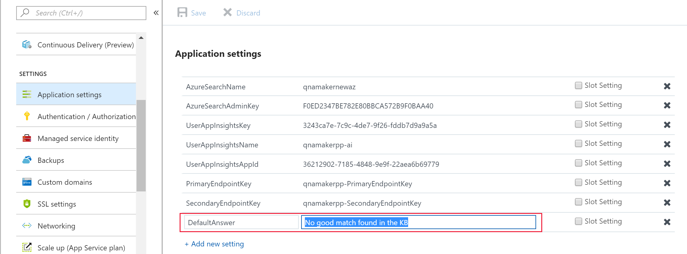

# Confidence score of a QnA Maker knowledge base
When a user query is matched against a knowledge base, QnA Maker returns relevant answers, along with a confidence score. This score indicates the confidence that the answer is the right match for the given user query. 

The confidence score is a number between 0 and 100. A score of 100 is likely an exact match, while a score of 0 means, that no matching answer was found. The higher the score- the greater the confidence in the answer. For a given query, there could be multiple answers returned. In that case, the answers are returned in order of decreasing confidence score.

In the example below, you can see one QnA entity, with 2 questions. 

For the above example- you can expect scores like the sample score range below- for different types of user queries:

The following table indicates typical confidence associated for a given score.

|Score Value|Score Meaning|Example Query|
|--|--|--|
|90 - 100|A near exact match of user query and a KB question|"My changes aren't updated in KB after publish"|
|> 70|High confidence - typically a good answer that completely answers the user's query|"I published my KB but it's not updated"|
|50 - 70|Medium confidence - typically a fairly good answer that should answer the main intent of the user query|"Should I save my updates before I publish my KB?"|
|30 - 50|Low confidence - typically a related answer, that partially answers the user's intent|" What does the save and train do?"|
|< 30|Very low confidence - typically does not answer the user's query, but has some matching words or phrases |" Where can I add synonyms to my KB"|
|0|No match, so the answer is not returned.|"How much does the service cost"|

## Choose a score threshold
The table above shows the scores that are expected on most KBs. However, since every KB is different, and has different types of words, intents and goals- we recommend you test and choose the threshold that best works for you. The default and recommended threshold that should work for most KBs, is **50**.

When choosing your threshold, keep in mind the balance between Accuracy and Coverage, and tweak your threshold based on your requirements.

- If **Accuracy** (or precision) is more important for your scenario, then increase your threshold. This way, every time you return an answer, it will be a much more CONFIDENT case, and much more likely to be the answer users are looking for. In this case, you might end up leaving more questions unanswered. *For example:* if you make the threshold **70**, you might miss some ambiguous examples likes "what is save and train?".

- If **Coverage** (or recall) is more important- and you want to answer as many questions as possible, even if there is only a partial relation to the user's question- then LOWER the threshold. This means there could be more cases where the answer does not answer the user's actual query, but gives some other somewhat related answer. *For example:* if you make the threshold **30**, you might give not very related answers like, answering with the above example, for queries like "Where can I edit my KB?"

> [!NOTE]
> Newer versions of QnA Maker include improvements to scoring logic, and could affect your threshold. Any time you update the service, make sure to test and tweak the threshold if necessary. You can check your QnA Service version [here](https://www.qnamaker.ai/UserSettings), and see how to get the latest updates [here](../How-To/troubleshooting-runtime.md).

## Improve confidence scores
To improve the confidence score of a particular response to a user query, you can add the user query to the knowledge base as an alternate question on that response. You can also use [word alterations](https://westus.dev.cognitive.microsoft.com/docs/services/5a93fcf85b4ccd136866eb37/operations/5ac266295b4ccd1554da75fd) to add synonyms to keywords in your KB.

## Similar confidence scores
When multiple responses have a similar confidence score, it is likely that the query was too generic and therefore matched with equal likelihood with multiple answers. Try to structure your QnAs better so that every QnA entity has a distinct intent.

## Confidence score differences
The confidence score of an answer may change negligibly between the test and published version of the knowledge base even if the content is the same. This is because the content of the test and the published knowledge base are located in different Azure Search indexes.
See here how the [publish](../How-To/publish-knowledge-base.md) operation works.

## No match found
When no good match is found by the ranker, the confidence score of 0.0 or "None" is returned and the default response is "No good match found in the KB". You can override this default response in the bot or application code calling the endpoint. Alternately, you can also set the override response in Azure and this changes the default for all knowledge bases deployed in a particular QnA Maker service.

### Change Default Answer

1. Go to the [Azure portal](https://portal.azure.com) and navigate to the resource group that represents the QnA Maker service you created.

2. Click to open the **App Service**.

    

3. Click on **Application Settings** and edit the **DefaultAnswer** field to the desired default response. Click **Save**.

    

4. Restart your App service

    

## Next steps
> [!div class="nextstepaction"]
> [Data sources supported](./data-sources-supported.md)
## See also 
[QnA Maker overview](../Overview/overview.md)
