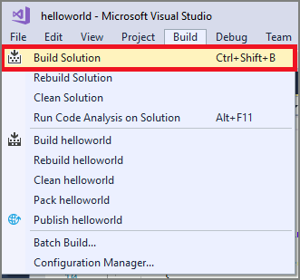

# Quickstart: Recognize speech with the Speech SDK for .NET Framework (Windows)

[!INCLUDE [Selector](../../../includes/cognitive-services-speech-service-quickstart-selector.md)]

Use this guide to create a speech-to-text console application using the .NET framework for Windows and the Speech SDK. When finished, you can use your computer's microphone to transcribe speech to text in real time.

## Prerequisites

To complete this project, you'll need:

* [Visual Studio 2017](https://visualstudio.microsoft.com/downloads/)
* A subscription key for the Speech Service. [Get one for free](get-started.md).
* Access to your computer's microphone

## Create a Visual Studio project

[!INCLUDE [Create project ](../../../includes/cognitive-services-speech-service-create-speech-project-vs-csharp.md)]

## Add sample code

1. Open `Program.cs` and replace the automatically generated code with this sample:

    [!code-csharp[Quickstart Code](~/samples-cognitive-services-speech-sdk/quickstart/csharp-dotnet-windows/helloworld/Program.cs#code)]

1. Locate and replace the string `YourSubscriptionKey` with your Speech Service subscription key.

1. Locate and replace the string `YourServiceRegion` with the [region](regions.md) associated with your subscription. For example, if you're using the free trial, the region is `westus`.

1. Save the changes to the project.

## Build and run the app

1. From the menu bar, select **Build** > **Build Solution**. The code should compile without errors now.

    

1. From the menu bar, select **Debug** > **Start Debugging**, or press **F5** to start the application.

    

1. A console window will appear, prompting you to speak. Now, say something in English. Your speech is transmitted to the Speech Service and transcribed to text in real time. The result is printed to the console.

    

## Next steps

> [!div class="nextstepaction"]
> [Explore C# samples on GitHub](https://aka.ms/csspeech/samples)

## See also

- [Customize acoustic models](how-to-customize-acoustic-models.md)
- [Customize language models](how-to-customize-language-model.md)
