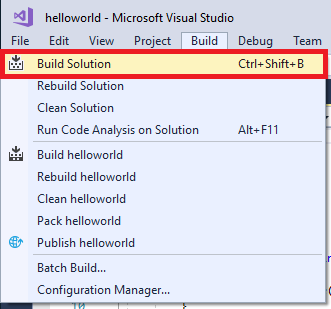
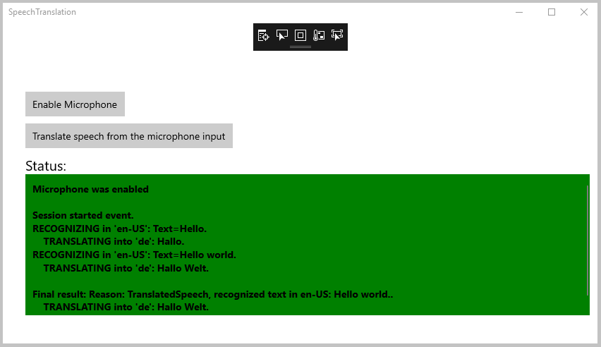

# Quickstart: Translate speech with the Speech SDK for C# (UWP)

In this quickstart, you'll create a simple Universal Windows Platform (UWP) application that captures user speech from your computer's microphone, translates the speech, and transcribes the translated text to the command line in real time. This application is designed to run on 64-bit Windows, and is built with the [Speech SDK NuGet package](https://aka.ms/csspeech/nuget) and Microsoft Visual Studio 2017.

For a complete list of languages available for speech translation, see [language support](language-support.md).

> [!NOTE]
> UWP lets you develop apps that run on any device that supports Windows 10, including PCs, Xbox, Surface Hub, and other devices.

## Prerequisites

This quickstart requires:

* [Visual Studio 2017](https://visualstudio.microsoft.com/downloads/)
* An Azure subscription key for the Speech Service. [Get one for free](get-started.md).

## Create a Visual Studio project

[!INCLUDE [](../../../includes/cognitive-services-speech-service-quickstart-uwp-create-proj.md)]

## Add sample code

1. The application's user interface is defined by using XAML. Open `MainPage.xaml` in Solution Explorer. In the designer's XAML view, insert the following XAML snippet between `<Grid>` and `</Grid>`.

    ```xaml
    <StackPanel Orientation="Vertical" HorizontalAlignment="Center"  Margin="20,50,0,0" VerticalAlignment="Center" Width="800">
        <Button x:Name="EnableMicrophoneButton" Content="Enable Microphone"  Margin="0,0,10,0" Click="EnableMicrophone_ButtonClicked" Height="35"/>
        <Button x:Name="SpeechRecognitionButton" Content="Translate speech from the microphone input" Margin="0,10,10,0" Click="SpeechTranslationFromMicrophone_ButtonClicked" Height="35"/>
        <StackPanel x:Name="StatusPanel" Orientation="Vertical" RelativePanel.AlignBottomWithPanel="True" RelativePanel.AlignRightWithPanel="True" RelativePanel.AlignLeftWithPanel="True">
            <TextBlock x:Name="StatusLabel" Margin="0,10,10,0" TextWrapping="Wrap" Text="Status:" FontSize="20"/>
            <Border x:Name="StatusBorder" Margin="0,0,0,0">
                <ScrollViewer VerticalScrollMode="Auto"  VerticalScrollBarVisibility="Auto" MaxHeight="200">
                    <!-- Use LiveSetting to enable screen readers to announce the status update. -->
                    <TextBlock x:Name="StatusBlock" FontWeight="Bold" AutomationProperties.LiveSetting="Assertive"
            MaxWidth="{Binding ElementName=Splitter, Path=ActualWidth}" Margin="10,10,10,20" TextWrapping="Wrap"  />
                </ScrollViewer>
            </Border>
        </StackPanel>
    </StackPanel>
    ```

1. Open the code-behind source file `MainPage.xaml.cs` (find it grouped under `MainPage.xaml`). Replace all the code in it with the following.

    ```csharp
    using System;
    using System.Threading.Tasks;
    using Windows.UI.Xaml;
    using Windows.UI.Xaml.Controls;
    using Windows.UI.Xaml.Media;
    using Microsoft.CognitiveServices.Speech;
    using Microsoft.CognitiveServices.Speech.Translation;

    namespace helloworld
    {
        /// <summary>
        /// An empty page that can be used on its own or navigated to within a Frame.
        /// </summary>
        public sealed partial class MainPage : Page
        {
            public MainPage()
            {
                this.InitializeComponent();
            }

            private async void EnableMicrophone_ButtonClicked(object sender, RoutedEventArgs e)
            {
                bool isMicAvailable = true;
                try
                {
                    var mediaCapture = new Windows.Media.Capture.MediaCapture();
                    var settings = new Windows.Media.Capture.MediaCaptureInitializationSettings();
                    settings.StreamingCaptureMode = Windows.Media.Capture.StreamingCaptureMode.Audio;
                    await mediaCapture.InitializeAsync(settings);
                }
                catch (Exception)
                {
                    isMicAvailable = false;
                }
                if (!isMicAvailable)
                {
                    await Windows.System.Launcher.LaunchUriAsync(new Uri("ms-settings:privacy-microphone"));
                }
                else
                {
                    NotifyUser("Microphone was enabled", NotifyType.StatusMessage);
                }
            }

            private async void SpeechTranslationFromMicrophone_ButtonClicked(object sender, RoutedEventArgs e)
            {
                // Creates an instance of a speech config with specified subscription key and service region.
                // Replace with your own subscription key and service region (e.g., "westus").
                var config = SpeechTranslationConfig.FromSubscription("YourSubscriptionKey", "YourServiceRegion");

                // Sets source and target languages.
                string fromLanguage = "en-US";
                config.SpeechRecognitionLanguage = fromLanguage;
                config.AddTargetLanguage("de");

                try
                {
                    // Creates a speech recognizer using microphone as audio input.
                    using (var recognizer = new TranslationRecognizer(config))
                    {
                        // The TaskCompletionSource to stop recognition.
                        var stopRecognition = new TaskCompletionSource<int>();

                        // Subscribes to events.
                        recognizer.Recognizing += (s, ee) =>
                        {
                            NotifyUser($"RECOGNIZING in '{fromLanguage}': Text={ee.Result.Text}", NotifyType.StatusMessage);
                            foreach (var element in ee.Result.Translations)
                            {
                                NotifyUser($"    TRANSLATING into '{element.Key}': {element.Value}", NotifyType.StatusMessage);
                            }
                        };

                        recognizer.Recognized += (s, ee) =>
                        {
                            if (ee.Result.Reason == ResultReason.TranslatedSpeech)
                            {
                                NotifyUser($"\nFinal result: Reason: {ee.Result.Reason.ToString()}, recognized text in {fromLanguage}: {ee.Result.Text}.", NotifyType.StatusMessage);
                                foreach (var element in ee.Result.Translations)
                                {
                                    NotifyUser($"    TRANSLATING into '{element.Key}': {element.Value}", NotifyType.StatusMessage);
                                }
                            }
                        };

                        recognizer.Canceled += (s, ee) =>
                        {
                            NotifyUser($"\nRecognition canceled. Reason: {ee.Reason}; ErrorDetails: {ee.ErrorDetails}", NotifyType.StatusMessage);
                        };

                        recognizer.SessionStarted += (s, ee) =>
                        {
                            NotifyUser("\nSession started event.", NotifyType.StatusMessage);
                        };

                        recognizer.SessionStopped += (s, ee) =>
                        {
                            NotifyUser("\nSession stopped event.", NotifyType.StatusMessage);
                            stopRecognition.TrySetResult(0);
                        };

                        // Starts continuous recognition. Uses StopContinuousRecognitionAsync() to stop recognition.
                        await recognizer.StartContinuousRecognitionAsync().ConfigureAwait(false);

                        // Waits for completion.
                        // Use Task.WaitAny to keep the task rooted.
                        Task.WaitAny(new[] { stopRecognition.Task });

                        // Stops continuous recognition.
                        await recognizer.StopContinuousRecognitionAsync().ConfigureAwait(false);
                    }
                }
                catch (Exception ex)
                {
                    NotifyUser($"{ex.ToString()}", NotifyType.ErrorMessage);
                }
            }

            private enum NotifyType
            {
                StatusMessage,
                ErrorMessage
            };

            private void NotifyUser(string strMessage, NotifyType type)
            {
                // If called from the UI thread, then update immediately.
                // Otherwise, schedule a task on the UI thread to perform the update.
                if (Dispatcher.HasThreadAccess)
                {
                    UpdateStatus(strMessage, type);
                }
                else
                {
                    var task = Dispatcher.RunAsync(Windows.UI.Core.CoreDispatcherPriority.Normal, () => UpdateStatus(strMessage, type));
                }
            }

            private void UpdateStatus(string strMessage, NotifyType type)
            {
                switch (type)
                {
                    case NotifyType.StatusMessage:
                        StatusBorder.Background = new SolidColorBrush(Windows.UI.Colors.Green);
                        break;
                    case NotifyType.ErrorMessage:
                        StatusBorder.Background = new SolidColorBrush(Windows.UI.Colors.Red);
                        break;
                }
                StatusBlock.Text += string.IsNullOrEmpty(StatusBlock.Text) ? strMessage : "\n" + strMessage;

                // Collapse the StatusBlock if it has no text to conserve real estate.
                StatusBorder.Visibility = !string.IsNullOrEmpty(StatusBlock.Text) ? Visibility.Visible : Visibility.Collapsed;
                if (!string.IsNullOrEmpty(StatusBlock.Text))
                {
                    StatusBorder.Visibility = Visibility.Visible;
                    StatusPanel.Visibility = Visibility.Visible;
                }
                else
                {
                    StatusBorder.Visibility = Visibility.Collapsed;
                    StatusPanel.Visibility = Visibility.Collapsed;
                }
                // Raise an event if necessary to enable a screen reader to announce the status update.
                var peer = Windows.UI.Xaml.Automation.Peers.FrameworkElementAutomationPeer.FromElement(StatusBlock);
                if (peer != null)
                {
                    peer.RaiseAutomationEvent(Windows.UI.Xaml.Automation.Peers.AutomationEvents.LiveRegionChanged);
                }
            }
        }
    }
    ```

1. In the `SpeechTranslationFromMicrophone_ButtonClicked` handler in this file, replace the string `YourSubscriptionKey` with your subscription key.

1. In the `SpeechTranslationFromMicrophone_ButtonClicked` handler, replace the string `YourServiceRegion` with the [region](regions.md) associated with your subscription (for example, `westus` for the free trial subscription).

1. Save all changes to the project.

## Build and run the app

1. Build the application. From the menu bar, select **Build** > **Build Solution**. The code should compile without errors now.

    

1. Start the application. From the menu bar, select **Debug** > **Start Debugging**, or press **F5**.

    

1. A window pops up. Select **Enable Microphone**, and acknowledge the permission request that pops up.

    

1. Select **Speech recognition with microphone input**, and speak an English phrase or sentence into your device's microphone. Your speech is transmitted to the Speech service and transcribed to text, which appears in the window.

    

## Next steps

> [!div class="nextstepaction"]
> [Explore C# samples on GitHub](https://aka.ms/csspeech/samples)

## See also

- [Customize acoustic models](how-to-customize-acoustic-models.md)
- [Customize language models](how-to-customize-language-model.md)
