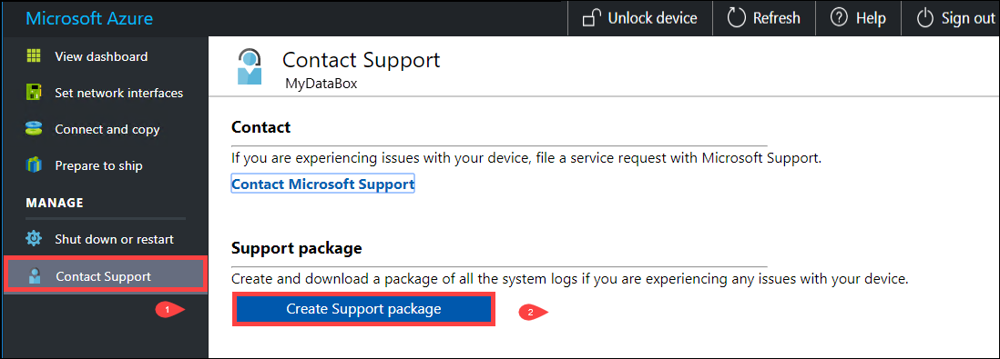
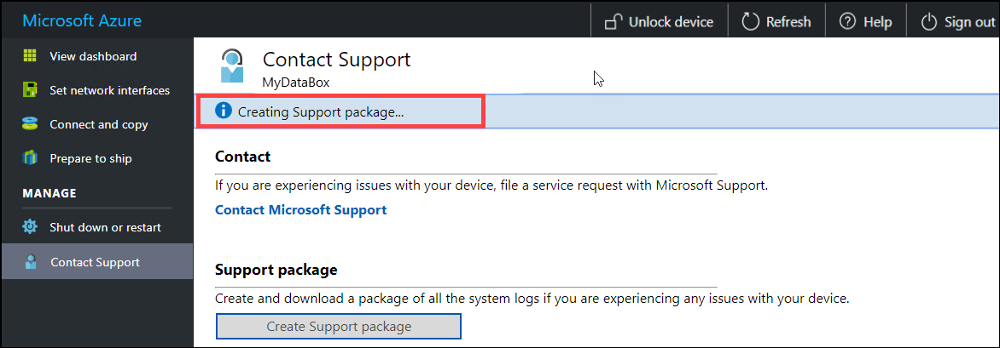
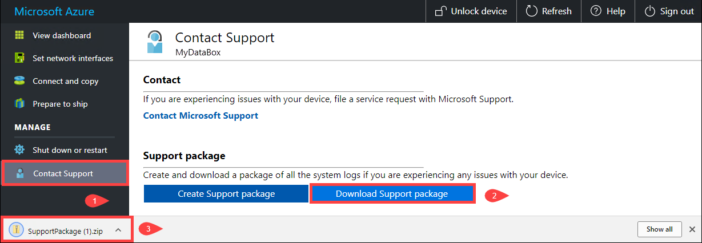
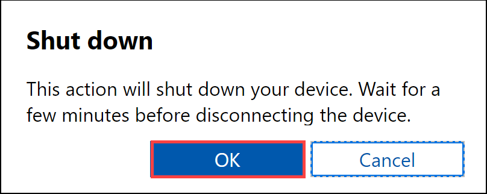

# Use the local web UI to administer your Data Box

This article describes some of the configuration and management tasks that can be performed on the Data Box. You can manage the Data Box via the Azure portal UI and the local web UI for the device. This article focuses on the tasks that you can perform using the local web UI.

Local web UI for the Data Box is used for the initial configuration of the device. You can also use the local web UI to shut down or restart the Data Box, run diagnostic tests, update software, view copy logs, and generate a log package for Microsoft Support.

This article includes the following tutorials:

- Generate a Support package
- Shut down or restart your device
- View available capacity of the device
- Skip checksum validation 

## Generate Support package

If you experience any device issues, you can create a Support package from the system logs. Microsoft Support uses this package to troubleshoot the issue. To generate a Support package, perform the following steps:

1. In the local web UI, go to **Contact Support** and click **Create Support package**.

    

2. A Support package is gathered. This operation takes a few minutes.

    

3. Once the Support package creation is complete, click **Download Support package**. 

    

4. Browse and choose the download location. Open the folder to view the contents.

    

## Shut down or restart your device

You can shut down or restart your Data Box using the local web UI. We recommend that before you restart, take the shares offline on the host and then the device. This minimizes any possibility of data corruption. Ensure that data copy is not in progress when you shut down the device.

To shut down your Data Box, perform the following steps.

1. In the local web UI, go to **Shut down or restart**.
2. Click **Shut down**.

    

3. When prompted for confirmation, click **OK** to proceed.

    

Once the device is shut down, use the power button on the front panel to turn on the device.

To restart your Data Box, perform the following steps.

1. In the local web UI, go to **Shut down or restart**.
2. Click **Restart**.

    

3. When prompted for confirmation, click **OK** to proceed.

   The device shuts down and then restarts.

## View available capacity of the device

You can use the device dashboard to view the available and used capacity of the device. 

1. In the local web UI, go to **View dashboard**.
2. Under the **Connect and copy**, the free and used space on the device is shown.

    

## Skip checksum validation

Checksum are generated for your data by default when you prepare to ship. In certain rare cases, depending on the data type (small file sizes), the performance may be really slow. In such instances, you can skip checksum. 

We strongly recommend that you do not disable checksum unless the performance is severely impacted.

1. In the top right corner of the local web UI of your device, go to Settings.

    

2. **Disable** checksum validation
3. Click **Apply**.

## Next steps

- Learn how to [Manage the Data Box via the Azure portal](data-box-portal-admin.md).

