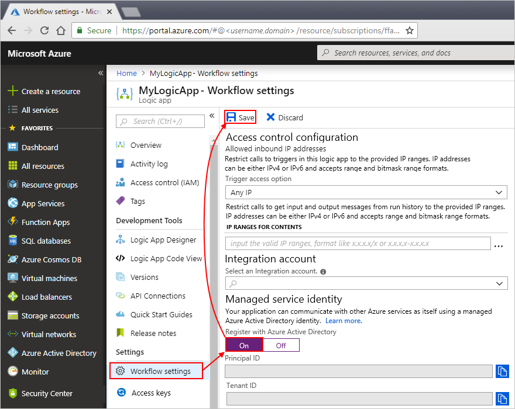
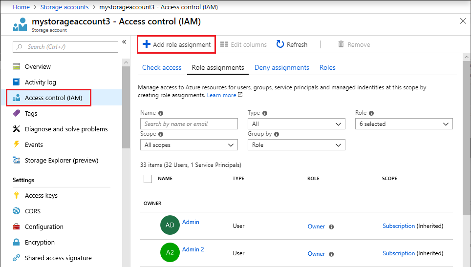
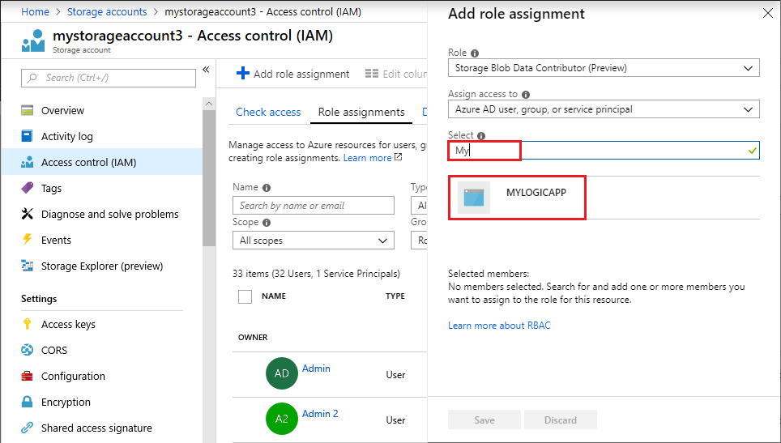
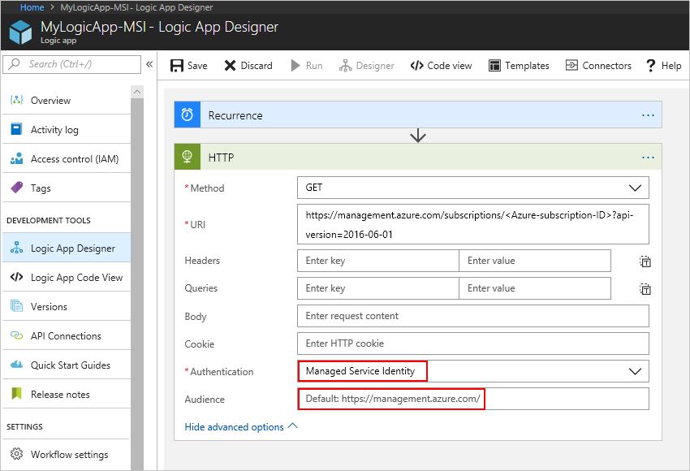
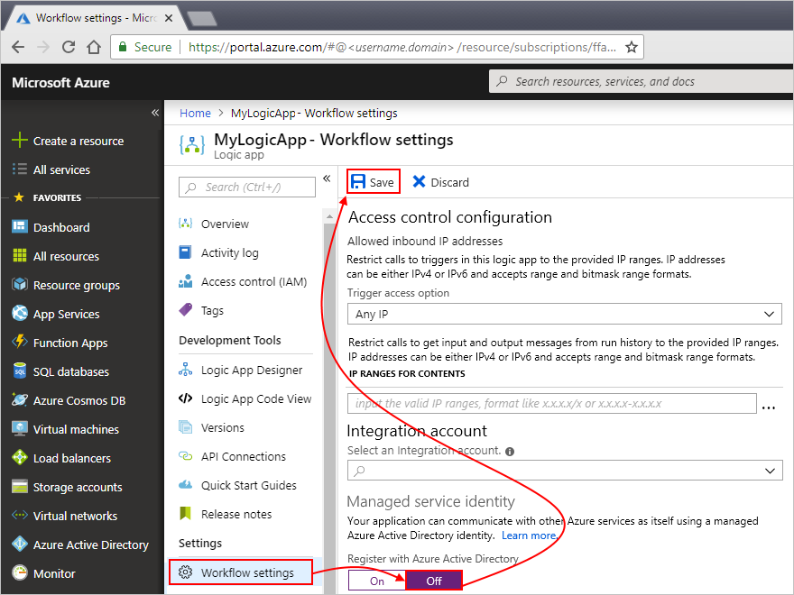

# Authenticate and access resources with managed identities in Azure Logic Apps

To access resources in other Azure Active Directory (Azure AD) tenants and 
authenticate your identity without signing in, your logic app can use a 
[managed identity](../active-directory/managed-identities-azure-resources/overview.md) 
(formerly known as Managed Service Identity or MSI), rather than credentials or secrets. 
Azure manages this identity for you and helps secure your credentials because you don't 
have to provide or rotate secrets. This article shows how you can create and use a 
system-assigned managed identity for your logic app. For more information about managed identities, 
see [What is managed identities for Azure resources?](../active-directory/managed-identities-azure-resources/overview.md)

> [!NOTE]
> You can currently have up to 10 logic app workflows with 
> system-assigned managed identities in each Azure subscription.

## Prerequisites

* An Azure subscription, or if you don't have a subscription, 
<a href="https://azure.microsoft.com/free/" target="_blank">sign up for a free Azure account</a>.

* The logic app where you want to use the system-assigned 
managed identity. If you don't have a logic app, see 
[Create your first logic app workflow](../logic-apps/quickstart-create-first-logic-app-workflow.md).

<a name="create-identity"></a>

## Create managed identity

You can create or enable a system-assigned managed identity for your 
logic app through the Azure portal, Azure Resource Manager templates, 
or Azure PowerShell. 

### Azure portal

To enable a system-assigned managed identity for your logic app through 
the Azure portal, turn on the **Register with Azure Active Directory** 
setting in your logic app's workflow settings.

1. In the [Azure portal](https://portal.azure.com), 
open your logic app in Logic App Designer.

1. Follow these steps: 

   1. On the logic app menu, under **Settings**, 
   select **Workflow settings**. 

   1. Under **Managed service identity** > 
   **Register with Azure Active Directory**, choose **On**.

   1. When you're done, choose **Save** on the toolbar.

      

      Your logic app now has a system-assigned managed identity registered 
      in Azure Active Directory with these properties and values:

      

      | Property | Value | Description | 
      |----------|-------|-------------| 
      | **Principal ID** | <*principal-ID*> | A Globally Unique Identifier (GUID) that represents the logic app in an Azure AD tenant | 
      | **Tenant ID** | <*Azure-AD-tenant-ID*> | A Globally Unique Identifier (GUID) that represents the Azure AD tenant where your logic app is now a member. Inside the Azure AD tenant, the service principal has the same name as the logic app instance. | 
      ||| 

### Deployment template

When you want to automate creating and deploying 
Azure resources such as logic apps, you can use 
[Azure Resource Manager templates](../logic-apps/logic-apps-create-deploy-azure-resource-manager-templates.md). 
To create a system-assigned managed identity for 
your logic app through a template, add the `"identity"` 
element and `"type"` property to your logic app workflow 
definition in your deployment template: 

```json
"identity": {
   "type": "SystemAssigned"
}
```

For example:

```json
{
   "apiVersion": "2016-06-01", 
   "type": "Microsoft.logic/workflows", 
   "name": "[variables('logicappName')]", 
   "location": "[resourceGroup().location]", 
   "identity": { 
      "type": "SystemAssigned" 
   }, 
   "properties": { 
      "definition": { 
         "$schema": "https://schema.management.azure.com/providers/Microsoft.Logic/schemas/2016-06-01/workflowdefinition.json#", 
         "actions": {}, 
         "parameters": {}, 
         "triggers": {}, 
         "contentVersion": "1.0.0.0", 
         "outputs": {} 
   }, 
   "parameters": {}, 
   "dependsOn": [] 
}
```

When Azure creates your logic app, that logic app's 
workflow definition includes these additional properties:

```json
"identity": {
   "type": "SystemAssigned",
   "principalId": "<principal-ID>",
   "tenantId": "<Azure-AD-tenant-ID>"
}
```

| Property | Value | Description | 
|----------|-------|-------------|
| **principalId** | <*principal-ID*> | A Globally Unique Identifier (GUID) that represents the logic app in the Azure AD tenant | 
| **tenantId** | <*Azure-AD-tenant-ID*> | A Globally Unique Identifier (GUID) that represents the Azure AD tenant where the logic app is now a member. Inside the Azure AD tenant, the service principal has the same name as the logic app instance. | 
||| 

<a name="access-other-resources"></a>

## Access resources with managed identity

After you create a system-assigned managed identity for your logic app, 
you can [give that identity access to other Azure resources](../active-directory/managed-identities-azure-resources/howto-assign-access-portal.md). 
You can then use that identity for authentication, just like any other 
[service principal](../active-directory/develop/app-objects-and-service-principals.md). 

> [!NOTE]
> Both the system-assigned managed identity and the resource where 
> you want to assign access must have the same Azure subscription.

### Assign access to managed identity

To give access to another Azure resource for your logic 
app's system-assigned managed identity, follow these steps:

1. In the Azure portal, go to the Azure resource where 
you want to assign access for your managed identity. 

1. From the resource's menu, select **Access control (IAM)**, 
and choose **Add role assignment**. 

   

1. Under **Add role assignment**, select the **Role** you want for the identity. 

1. In the **Assign access to** property, 
select **Azure AD user, group, or service principal**, 
if not already selected.

1. In the **Select** box, starting with the first character 
in your logic app's name, enter your logic app's name. 
When your logic app appears, select the logic app.

   

1. When you're done, choose **Save**.

### Authenticate with managed identity in logic app

After you set up your logic app with a system-assigned managed identity 
and assigned access to the resource you want for that identity, 
you can now use that identity for authentication. For example, 
you can use an HTTP action so your logic app can send an HTTP 
request or call to that resource. 

1. In your logic app, add the **HTTP** action. 

1. Provide the necessary details for that action, 
such as the request **Method** and **URI** location 
for the resource you want to call.

1. In the HTTP action, choose **Show advanced options**. 

1. From the **Authentication** list, select **Managed Service Identity**, 
which then shows the **Audience** property for you to set:

   

1. Continue building the logic app the way you want.

<a name="remove-identity"></a>

## Remove managed identity

To disable a system-assigned managed identity on your logic app, 
you can follow the steps similar to how you created 
the identity through the Azure portal, Azure Resource 
Manager deployment templates, or Azure PowerShell. 

When you delete your logic app, 
Azure automatically removes your logic app's 
system-assigned identity from Azure AD.

### Azure portal

1. In Logic App Designer, open your logic app.

1. Follow these steps: 

   1. On the logic app menu, under **Settings**, 
   select **Workflow settings**. 
   
   1. Under **Managed service identity**, choose **Off** 
   for the **Register with Azure Active Directory** property.

   1. When you're done, choose **Save** on the toolbar.

      

### Deployment template

If you created the logic app's system-assigned managed identity 
with an Azure Resource Manager deployment template, set the 
`"identity"` element's `"type"` property to `"None"`. 
This action also deletes the principal ID from Azure AD. 

```json
"identity": {
   "type": "None"
}
```

## Get support

* For questions, visit the [Azure Logic Apps forum](https://social.msdn.microsoft.com/Forums/en-US/home?forum=azurelogicapps).
* To submit or vote on feature ideas, visit the 
[Logic Apps user feedback site](https://aka.ms/logicapps-wish).

