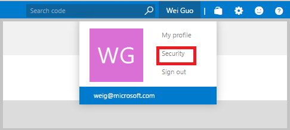
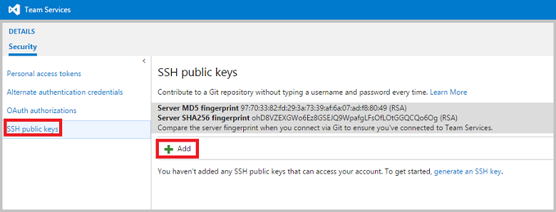

# Platforms and tools for data science projects

Microsoft provides a full spectrum of data and analytics services and resources for both cloud or on-premises platforms. They can be deployed to make the execution of your data science projects efficient and scalable. Guidance for teams implementing data science projects in a trackable, version controlled, and collaborative way is provided by the [Team Data Science Process](overview.md) (TDSP).  For an outline of the personnel roles, and their associated tasks that are handled by a data science team standardizing on this process, see [Team Data Science Process roles and tasks](roles-tasks.md).

The data and analytics services available to data science teams using the TDSP include:

- Data Science Virtual Machines (both Windows and Linux CentOS)
- HDInsight Spark Clusters
- SQL Data Warehouse
- Azure Data Lake
- HDInsight Hive Clusters
- Azure File Storage
- SQL Server 2016 R Services

In this document, we briefly describe the resources and provide links to the tutorials and walkthroughs the TDSP teams have published. They can help you learn how to use them step by step and start using them to build your intelligent applications. More information on these resources is available on their product pages. 

## Data Science Virtual Machine (DSVM)

The data science virtual machine offered on both Windows and Linux by Microsoft, contains popular tools for data science modeling and development activities. It includes tools such as:

- Microsoft R Server Developer Edition 
- Anaconda Python distribution
- Jupyter notebooks for Python and R 
- Visual Studio Community Edition with Python and R Tools on Windows / Eclipse on Linux
- Power BI desktop for Windows
- SQL Server 2016 Developer Edition on Windows / Postgres on Linux

It also includes **ML and AI tools** like CNTK (an Open Source Deep Learning toolkit from Microsoft), xgboost, mxnet and Vowpal Wabbit.

Currently DSVM is available in **Windows** and **Linux CentOS** operating systems. Choose the size of your DSVM (number of CPU cores and the amount of memory) based on the needs of the data science projects that you are planning to execute on it. 

For more information on Windows edition of DSVM, see [Microsoft Data Science Virtual Machine](https://azure.microsoft.com/marketplace/partners/microsoft-ads/standard-data-science-vm/) on the Azure marketplace. For the Linux edition of the DSVM, see [Linux Data Science Virtual Machine](https://azure.microsoft.com/marketplace/partners/microsoft-ads/linux-data-science-vm/).

To learn how to execute some of the common data science tasks on the DSVM efficiently, see [Ten things you can do on the Data science Virtual Machine](../data-science-virtual-machine/vm-do-ten-things.md)

## Azure HDInsight Spark clusters

Apache Spark is an open-source parallel processing framework that supports in-memory processing to boost the performance of big-data analytic applications. The Spark processing engine is built for speed, ease of use, and sophisticated analytics. Spark's in-memory computation capabilities make it a good choice for iterative algorithms in machine learning and for graph computations. Spark is also compatible with Azure Blob storage (WASB), so your existing data stored in Azure can easily be processed using Spark.

When you create a Spark cluster in HDInsight, you create Azure compute resources with Spark installed and configured. It takes about 10 minutes to create a Spark cluster in HDInsight. Store the data to be processed in Azure Blob storage. For information on using Azure Blob Storage with a cluster, see [Use HDFS-compatible Azure Blob storage with Hadoop in HDInsight](../../hdinsight/hdinsight-hadoop-use-blob-storage.md).

TDSP team from Microsoft has published two end-to-end walkthroughs on how to use Azure HDInsight Spark Clusters to build data science solutions, one using Python and the other Scala. For more information on Azure HDInsight **Spark Clusters**, see [Overview: Apache Spark on HDInsight Linux](../../hdinsight/spark/apache-spark-overview.md). To learn how to build a data science solution using **Python** on an Azure HDInsight Spark Cluster, see [Overview of Data Science using Spark on Azure HDInsight](spark-overview.md). To learn how to build a data science solution using **Scala** on an Azure HDInsight Spark Cluster, see [Data Science using Scala and Spark on Azure](scala-walkthrough.md). 

##  Azure SQL Data Warehouse

Azure SQL Data Warehouse allows you to scale compute resources easily and in seconds, without over-provisioning or over-paying. It also offers the unique option to pause the use of compute resources, giving you the freedom to better manage your cloud costs. The ability to deploy scalable compute resources makes it possible to bring all your data into Azure SQL Data Warehouse. Storage costs are minimal and you can run compute only on the parts of datasets that you want to analyze. 

For more information on Azure SQL Data Warehouse, see the [SQL Data Warehouse](https://azure.microsoft.com/services/sql-data-warehouse) website. To learn how to build end-to-end advanced analytics solutions with SQL Data Warehouse, see [The Team Data Science Process in action: using SQL Data Warehouse](sqldw-walkthrough.md).

## Azure Data Lake

Azure data lake is as an enterprise-wide repository of every type of data collected in a single location, prior to any formal requirements or schema being imposed. This flexibility allows every type of data to be kept in a data lake, regardless of its size or structure or how fast it is ingested. Organizations can then use Hadoop or advanced analytics to find patterns in these data lakes. Data lakes can also serve as a repository for lower-cost data preparation before curating the data and moving it into a data warehouse.

For more information on Azure Data Lake, see [Introducing Azure Data Lake](https://azure.microsoft.com/blog/introducing-azure-data-lake/). To learn how to build a scalable end-to-end data science solution with Azure Data Lake, see [Scalable Data Science in Azure Data Lake: An end-to-end Walkthrough](data-lake-walkthrough.md)

## Azure HDInsight Hive (Hadoop) clusters

Apache Hive is a data warehouse system for Hadoop, which enables data summarization, querying, and the analysis of data using HiveQL, a query language similar to SQL. Hive can be used to interactively explore your data or to create reusable batch processing jobs.

Hive allows you to project structure on largely unstructured data. After you define the structure, you can use Hive to query that data in a Hadoop cluster without having to use, or even know, Java or MapReduce. HiveQL (the Hive query language) allows you to write queries with statements that are similar to T-SQL.

For data scientists, Hive can run Python User-Defined Functions (UDFs) in Hive queries to process records. This ability extends the capability of Hive queries in data analysis considerably. Specifically, it allows data scientists to conduct scalable feature engineering in languages they are mostly familiar with: the SQL-like HiveQL and Python. 

For more information on Azure HDInsight Hive Clusters, see [Use Hive and HiveQL with Hadoop in HDInsight](../../hdinsight/hadoop/hdinsight-use-hive.md). To learn how to build a scalable end-to-end data science solution with Azure HDInsight Hive Clusters, see [The Team Data Science Process in action: using HDInsight Hadoop clusters](hive-walkthrough.md).

## Azure File Storage 

Azure File Storage is a service that offers file shares in the cloud using the standard Server Message Block (SMB) Protocol. Both SMB 2.1 and SMB 3.0 are supported. With Azure File storage, you can migrate legacy applications that rely on file shares to Azure quickly and without costly rewrites. Applications running in Azure virtual machines or cloud services or from on-premises clients can mount a file share in the cloud, just as a desktop application mounts a typical SMB share. Any number of application components can then mount and access the File storage share simultaneously.

Especially useful for data science projects is the ability to create an Azure file store as the place to share project data with your project team members. Each of them then has access to the same copy of the data in the Azure file storage. They can also use this file storage to share feature sets generated during the execution of the project. If the project is a client engagement, your clients can create an Azure file storage under their own Azure subscription to share the project data and features with you. In this way, the client has full control of the project data assets. For more information on Azure File Storage, see [Get started with Azure File storage on Windows](https://azure.microsoft.com/documentation/articles/storage-dotnet-how-to-use-files) and [How to use Azure File Storage with Linux](../../storage/files/storage-how-to-use-files-linux.md).

## SQL Server 2016 R Services

R Services (In-database) provide a platform for developing and deploying intelligent applications that can uncover new insights. You can use the rich and powerful R language, including the many packages provided by the R community, to create models and generate predictions from your SQL Server data. Because R Services (In-database) integrate the R language with SQL Server, analytics are kept close to the data, which eliminates the costs and security risks associated with moving data.

R Services (In-database) support the open source R language with a comprehensive set of SQL Server tools and technologies. They offer superior performance, security, reliability, and manageability. You can deploy R solutions using convenient and familiar tools. Your production applications can call the R runtime and retrieve predictions and visuals using Transact-SQL. You also use the ScaleR libraries to improve the scale and performance of your R solutions. For more information, see [SQL Server R Services](https://docs.microsoft.com/sql/advanced-analytics/r/sql-server-r-services).

The TDSP team from Microsoft has published two end-to-end walkthroughs that show how to build data science solutions in SQL Server 2016 R Services: one for R programmers and one for SQL developers. For **R Programmers**, see [Data Science End-to-End Walkthrough](https://docs.microsoft.com/sql/advanced-analytics/tutorials/walkthrough-data-science-end-to-end-walkthrough). For **SQL Developers**, see [In-Database Advanced Analytics for SQL Developers (Tutorial)](https://docs.microsoft.com/sql/advanced-analytics/tutorials/sqldev-in-database-r-for-sql-developers).

## Appendix: Tools to set up data science projects

### Install Git Credential Manager on Windows

If you are following the TDSP on **Windows**, you need to install the **Git Credential Manager (GCM)** to communicate with the Git repositories. To install GCM, you first need to install **Chocolaty**. To install Chocolaty and the GCM, run the following commands in Windows PowerShell as an **Administrator**:  

	iwr https://chocolatey.org/install.ps1 -UseBasicParsing | iex
	choco install git-credential-manager-for-windows -y
	

### Install Git on Linux (CentOS) machines

Run the following bash command to install Git on Linux (CentOS) machines:

	sudo yum install git

### Generate public SSH key on Linux (CentOS) machines

If you are using Linux (CentOS) machines to run the git commands, you need to add the public SSH key of your machine to your Azure DevOps Services, so that this machine is recognized by the Azure DevOps Services. First, you need to generate a public SSH key and add the key to SSH public keys in your Azure DevOps Services security setting page. 

- To generate the SSH key, run the following two commands: 

		ssh-keygen
		cat .ssh/id_rsa.pub

- Copy the entire ssh key including *ssh-rsa*. 
- Log in to your Azure DevOps Services. 
- Click **<Your Name\>** at the top right corner of the page and click **security**. 
	
	

- Click **SSH public keys**, and click **+Add**. 

	

- Paste the ssh key just copied into the text box and save.

## Next steps

Full end-to-end walkthroughs that demonstrate all the steps in the process for **specific scenarios** are also provided. They are listed and linked with thumbnail descriptions in the [Example walkthroughs](walkthroughs.md) topic. They illustrate how to combine cloud, on-premises tools, and services into a workflow or pipeline to create an intelligent application. 

For examples executing steps in the Team Data Science Process that use Azure Machine Learning Studio, see the [With Azure ML](https://docs.microsoft.com/azure/machine-learning/team-data-science-process/) learning path.