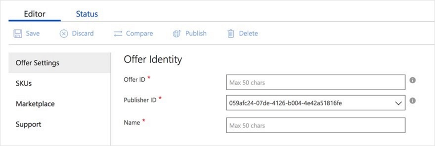
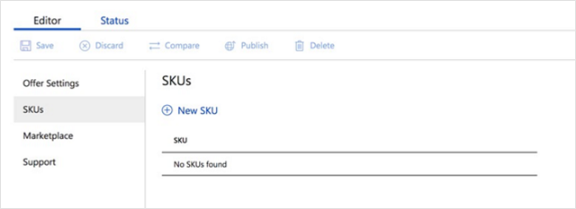
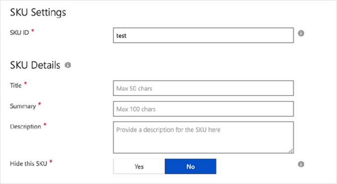
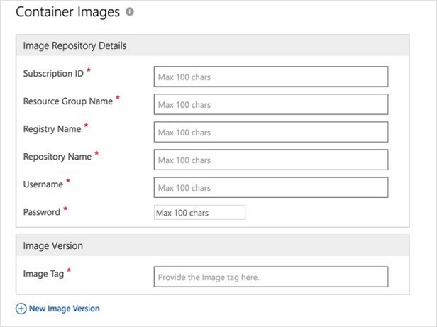
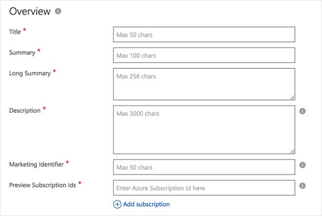
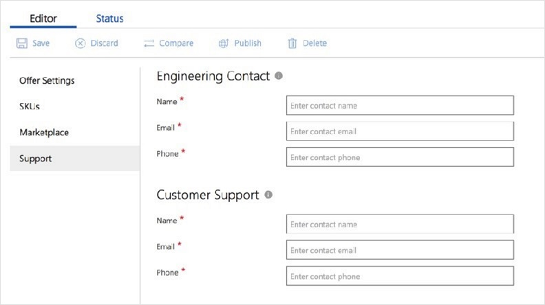

# How to publish a new IoT Edge Module in the Cloud Partner Portal

This article describes the steps for publishing a new IoT Edge module offer.

## Prerequisites

The following prerequisites apply to publishing an IoT Edge module for the Azure Marketplace.

-   Access to the [Cloud Partner Portal (CPP)](https://cloudpartner.azure.com/#alloffers). For more information, see the [publishing guide](https://docs.microsoft.com/azure/marketplace/marketplace-publishers-guide).

-   Have your IoT Edge module hosted in an Azure Container Registry.

-   Have your IoT Edge module metadata ready (including non-exhaustive list):

    -   Title

    -   Description (basic HTML format)

    -   A logo in png image format and in the following sizes: 40 pixels x 40 pixels, 90 pixels x 90 pixels, 115 pixels x 115 pixels, 255 pixels x 115 pixels.

    -   Terms of use and privacy policy

Prepare your IoT Edge Module listing in CPP
-------------------------------------------

### Create a new offer of the type IoT Edge module 

Follow these steps to prepare your IoT Edge Module listing:

-   Sign to your [CPP account](https://cloudpartner.azure.com/).

>[!Note]
>For general information about the Cloud Partner Portal, you can check
the [learn documentation](https://docs.microsoft.com/azure/marketplace/cloud-partner-portal-orig/cloud-partner-portal-getting-started-with-the-cloud-partner-portal)

-   Select **New offer**, and then select **IoT Edge Module**.

>[!NOTE]
>An IoT Edge Module is a container that is specifically made to run
>on IoT Edge. The scenarios addressed by an IoT Edge module must make sense in an IoT Edge context. It also includes default configuration settings to make the deployment to an IoT Edge device straight-forward. The container may also include the IoT Edge Module SDK to enable communication with the edgeHub and IoT Hub.

### Define your offer settings

In the Offer Settings tab, enter the information for your offer.

-   The **Offer ID** uniquely identifies your offer in CPP and may be used in customer-facing URLS.

-   The **Name** is only visible by you for referencing this offer in CPP.

### Create one or more SKUs

Each SKU corresponds to a container image. You must have at least one SKU and can add more than one. There are two parts to a SKU:

-   SKU metadata

-   Container metadata

**To create a SKU:**

Select the **SKUs** tab, and then select **New SKU**.

The SKU metadata contains the following fields, which are required:
- SKU ID - A unique identifier.
- Title - The SKU title, up to 50 characters.
- Summary - A short description, up to 100 characters.
- Description - A long description.
- Hide this SKU - The default is **No**.
   

#### IoT Edge module metadata and the container registry

The IoT Edge module's metadata has image reference information that's stored in the Azure container registry (ACR). The Azure Marketplace copies the image to the public marketplace registry, and it's available to customers after certification. All user request to  consume an IoT Edge module image are served from the Marketplace  container registry.

**Container Images**

The Image Repository Details has the following required fields:

-   **Subscription ID** The Azure subscription id where ACR registry is present.

-   **Resource group name** – The resource group name of the ACR registry.

-   **Registry name** – The ACR registry name.

-   **Repository name** – The repository name. Once set, this value can't be changed later. The name should be unique so that no other offer under your account has the same name.

-   **Username** – The username associated with ACR (admin username).

-   **Password** – The password associated with ACR.

    >[!Note]
    >The username and password are required to ensure that partners have access to the ACR described in the publishing process.

When you're publishing a IoT Edge module image, you can provide one or more image tags. Be sure to add a 'latest' tag (the default) to your module so you can easily identify the module during testing.

You can also specify the following IoT Edge module specifics:

-   **createOptions** - The default createOptions to pass so this IoT     Edge module can be started out of the box.

-   **twin:** - The default twin to pass so this IoT Edge module can be
    started out of the box when using the IoT Module SDK.

-   **routes:** - The default routes to pass so that this IoT Edge module can be started out of the box if using the IoT Module SDK.

### Describe your IoT Edge module for your customers

In the Marketplace tab, add your marketing-specific content. This information is what will be publicly visible and listed on the Azure Marketplace.

-   **Title** - The title of your IoT Edge module that's public-facing.

-   **Summary** - The summary of your IoT Edge module that's public-facing in most pages, such as the browsing pages.

-   **Long summary** - The summary of your IoT Edge module that's public-facing when the module's featured. 

-   **Description** - The description of your IoT Edge module that's public-facing on the product details page. (You can use basic HTML tags to format your description.)

-   **Marketing identifier** - A unique identifier that's used to create
    your product URL. This URL is in the following format:    *azuremarketplace.microsoft.com/enus/marketplace/apps/yourpublisherid.youriotedgemodulemarketingidentifier*.

-   **Preview subscription Ids** - Users who have access to these subscriptions will be able to see the IoT Edge module after the certification step and before it goes live.

-   **Useful links** - You can add up to 10 links that will be shown on your product details page.

-   **Suggested categories** - Pick up to five categories. They'll be shown on your product details page. Currently, all IoT Edge modules are shown under the *Internet of Things \> IoT Edge module* categories in the browse pages.

-   **Logos** - Upload your IoT Edge module logo images in the PNG format. Use the following sizes:  and
    exactly in the following sizes: 40 pixels x 40 pixels, 90 pixels  x 90 pixels, 115 pixels x 115 pixels, 255 pixels x 115 pixels.

-   **Screenshots** - Screenshots are displayed on your product details page. They're a good way to visually communicate what your IoT Edge module does and how it works. You can show architecture diagrams or use case illustrations for instance.

-   **Videos** - Videos are displayed on your product details page. They're a good way to visually communicate what your IoT Edge module does and how it works.

-   **Lead management** - You can choose a system to collect all the leads that show interest in your product.

-   **Privacy** - You must have a URL pointing to your privacy policy.

-   **Terms of use** - You must have terms of use. You can use HTML tags to format this page or point to one of your other pages.

### Enter your support contact information

In the Support tab, provide **Engineering Contact** and **Customer Support** information.

## Certify your IoT Edge module

After you provide all the information that's required, select **Publish** to send your IoT Edge module for certification. You'll see a timeline that show's the steps in the certification process.

**Module verification**

Your module is verified by our certification team. After the module is certified you'll get a private link for testing your module. If you need to make changes after testing, edit your offer's metadata and re-submit the module to the certification team. 

## Publish your IoT Edge module

After you finish testing and are ready to publish, select **Go Live** to publish your IoT Edge module.

>[!Important]
>If you want to have your IoT Edge module announced at the Ignite event, your module must be public by 09/23/2018.
