SaaS Application Technical Publishing Guide
===========================================

Welcome to the SaaS Applications Technical Publishing Guide! This guide
is designed to help candidate and existing publishers to list their
applications and services in AppSource or Azure Marketplace using the
SaaS Applications offering.

For an overview of all other Marketplace offerings, refer to the
[Marketplace Publisher Guide](https://aka.ms/sellerguide).

What are pre-requisites for publishing a SaaS App?
-------------------------------------------------

The [Cloud Partner Portal](https://cloudpartner.azure.com) provides role-based access to the portal allowing
multiple individuals to collaborate towards publishing an
offer. For more information, see [Manage Users](./cloud-partner-portal-manage-users.md). 

Before an offer can be published on behalf of a publisher account, one
of individuals with *Owner* role need to agree to comply with the
[Terms of Use](https://azure.microsoft.com/support/legal/website-terms-of-use/),
[Microsoft PrivacyStatement](https://www.microsoft.com/privacystatement/default.aspx),
and [Microsoft Azure Certified ProgramAgreement](https://azure.microsoft.com/support/legal/marketplace/certified-program-agreement/).

Creating an Offer
-----------------

This section describes the process of how to create a new SaaS App offer.

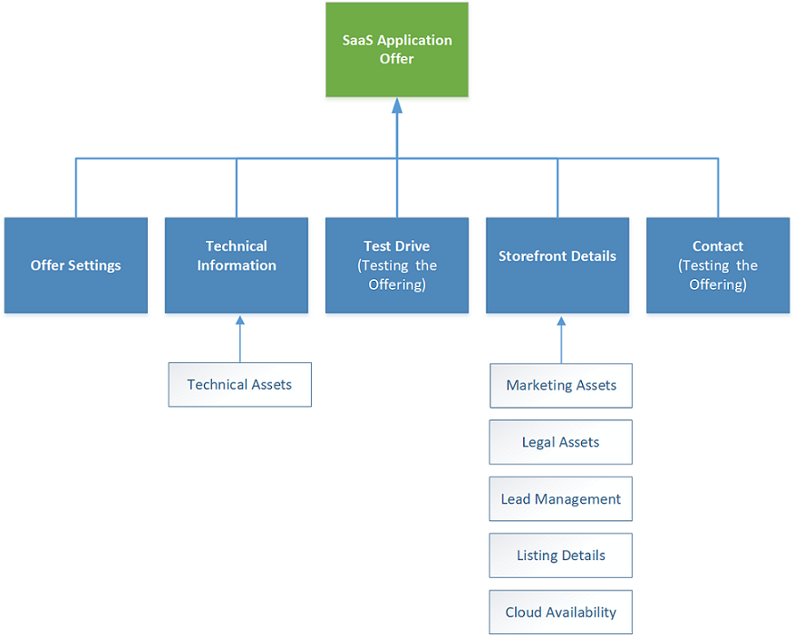

The SaaS App offer consists of five sections, described in the following table:

| **Offer Section**  | **Description**                                                                                                     |
|--------------------|-------------------------------------------------------------------------------------------------------------------------------|
| Offer Settings     | Helps to define a unique name and ID for the SaaS App                                                                         |
| Technical Info     | Helps to configure the SaaS Solution type, and provide the connection details for your application                            |
| Test Drive         | Optional section that allows you to define a service that will allow customers to test your offering before they purchase it. |
| Storefront Details | Contains the marketing, legal, lead management, and listing sections:     - The Marketing section enables you to enter the description and logos required for the offer to be properly displayed in the marketplace user portal.    - The Lead Management enables you to define a place where to redirect the end user leads generated in the Azure Marketplace End user portal.    - The Legal section enables you to enter Privacy Policy and Term of Use legal documentation.  |
| Contact            | Enables you to enter the offer’s support contact information.                                                                  |
|  |  |

### Creating a New Offer

After you sign in to the [Cloud Partner Portal](https://cloudpartner.azure.com), select the **New Offer**
item on the left menubar, which displays a menu of available
offerings. The following image shows an example of these offerings:

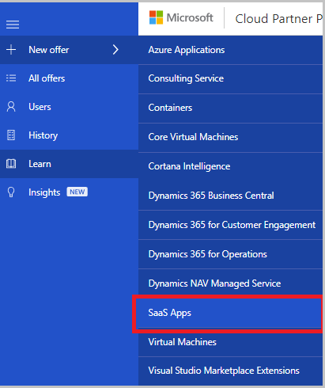

Select the offering that you have been approved for from the list, and a
new offer form will open.

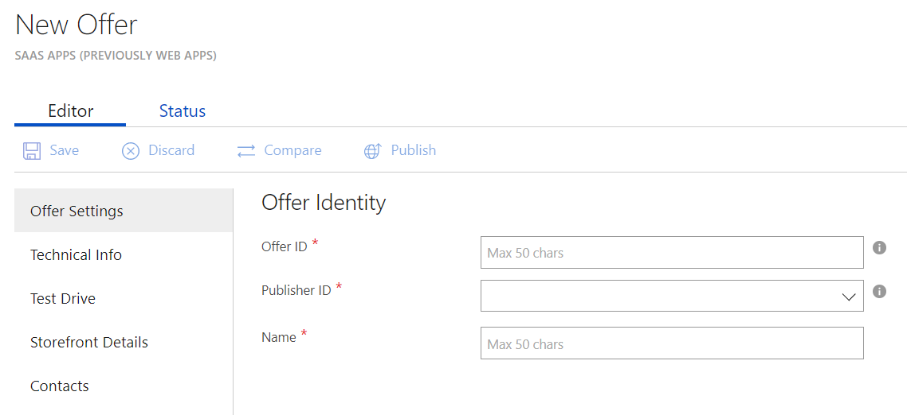

The following table describes the offer fields:

| **Offer Fields** | **Description**                                                                                            |
|------------------|----------------------------------------------------------------------------------------------------------- |
| Offer ID         | A unique identifier for the offer within a publisher profile. This ID will be visible in product URLs and billing reports. It can only be composed of lowercase alphanumeric characters or dashes (-). The ID cannot end in a dash and can have a maximum of 50 characters. Note that this field is locked once an offer goes live. For example, if a publisher, Contoso, publishes an offer with offer ID sample-vm, it will show up in Azure marketplace as: [https://azuremarketplace.microsoft.com/marketplace/apps/contoso.sample-vm?tab=Overview](https://azuremarketplace.microsoft.com/) |
| Publisher ID     | The Publisher ID is your unique identifier in the Marketplace. All your offerings should be attached your publisher ID. The Publisher ID cannot be modified once the offer is saved.                                                                                       |
| Name             | This is the display name for your offer. This is the name that will show up in Azure Marketplace and in Azure Portal. It can have a maximum of 50 characters. Guidance here is to include a recognizable brand name for your product. Don’t include your company name here unless that is how it is marketed. If you are marketing this offer at your own website, ensure that the name is exactly how it shows up in your website.             |
|  |  |

Click **Save** to save your progress. The next section describes adding plans to your offer.

### Technical Information

The technical information section allows you to enter the following information:

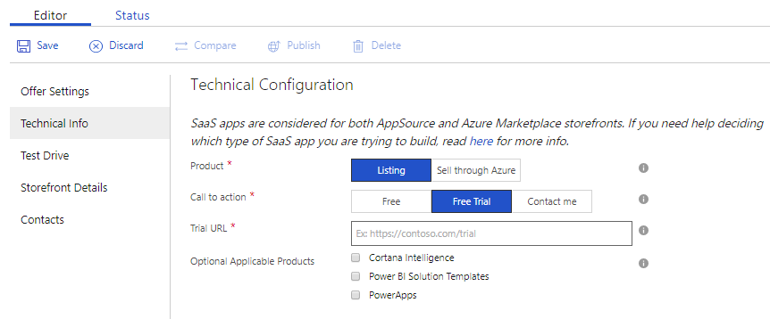

The most important decision is whether you are going to have a SaaS
listing or to have commerce enabled. If you are a SaaS listing, you must
select between:

-   Free - Provide a URL of the SaaS application where customers can get your app.
-   Free Trial - Provide a URL of the SaaS application where customers
    can run the trial before they purchase the offer.
-   Contact me - Only relevant if you have a lead management system
    connected, this option allows for customers to ask to be contacted,
    and a lead is shared with you.

If you are a SaaS app that is on the Azure Marketplace and wants to
enable commerce through Microsoft transactions, select **Sell through Azure**.  
For more information about connecting your SaaS app, see 
[SaaS - Sell through Azure](./cloud-partner-portal-saas-offer-subscriptions.md).

### Test Drive

Creating a trial experience for your customers is a best practice to
ensure they can buy with confidence. Of the trial options available,
Test Drive is the most effective at generating high-quality leads and
increased conversion of those leads.

It provides customers with a hands-on, self-guided trial of your
product's key features and benefits, demonstrated in a real-world
implementation scenario.

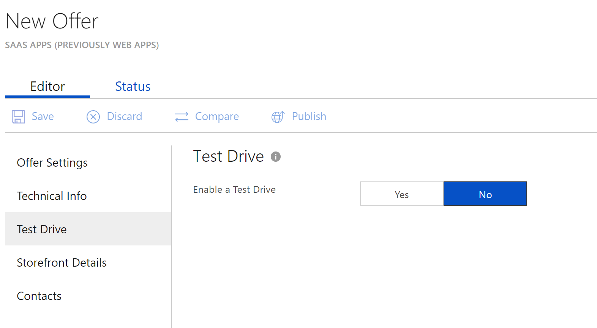

#### How a Test Drive Works

A potential customer searches and discovers your application on the
Marketplace. The customer signs in and agrees to the terms of use. At
this point, the customer receives your pre-configured environment to try
for a fixed number of hours, while you receive a highly qualified lead
to follow up with.

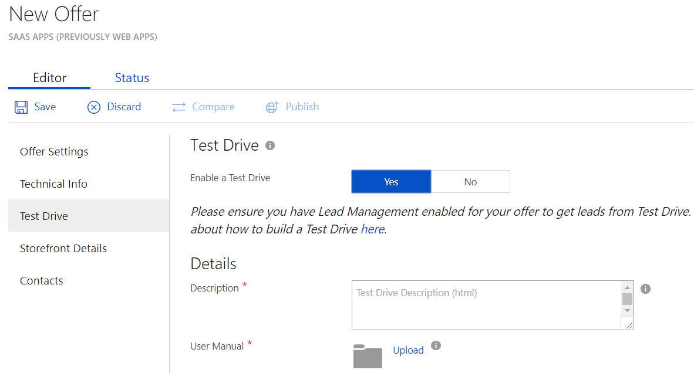

No matter how complex your application is, your Microsoft Test Drive
helps you bring your product to life for the customer. There are three
different types of Test Drives available, each based on the type of
product, scenario, and marketplace you are on.

-   **Azure Resource Manager** - An Azure ARM Test Drive is a deployment
    template that contains all of the Azure resources that comprise a
    solution being built by the publisher. Products that fit this type
    of Test Drive are ones that use only Azure resources.
-   **Logic App** - A Logic App Test Drive is a deployment template
    which is meant to encompass all complex solution architectures. All
    Dynamics applications or custom products should use this type of
    Test Drive.
-   **Power BI** - A Power BI Test Drive consists of an embedded link to
    a custom-built dashboard. Any product that wants to demonstrate an
    interactive Power BI visual should use this type of Test Drive. All
    you need to upload is your embedded Power BI URL.

The main publishing steps for adding a test Drive are:

1.  Define your Test Drive scenario
2.  Build and/or modify your Resource Manager template
3.  Create your Test Drive step-by-step manual
4.  Republish your offer

For more information, see [Test Drive](./what-is-test-drive.md).

### Storefront Details

SaaS Apps need the first two sections of a summary and description to be
provided about your app.

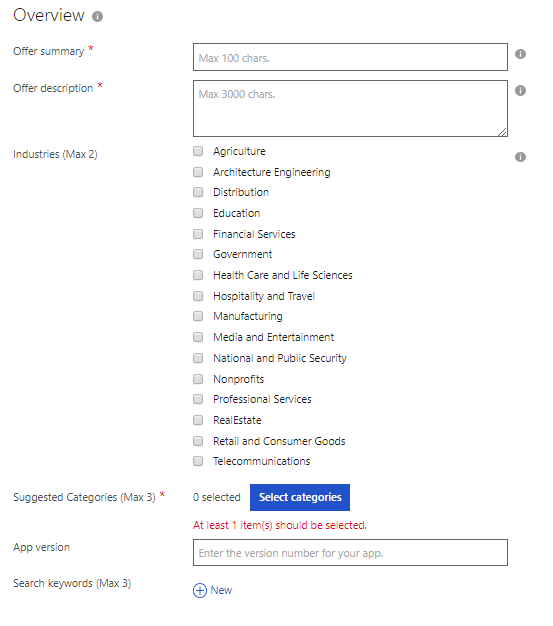

The following table describes the offer\'s Storefront Details:

| **Offer Fields**        | **Description**                                                                                          |
|-------------------------| ---------------------------------------------------------------------------------------------------------|
| Offer Summary           | Summary of your offer's value proposition. It will appear on your offer's search page. It should be a maximum of 100 characters.   |
| Offer Description       | Description that will appear on your application’s detail page. Maximum allowed is 1300 characters *Note* this field accepts HTML content with tags such as &ltp\>, &lth1\>, &lth2\>, &ltli\>, etc., that enables you to make the content much more presentable. Publishing portal team is working on adding a feature to enable one to see a preview of their storefront details to iteratively making the content more presentable - in the meanwhile, you can use any you can use any online real-time HTML tools like http://htmledit.squarefree.com to see how your description would look. |
| Industries              | Select the industries that your Offer is best aligned to. If your app relates to multiple industries, you can select a maximum of two. |
| Suggested Categories    | Select the categories that your Offer is best aligned to. You can select a maximum of three categories.     |
| Application Version     | Enter the version number of your application                                                                |
| Search Keywords (Max 3) | Enter up to three search keywords that customers can use to find your application in the Marketplace storefront website. |
|  |  |

### Marketing Artifacts

The marketing artifacts section allows you to define the Azure Marketplace marketing assets like logos, videos, screenshots, and documents:

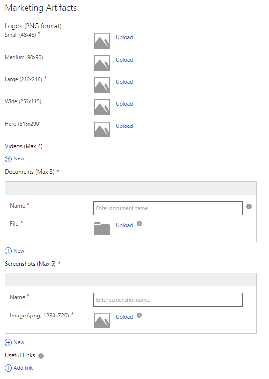

The following table describes the Marketing fields:

| **Offer Fields** | **Description**                                                                                                          |
|------------------| ------------------------------------------------------------------------------------------------------------------------ |
| Logos            | If you are a **Sell through Azure** SaaS app, you should provide all logo images. If you are just a listing, then only 2 logos are required. All the logos uploaded in the [Cloud Partner Portal](https://cloudpartner.azure.com) should use the following guidelines:       - Keep the number of primary and secondary colors on your logo low. The Azure design has a simple color palette.       -  Avoid using black or white as the background color of your logo. The theme colors of the Azure Portal are black and  white. Instead, use some color that would make your logo prominent in the Azure Portal. We recommend simple primary colors. If you are using a transparent background, then make sure that the logo and text are not black, white, or blue.       - Do not use a gradient background on the logo.       - Avoid placing text, even your company or brand name, on the logo. The look and feel of  your logo should be 'flat' and should avoid gradients.      - The logo image should not be stretched.                   |
| Videos           | Allows you to add links of videos of your offer. You can use links to YouTube and/or Vimeo videos, which are shown along with your offer to customers. You will also need to enter a thumbnail image of the video, with a png image of 1280x720 pixels. You can have a maximum of four videos per offer. |
| Documents        | Allows you to add marketing documents to your offer. All documents must be in PDF format, and you can have a maximum of three documents per offer.                                                                                                                                                      |
| Screenshots      | Allows you to add screenshots of your offer. There is a maximum of five screenshots that can be added per offer. The maximum image size is 1280x720 pixels.                                                                                                                                             |
| Useful Links     | Allows you to add external URLs for your offer to help point to architecture diagrams or other websites that a customer would want to see.                                                                                                                                                              |
|  |  |

The following image shows how the information is displayed in a Marketplace search result:

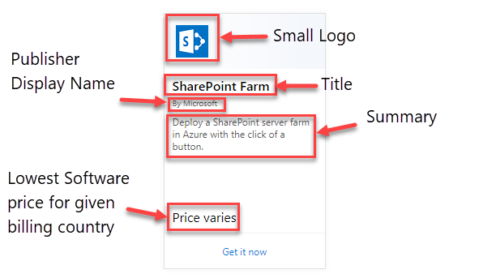

The following image shows how the offer is displayed in the Marketplace
after a customer clicks on the smaller offer tile:

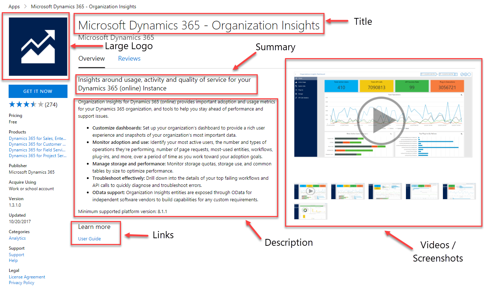

### Lead Management and Legal Information

The Legal section allows you to set the offer's legal documentation.
There are two Legal documents required for each SaaS Application offer:
Privacy Policy and the Terms of Use. For more information, see  
[Configure customer leads](./cloud-partner-portal-get-customer-leads.md).

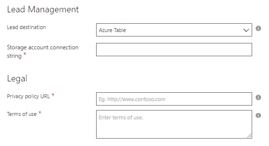

The following table describes the Legal section properties:

| **Offer Fields**   | **Description**                                                                                 |
|--------------------| ----------------------------------------------------------------------------------------------- |
| Privacy Policy URL | The URL to your company's Privacy Policy.                                                       |
| Terms of Use       | The Terms of Use for your offer. Type or copy and paste the Terms of use here. Basic HTML usage is allowed, such as that this field takes html content with tags such as &ltp\>, &lth1\>, &lth2\>, &ltli\>, etc. *Important* We highly recommend that you review and preview the HTML you created in a browser prior to submitting the offering. |
|  |  |

### Contact Information

In this section, you will enter the support contacts from your company
that will be responsible for supporting customers utilizing this offer.
There are three main areas: Engineering Contact, Support Contact, and
Support URLs:

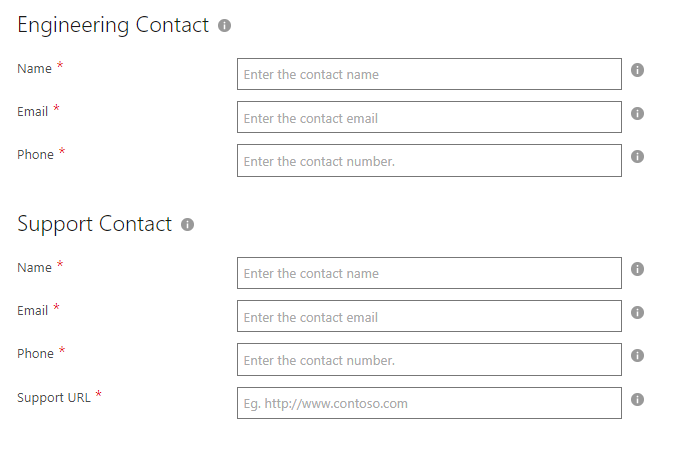

| **Contact**         | **Description**                                                                                                                          |
|---------------------|------------------------------------------------------------------------------------------------------------------------------------------|
| Engineering Contact | Provide the name, email, and phone number of an engineering contact that Microsoft can contact for any support and business issues. |
| Support Contact     | Provide the name, email, phone number, and support URL that your customers can contact when they have support requests.                  |
|  |  |

Once your offer is ready and you hit Publish, the offer goes through
certification. We test your SaaS app through a manual verification
around testing your URL if you have a listing, or endpoints if you have
Sell through Azure selected. During this manual approval, we also decide
the appropriate storefront your app should show up on (AppSource, Azure
Marketplace, or both).

Updating the Offer
------------------

There are various kinds of updates that you might want to do to your
offer after it has been published and is live. Any change you make to
your new version of your offer should be saved and republished to have
it reflect in the Marketplace.

Deleting an Existing Offer
--------------------------

You may decide to remove your offer from the Marketplace. Offer Removal
ensures that new customers may no longer purchase or deploy your offer,
however it has no impact on existing customers. Offer Termination is the
process of terminating the service and/or licensing agreement between
you and your existing customers.

Guidance and policies related to offer removal and termination are
governed by Microsoft Marketplace Publisher Agreement (see Section 7)
and the Participation Policies (see Section 6.2). This section provides
information regarding the different supported delete scenarios and the
steps you can take for them.

### Delete the Live Offer

There are various aspects that need to be taken care of if a
request to remove a live Offer. Follow the steps below to get
guidance from the support team to remove a live offer from Azure
Marketplace:

1.  Raise a support ticket using this link
2.  In the Problem Type list, select **Managing offers**, and in the
    Category list, select **Modifying an offer and/or SKU already in
    production**.
3.  Submit the request

The support team will guide you through the offer deletion process.

> [!NOTE] 
> Deleting an offer does not affect current purchases of that offer. Those customer purchases will continue to work as before.
However, the offer will not be available for any new purchases after the deletion is complete.
