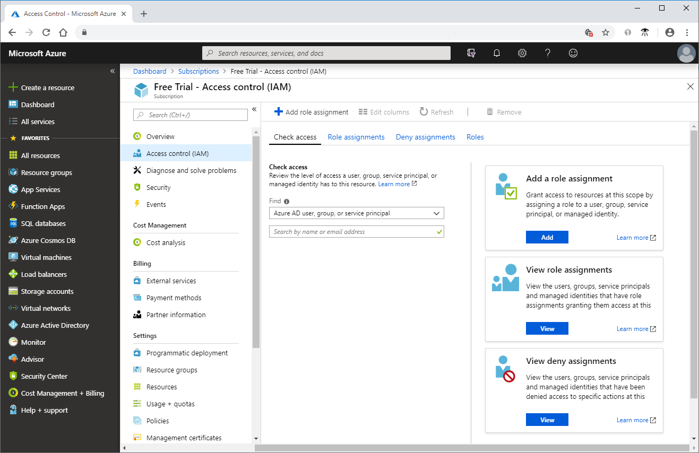
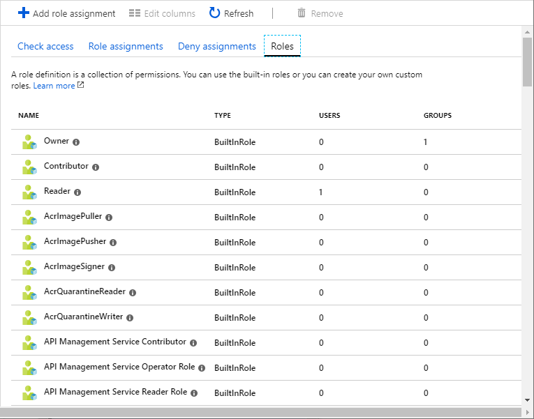
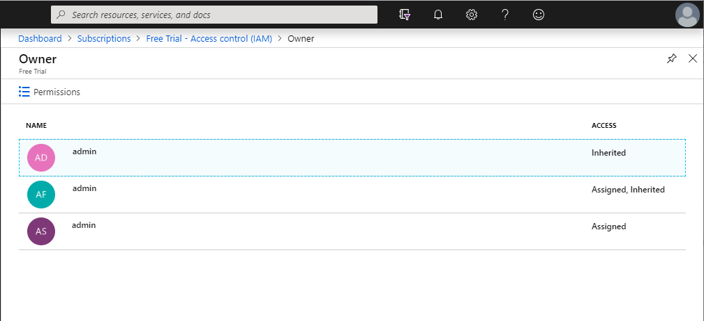
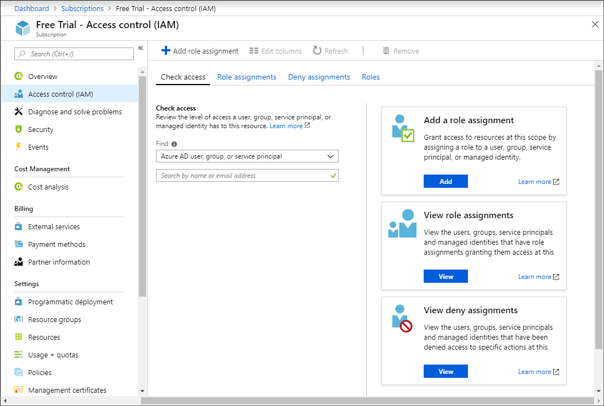
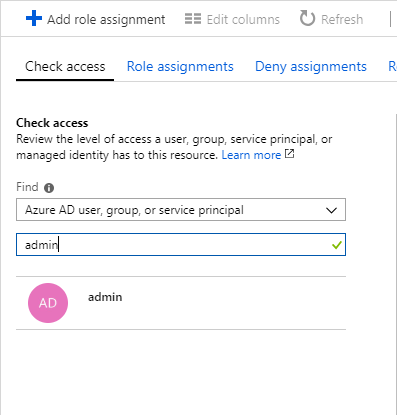
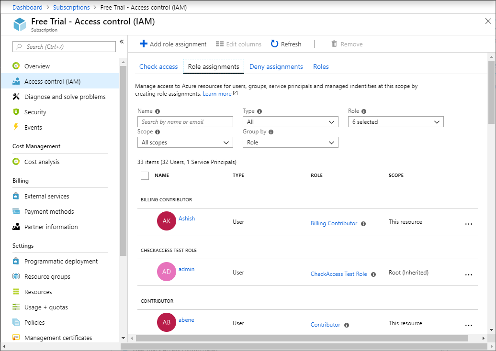
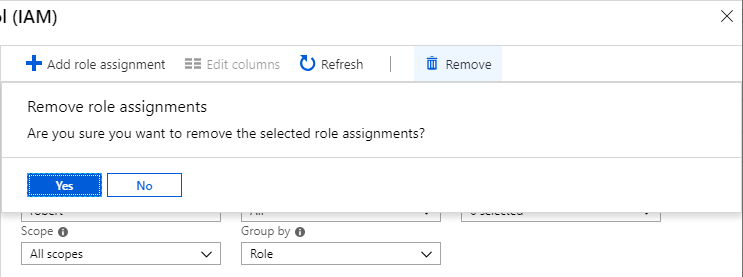
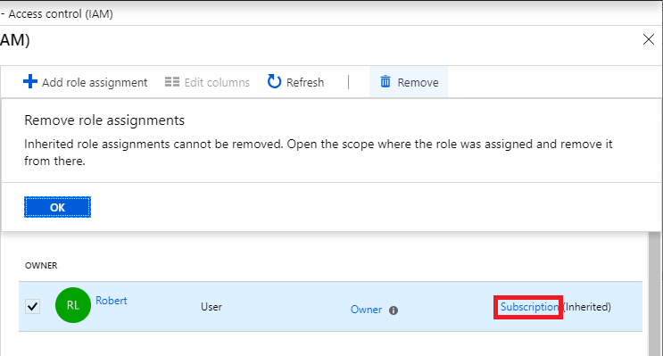

# Manage access using RBAC and the Azure portal

[Role-based access control (RBAC)](overview.md) is the way that you manage access to resources in Azure. This article describes how you manage access for users, groups, service principals, and managed identities using RBAC and the Azure portal.

## Open Access control (IAM)

The **Access control (IAM)** blade, also known as identity and access management, appears throughout the portal. To view or manage access in the portal, the first thing you typically do is open the Access control (IAM) blade at the scope where you want to view or make a change.

1. In the Azure portal, click **All services** and then select the scope or resource you want to view or manage. For example, you can select **Management groups**, **Subscriptions**, **Resource groups**, or a resource.

1. Click the specific resource you want to view or manage.

1. Click **Access control (IAM)**.

    The following shows an example of the Access control (IAM) blade for a subscription.

    

## View roles and permissions

A role definition is a collection of permissions that you use for role assignments. Azure has over 70 [built-in roles](built-in-roles.md). Follow these steps to view the roles and permissions that can be performed on the management and data plane.

1. Open **Access control (IAM)** at a scope, such as management group, subscription, resource group, or resource, where you want to view roles and permissions.

1. Click the **Roles** tab to see a list of all the built-in and custom roles.

   You can see the number of users and groups that are assigned to each role at this scope.

   

1. Click an individual role to see who has been assigned this role and also view the permissions for the role.

   

## View role assignments

When managing access, you want to know who has access, what are their permissions, and at what level. To list access for a user, group, service principal, or managed identity, you view the role assignments.

### View role assignments for a single user

Follow these steps to view the access for a single user, group, service principal, or managed identity at a particular scope.

1. Open **Access control (IAM)** at a scope, such as management group, subscription, resource group, or resource, where you want to view access.

1. Click the **Check access** tab.

    

1. In the **Find** list, select the type of security principal you want to check access for.

1. In the search box, enter a string to search the directory for display names, email addresses, or object identifiers.

    

1. Click the security principal to open the **assignments** pane.

    

    On this pane, you can see the roles assigned to the selected security principal and the scope. If there are any deny assignments at this scope or inherited to this scope, they will be listed.

### View all role assignments at a scope

1. Open **Access control (IAM)** at a scope, such as management group, subscription, resource group, or resource, where you want to view access.

1. Click the **Role assignments** tab (or click the **View** button on the View role assignments tile) to view all the role assignments at this scope.

   

   On the Role assignments tab, you can see who has access at this scope. Notice that some roles are scoped to **This resource** while others are **(Inherited)** from another scope. Access is either assigned specifically to this resource or inherited from an assignment to the parent scope.

## Add a role assignment

In RBAC, to grant access, you assign a role to a user, group, service principal, or managed identity. Follow these steps to grant access at different scopes.

### Assign a role at a scope

1. Open **Access control (IAM)** at a scope, such as management group, subscription, resource group, or resource, where you want to grant access.

1. Click the **Role assignments** tab to view all the role assignments at this scope.

1. Click **Add role assignment** to open the Add role assignment pane.

   If you don't have permissions to assign roles, the Add role assignment option will be disabled.

   

1. In the **Role** drop-down list, select a role such as **Virtual Machine Contributor**.

1. In the **Select** list, select a user, group, service principal, or managed identity. If you don't see the security principal in the list, you can type in the **Select** box to search the directory for display names, email addresses, and object identifiers.

1. Click **Save** to assign the role.

   After a few moments, the security principal is assigned the role at the selected scope.

### Assign a user as an administrator of a subscription

To make a user an administrator of an Azure subscription, assign them the [Owner](built-in-roles.md#owner) role at the subscription scope. The Owner role gives the user full access to all resources in the subscription, including the right to delegate access to others. These steps are the same as any other role assignment.

1. In the Azure portal, click **All services** and then **Subscriptions**.

1. Click the subscription where you want to grant access.

1. Click **Access control (IAM)**.

1. Click the **Role assignments** tab to view all the role assignments for this subscription.

1. Click **Add role assignment** to open the Add role assignment pane.

   If you don't have permissions to assign roles, the Add role assignment option will be disabled.

   

1. In the **Role** drop-down list, select the **Owner** role.

1. In the **Select** list, select a user. If you don't see the user in the list, you can type in the **Select** box to search the directory for display names and email addresses.

1. Click **Save** to assign the role.

   After a few moments, the user is assigned the Owner role at the subscription scope.

## Remove role assignments

In RBAC, to remove access, you remove a role assignment. Follow these steps to remove access.

1. Open **Access control (IAM)** at a scope, such as management group, subscription, resource group, or resource, where you want to remove access.

1. Click the **Role assignments** tab to view all the role assignments for this subscription.

1. In the list of role assignments, add a checkmark next to the security principal with the role assignment you want to remove.

   

1. Click **Remove**.

   

1. In the remove role assignment message that appears, click **Yes**.

    Inherited role assignments cannot be removed. If you need to remove an inherited role assignment, you must do it at the scope where the role assignment was created. In the **Scope** column, next to **(Inherited)** there is a link that takes you to the scope where this role was assigned. Go to the scope listed there to remove the role assignment.

   

## Next steps

* [Tutorial: Grant access for a user using RBAC and the Azure portal](quickstart-assign-role-user-portal.md)
* [Tutorial: Grant access for a user using RBAC and Azure PowerShell](tutorial-role-assignments-user-powershell.md)
* [Built-in roles](built-in-roles.md)
* [Organize your resources with Azure management groups](../azure-resource-manager/management-groups-overview.md)
