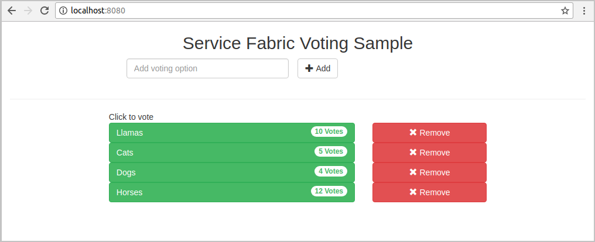
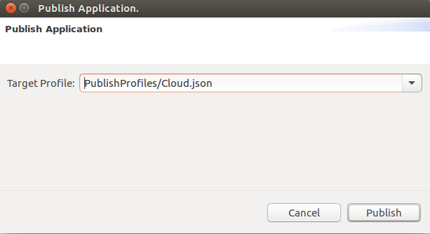

# Quickstart: Deploy a Java reliable services application to Service Fabric

Azure Service Fabric is a distributed systems platform for deploying and managing microservices and containers.

This quickstart shows how to deploy your first Java application to Service Fabric using the Eclipse IDE on a Linux developer machine. When you're finished, you have a voting application with a Java web front end that saves voting results in a stateful back-end service in the cluster.



In this quickstart, you learn how to:

* Use Eclipse as a tool for your Service Fabric Java applications
* Deploy the application to your local cluster
* Deploy the application to a cluster in Azure
* Scale-out the application across multiple nodes

## Prerequisites

To complete this quickstart:

1. [Install Service Fabric SDK & Service Fabric Command Line Interface (CLI)](https://docs.microsoft.com/azure/service-fabric/service-fabric-get-started-linux#installation-methods)
2. [Install Git](https://git-scm.com/)
3. [Install Eclipse](https://www.eclipse.org/downloads/)
4. [Set up Java Environment](https://docs.microsoft.com/azure/service-fabric/service-fabric-get-started-linux#set-up-java-development), making sure to follow the optional steps to install the Eclipse plug-in

## Download the sample

In a command window, run the following command to clone the sample app repository to your local machine.

```git
git clone https://github.com/Azure-Samples/service-fabric-java-quickstart.git
```

## Run the application locally

1. Start your local cluster by running the following command:

    ```bash
    sudo /opt/microsoft/sdk/servicefabric/common/clustersetup/devclustersetup.sh
    ```
    The startup of the local cluster takes some time. To confirm that the cluster is fully up, access the Service Fabric Explorer at **http://localhost:19080**. The five healthy nodes indicate the local cluster is up and running.

    

2. Open Eclipse.
3. Click File -> Import -> Gradle -> Existing Gradle Project and follow the wizard.
4. Click Directory and choose the `Voting` directory from the `service-fabric-java-quickstart` folder you cloned from GitHub. Click Finish.

    

5. You now have the `Voting` project in the Package Explorer for Eclipse.
6. Right click on the project and select **Publish Application...** under the **Service Fabric** dropdown. Choose **PublishProfiles/Local.json** as the Target Profile and click Publish.

    

7. Open your favorite web browser and access the application by accessing **http://localhost:8080**.

    

You can now add a set of voting options, and start taking votes. The application runs and stores all data in your Service Fabric cluster, without the need for a separate database.

## Deploy the application to Azure

### Set up your Azure Service Fabric Cluster

To deploy the application to a cluster in Azure, create your own cluster.

Party clusters are free, limited-time Service Fabric clusters hosted on Azure and run by the Service Fabric team. You can use party clusters to deploy applications and learn about the platform. The cluster uses a single, self-signed certificate for node-to-node and client-to-node security.

Sign in and join a [Linux cluster](https://aka.ms/tryservicefabric). Download the PFX certificate to your computer by clicking the **PFX** link. Click the **ReadMe** link to find the certificate password and instructions about how to configure various environments to use the certificate. Keep both the **Welcome** page and the **ReadMe** page open, you will use some of the instructions in the following steps.

> [!Note]
> There are a limited number of party clusters available per hour. If you get an error when you try to sign up for a party cluster, you can wait for a period and try again, or you can follow these steps in [Create a Service Fabric cluster on Azure](service-fabric-tutorial-create-vnet-and-linux-cluster.md) to create a cluster in your subscription.
>
> The Spring Boot service is configured to listen on port 8080 for incoming traffic. Make sure that port is open in your cluster. If you are using the Party Cluster, this port is open.
>

Service Fabric provides several tools that you can use to manage a cluster and its applications:

* Service Fabric Explorer, a browser-based tool.
* Service Fabric Command Line Interface (CLI), which runs on top of Azure CLI.
* PowerShell commands.

In this quickstart, you use the Service Fabric CLI and Service Fabric Explorer.

To use the CLI, you need to create a PEM file based on the PFX file you downloaded. To convert the file, use the following command. (For party clusters, you can copy a command specific to your PFX file from the instructions on the **ReadMe** page.)

    ```bash
    openssl pkcs12 -in party-cluster-1486790479-client-cert.pfx -out party-cluster-1486790479-client-cert.pem -nodes -passin pass:1486790479
    ```

To use Service Fabric Explorer, you need to import the certificate PFX file you downloaded from the Party Cluster website into your certificate store (Windows or Mac) or into the browser itself (Ubuntu). You need the PFX private key password, which you can get from the **ReadMe** page.

Use whatever method you are most comfortable with to import the certificate on your system. For example:

* On Windows: Double-click the PFX file and follow the prompts to install the certificate in your personal store, `Certificates - Current User\Personal\Certificates`. Alternatively, you can use the PowerShell command in the **ReadMe** instructions.
* On Mac: Double-click the PFX file and follow the prompts to install the certificate in your Keychain.
* On Ubuntu: Mozilla Firefox is the default browser in Ubuntu 16.04. To import the certificate into Firefox, click the menu button in the upper right corner of your browser, then click **Options**. On the **Preferences** page, use the search box to search for "certificates". Click **View Certificates**, select the **Your Certificates** tab, click **Import** and follow the prompts to import the certificate.

   

### Add certificate information to your application

Certificate thumbprint needs to be added to your application because it is using Service Fabric programming models.

1. You will need the thumbprint of your certificate in the `Voting/VotingApplication/ApplicationManifest.xml` file when running on a secure cluster. Run the following command to extract the thumbprint of the certificate.

    ```bash
    openssl x509 -in [CERTIFICATE_PEM_FILE] -fingerprint -noout
    ```

2. In the `Voting/VotingApplication/ApplicationManifest.xml` file, add the following snippet under the **ApplicationManifest** tag. The **X509FindValue** should be the thumbprint from the previous step (no semicolons).

    ```xml
    <Certificates>
        <SecretsCertificate X509FindType="FindByThumbprint" X509FindValue="0A00AA0AAAA0AAA00A000000A0AA00A0AAAA00" />
    </Certificates>
    ```

### Deploy the application using Eclipse

Now that the application and your cluster are ready, you can deploy it to the cluster directly from Eclipse.

1. Open the **Cloud.json** file under the **PublishProfiles** directory and fill in the `ConnectionIPOrURL` and `ConnectionPort` fields appropriately. An example is provided:

    ```bash
    {
         "ClusterConnectionParameters":
         {
            "ConnectionIPOrURL": "lnxxug0tlqm5.westus.cloudapp.azure.com",
            "ConnectionPort": "19080",
            "ClientKey": "[path_to_your_pem_file_on_local_machine]",
            "ClientCert": "[path_to_your_pem_file_on_local_machine]"
         }
    }
    ```

2. Right click on the project and select **Publish Application...** under the **Service Fabric** dropdown. Choose **PublishProfiles/Cloud.json** as the Target Profile and click Publish.

    

3. Open your web browser and access the application by accessing **http://\<ConnectionIPOrURL>:8080**.

    

## Scale applications and services in a cluster

Services can be scaled across a cluster to accommodate for a change in the load on the services. You scale a service by changing the number of instances running in the cluster. There are many ways of scaling your services; for example, you can use scripts or commands from Service Fabric CLI (sfctl). The following steps use Service Fabric Explorer.

Service Fabric Explorer runs in all Service Fabric clusters and can be accessed from a browser by browsing to the cluster's HTTP management port (19080); for example, `http://lnxxug0tlqm5.westus.cloudapp.azure.com:19080`.

To scale the web front-end service, do the following:

1. Open Service Fabric Explorer in your cluster - for example, `https://lnxxug0tlqm5.westus.cloudapp.azure.com:19080`.
2. Click on the ellipsis (three dots) next to the **fabric:/Voting/VotingWeb** node in the treeview and choose **Scale Service**.

    

    You can now choose to scale the number of instances of the web front-end service.

3. Change the number to **2** and click **Scale Service**.
4. Click on the **fabric:/Voting/VotingWeb** node in the tree-view and expand the partition node (represented by a GUID).

    

    You can now see that the service has two instances, and in the tree view you see which nodes the instances run on.

Through this simple management task, you've doubled the resources available for the front-end service to process user load. It's important to understand that you don't need multiple instances of a service for it to run reliably. If a service fails, Service Fabric makes sure that a new service instance runs in the cluster.

## Next steps

In this quickstart, you learned how to:

* Use Eclipse as a tool for your Service Fabric Java applications
* Deploy Java applications to your local cluster
* Deploy Java applications to a cluster in Azure
* Scale-out the application across multiple nodes

To learn more about working with Java apps in Service Fabric, continue to the tutorial for Java apps.

> [!div class="nextstepaction"]
> [Deploy a Java app](./service-fabric-tutorial-create-java-app.md)
