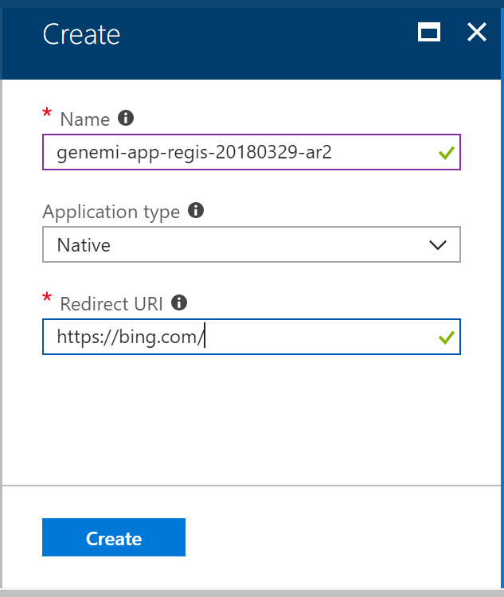
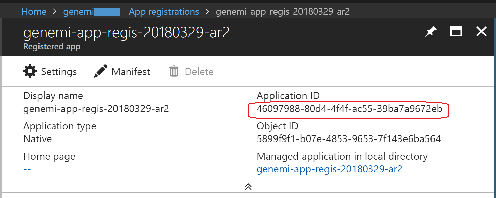
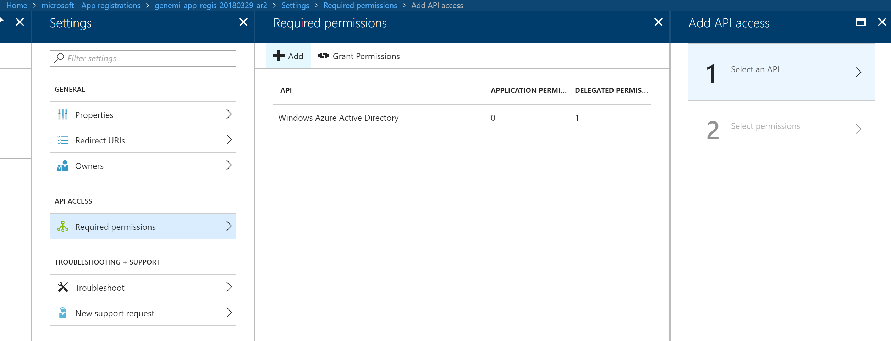
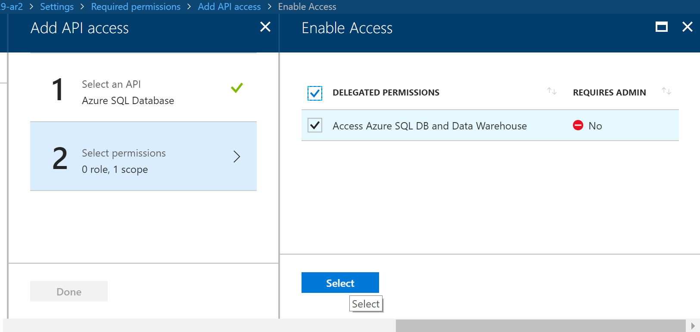

# Use ActiveDirectoryInteractive mode to connect to Azure SQL Database

This article provides a runnable C# code example that connects to your Microsoft Azure SQL Database. The C# program uses the interactive mode of authentication, which supports Azure AD multi-factor authentication (MFA). For instance, a connection attempt can include a verification code being sent to your mobile phone.

For more information about MFA support for SQL tools, see [Azure Active Directory support in SQL Server Data Tools (SSDT)](https://docs.microsoft.com/sql/ssdt/azure-active-directory).


## SqlAuthenticationMethod .ActiveDirectoryInteractive enum value

Starting in .NET Framework version 4.7.2, the enum [**SqlAuthenticationMethod**](https://docs.microsoft.com/dotnet/api/system.data.sqlclient.sqlauthenticationmethod) has a new value **.ActiveDirectoryInteractive**. When used by a client C# program, this enum value directs the system to use the Azure AD Interactive mode supporting MFA to authenticate to Azure SQL Database. The user who runs the program then sees the following dialogs:

1. A dialog that displays an Azure AD user name, and that asks for the password of the Azure AD user.
    - This dialog is not displayed if no password is needed. No password is needed if the user's domain is federated with Azure AD.

    If MFA is imposed on the user by the policy set in Azure AD, the following dialogs are displayed next.

2. Only the very first time the user experiences the MFA scenario, the system displays an additional dialog. The dialog asks for a mobile phone number to which text messages will be sent. Each message provides the *verification code* that the user must enter into the next dialog.

3. Another dialog that asks for the MFA verification code, which the system has sent to a mobile phone.

For information about how to configure Azure AD to require MFA, see [Getting started with Azure Multi-Factor Authentication in the cloud](https://docs.microsoft.com/azure/multi-factor-authentication/multi-factor-authentication-get-started-cloud).

For screenshots of these dialogs, see [Configure multi-factor authentication for SQL Server Management Studio and Azure AD](sql-database-ssms-mfa-authentication-configure.md).

> [!TIP]
> Our general search page for all kinds of .NET Framework APIs is available at the following link to our handy **.NET API Browser** tool:
>
> [https://docs.microsoft.com/dotnet/api/](https://docs.microsoft.com/dotnet/api/)
>
> By adding the type name to the optional appended **?term=** parameter, the search page can have our result ready and waiting for us:
>
> [https://docs.microsoft.com/dotnet/api/?term=SqlAuthenticationMethod](https://docs.microsoft.com/dotnet/api/?term=SqlAuthenticationMethod)


## Preparations for C#, by using the Azure portal

We assume that you already have an [Azure SQL Database server created](sql-database-get-started-portal.md) and available.


### A. Create an app registration

To use Azure AD authentication, your C# client program must supply a GUID as a *clientId* when your program attempts to connect. Completing an app registration generates and displays the GUID in the Azure portal, labeled as **Application ID**. The navigation steps are as follows:

1. Azure portal &gt; **Azure Active Directory** &gt; **App registration**

    

2. The **Application ID** value is generated and displayed.

    

3. **Registered app** &gt; **Settings** &gt; **Required permissions** &gt; **Add**

    

4. **Required permissions** &gt; **Add API access** &gt; **Select an API** &gt; **Azure SQL Database**

    

5. **API access** &gt; **Select permissions** &gt; **Delegated permissions**

    


### B. Set Azure AD admin on your SQL Database server

Each Azure SQL Database server has its own SQL logical server of Azure AD. For our C# scenario, you must set an Azure AD administrator for your Azure SQL server.

1. **SQL Server** &gt; **Active Directory admin** &gt; **Set admin**

    - For more information about Azure AD admins and users for Azure SQL Database, see the screenshots in [Configure and manage Azure Active Directory authentication with SQL Database](sql-database-aad-authentication-configure.md#provision-an-azure-active-directory-administrator-for-your-azure-sql-database-server), in its section **Provision an Azure Active Directory administrator for your Azure SQL Database server**.


### C. Prepare an Azure AD user to connect to a specific database

In the Azure AD that is specific to your Azure SQL Database server, you can add a user who shall have access to a particular database.

For more information, see [Use Azure Active Directory Authentication for authentication with SQL Database, Managed Instance, or SQL Data Warehouse](sql-database-aad-authentication.md).


### D. Add a non-admin user to Azure AD

The Azure AD admin of SQL Database server can be used to connect to your SQL Database server. However, a more general case is to add a non-admin user to the Azure AD. When the non-admin user is used to connect, the MFA sequence is invoked if MFA is imposed on this user by Azure AD.


## Azure Active Directory Authentication Library (ADAL)

The C# program relies on the namespace **Microsoft.IdentityModel.Clients.ActiveDirectory**. The classes for this namespace are in the assembly by the same name.

- Use NuGet to download and install the ADAL assembly.
    - [https://www.nuget.org/packages/Microsoft.IdentityModel.Clients.ActiveDirectory/](https://www.nuget.org/packages/Microsoft.IdentityModel.Clients.ActiveDirectory/)

- Add a reference to the assembly, to support a compile of the C# program.


## SqlAuthenticationMethod enum

One namespaces that the C# example relies on is **System.Data.SqlClient**. Of special interest is the enum **SqlAuthenticationMethod**. This enum has the following values:

- **SqlAuthenticationMethod.ActiveDirectory *Interactive***:&nbsp;  Use this with an Azure AD user name, to achieve multi-factor authentication MFA.
    - This value is the focus of the present article. It produces an interactive experience by displaying dialogs for the user password, and then for MFA validation if MFA is imposed on this user.
    - This value is available starting with .NET Framework version 4.7.2.

- **SqlAuthenticationMethod.ActiveDirectory *Integrated***:&nbsp;  Use this for a *federated* account. For a federated account, the user name is known to the Windows domain. This method does not support MFA.

- **SqlAuthenticationMethod.ActiveDirectory *Password***:&nbsp;  Use this for authentication that requires an Azure AD user and the user's password. Azure SQL Database performs the authentication. This method does not support MFA.


## Prepare C# parameter values from the Azure portal

For a successful run of the C# program, you must assign the proper values to the following static fields. These static fields act like parameters into the program. The fields are shown here with pretend values. Also shown are the locations in the Azure portal from where you can obtain the proper values:


| Static field name | Pretend value | Where in Azure portal |
| :---------------- | :------------ | :-------------------- |
| Az_SQLDB_svrName | "my-favorite-sqldb-svr.database.windows.net" | **SQL servers** &gt; **Filter by name** |
| AzureAD_UserID | "user9@abc.onmicrosoft.com" | **Azure Active Directory** &gt; **User** &gt; **New guest user** |
| Initial_DatabaseName | "master" | **SQL servers** &gt; **SQL databases** |
| ClientApplicationID | "a94f9c62-97fe-4d19-b06d-111111111111" | **Azure Active Directory** &gt; **App registrations**<br /> &nbsp; &nbsp; &gt; **Search by name** &gt; **Application ID** |
| RedirectUri | new Uri( "https://bing.com/") | **Azure Active Directory** &gt; **App registrations**<br /> &nbsp; &nbsp; &gt; **Search by name** &gt; *[Your-App-regis]* &gt;<br /> &nbsp; &nbsp; **Settings** &gt; **RedirectURIs**<br /><br />For this article, any valid value is fine for RedirectUri. The value is not really used in our case. |
| &nbsp; | &nbsp; | &nbsp; |


Depending on your particular scenario, you might not need values all the parameters in the preceding table.


## Run SSMS to verify

It is helpful to run SQL Server Management Studio (SSMS) before running the C# program. The SSMS run verifies that various configurations are correct. Then any failure of the C# program can be narrows to just its source code.


#### Verify SQL Database firewall IP addresses

Run SSMS from the same computer, in the same building, that you will later run the C# program. You can use whichever **Authentication** mode you feel is the easiest. If there is any indication that the database server firewall is not accepting your IP address, you can fix that as shown in [Azure SQL Database server-level and database-level firewall rules](sql-database-firewall-configure.md).


#### Verify multi-factor authentication (MFA) for Azure AD

Run SSMS again, this time with **Authentication** set to **Active Directory - Universal with MFA support**. For this option you must have SSMS version 17.5 or later.

For more information, see [Configure multi-factor authentication for SSMS and Azure AD](sql-database-ssms-mfa-authentication-configure.md).


## C# code example

To compile this C# example, you must add a reference to the DLL assembly named **Microsoft.IdentityModel.Clients.ActiveDirectory**.


#### Reference documentation

- **System.Data.SqlClient** namespace:
    - Search:&nbsp; [https://docs.microsoft.com/dotnet/api/?term=System.Data.SqlClient](https://docs.microsoft.com/dotnet/api/?term=System.Data.SqlClient)
    - Direct:&nbsp; [System.Data.Client](https://docs.microsoft.com/dotnet/api/system.data.sqlclient)

- **Microsoft.IdentityModel.Clients.ActiveDirectory** namespace:
    - Search:&nbsp; [https://docs.microsoft.com/dotnet/api/?term=Microsoft.IdentityModel.Clients.ActiveDirectory](https://docs.microsoft.com/dotnet/api/?term=Microsoft.IdentityModel.Clients.ActiveDirectory)
    - Direct:&nbsp; [Microsoft.IdentityModel.Clients.ActiveDirectory](https://docs.microsoft.com/dotnet/api/microsoft.identitymodel.clients.activedirectory)


#### C# source code, in two parts

&nbsp;

```csharp

using System;    // C# ,  part 1 of 2.

// Add a reference to assembly:  Microsoft.IdentityModel.Clients.ActiveDirectory.DLL
using Microsoft.IdentityModel.Clients.ActiveDirectory;

using DA = System.Data;
using SC = System.Data.SqlClient;
using AD = Microsoft.IdentityModel.Clients.ActiveDirectory;
using TX = System.Text;
using TT = System.Threading.Tasks;

namespace ADInteractive5
{
    class Program
    {
        // ASSIGN YOUR VALUES TO THESE STATIC FIELDS !!
        static public string Az_SQLDB_svrName = "<YOUR VALUE HERE>";
        static public string AzureAD_UserID = "<YOUR VALUE HERE>";
        static public string Initial_DatabaseName = "master";
        // Some scenarios do not need values for the following two fields:
        static public readonly string ClientApplicationID = "<YOUR VALUE HERE>";
        static public readonly Uri RedirectUri = new Uri("<YOUR VALUE HERE>");

        public static void Main(string[] args)
        {
            var provider = new ActiveDirectoryAuthProvider();

            SC.SqlAuthenticationProvider.SetProvider(
                SC.SqlAuthenticationMethod.ActiveDirectoryInteractive,
                //SC.SqlAuthenticationMethod.ActiveDirectoryIntegrated,  // Alternatives.
                //SC.SqlAuthenticationMethod.ActiveDirectoryPassword,
                provider);

            Program.Connection();
        }

        public static void Connection()
        {
            SC.SqlConnectionStringBuilder builder = new SC.SqlConnectionStringBuilder();

            // Program._  static values that you set earlier.
            builder["Data Source"] = Program.Az_SQLDB_svrName;
            builder.UserID = Program.AzureAD_UserID;
            builder["Initial Catalog"] = Program.Initial_DatabaseName;

            // This "Password" is not used with .ActiveDirectoryInteractive.
            //builder["Password"] = "<YOUR PASSWORD HERE>";

            builder["Connect Timeout"] = 15;
            builder["TrustServerCertificate"] = true;
            builder.Pooling = false;

            // Assigned enum value must match the enum given to .SetProvider().
            builder.Authentication = SC.SqlAuthenticationMethod.ActiveDirectoryInteractive;
            SC.SqlConnection sqlConnection = new SC.SqlConnection(builder.ConnectionString);

            SC.SqlCommand cmd = new SC.SqlCommand(
                "SELECT '******** MY QUERY RAN SUCCESSFULLY!! ********';",
                sqlConnection);

            try
            {
                sqlConnection.Open();
                if (sqlConnection.State == DA.ConnectionState.Open)
                {
                    var rdr = cmd.ExecuteReader();
                    var msg = new TX.StringBuilder();
                    while (rdr.Read())
                    {
                        msg.AppendLine(rdr.GetString(0));
                    }
                    Console.WriteLine(msg.ToString());
                    Console.WriteLine(":Success");
                }
                else
                {
                    Console.WriteLine(":Failed");
                }
                sqlConnection.Close();
            }
            catch (Exception ex)
            {
                Console.ForegroundColor = ConsoleColor.Red;
                Console.WriteLine("Connection failed with the following exception...");
                Console.WriteLine(ex.ToString());
                Console.ResetColor();
            }
        }
    } // EOClass Program .

```

&nbsp;

#### Second half of the C# program

For better visual display, the C# program is split into two code blocks. To run the program, paste the two code blocks together.

&nbsp;

```csharp

    // C# ,  part 2 of 2 ,  to concatenate below part 1.

    /// <summary>
    /// SqlAuthenticationProvider - Is a public class that defines 3 different Azure AD
    /// authentication methods.  The methods are supported in the new .NET 4.7.2 .
    ///  . 
    /// 1. Interactive,  2. Integrated,  3. Password
    ///  . 
    /// All 3 authentication methods are based on the Azure
    /// Active Directory Authentication Library (ADAL) managed library.
    /// </summary>
    public class ActiveDirectoryAuthProvider : SC.SqlAuthenticationProvider
    {
        // Program._ more static values that you set!
        private readonly string _clientId = Program.ClientApplicationID;
        private readonly Uri _redirectUri = Program.RedirectUri;

        public override async TT.Task<SC.SqlAuthenticationToken>
            AcquireTokenAsync(SC.SqlAuthenticationParameters parameters)
        {
            AD.AuthenticationContext authContext =
                new AD.AuthenticationContext(parameters.Authority);
            authContext.CorrelationId = parameters.ConnectionId;
            AD.AuthenticationResult result;

            switch (parameters.AuthenticationMethod)
            {
                case SC.SqlAuthenticationMethod.ActiveDirectoryInteractive:
                    Console.WriteLine("In method 'AcquireTokenAsync', case_0 == '.ActiveDirectoryInteractive'.");

                    result = await authContext.AcquireTokenAsync(
                        parameters.Resource,  // "https://database.windows.net/"
                        _clientId,
                        _redirectUri,
                        new AD.PlatformParameters(AD.PromptBehavior.Auto),
                        new AD.UserIdentifier(
                            parameters.UserId,
                            AD.UserIdentifierType.RequiredDisplayableId));
                    break;

                case SC.SqlAuthenticationMethod.ActiveDirectoryIntegrated:
                    Console.WriteLine("In method 'AcquireTokenAsync', case_1 == '.ActiveDirectoryIntegrated'.");

                    result = await authContext.AcquireTokenAsync(
                        parameters.Resource,
                        _clientId,
                        new AD.UserCredential());
                    break;

                case SC.SqlAuthenticationMethod.ActiveDirectoryPassword:
                    Console.WriteLine("In method 'AcquireTokenAsync', case_2 == '.ActiveDirectoryPassword'.");

                    result = await authContext.AcquireTokenAsync(
                        parameters.Resource,
                        _clientId,
                        new AD.UserPasswordCredential(
                            parameters.UserId,
                            parameters.Password));
                    break;

                default: throw new InvalidOperationException();
            }
            return new SC.SqlAuthenticationToken(result.AccessToken, result.ExpiresOn);
        }

        public override bool IsSupported(SC.SqlAuthenticationMethod authenticationMethod)
        {
            return authenticationMethod == SC.SqlAuthenticationMethod.ActiveDirectoryIntegrated
                || authenticationMethod == SC.SqlAuthenticationMethod.ActiveDirectoryInteractive
                || authenticationMethod == SC.SqlAuthenticationMethod.ActiveDirectoryPassword;
        }
    } // EOClass ActiveDirectoryAuthProvider .
} // EONamespace.  End of entire program source code.

```

&nbsp;

#### Actual test output from C#

```
[C:\Test\VSProj\ADInteractive5\ADInteractive5\bin\Debug\]
>> ADInteractive5.exe
In method 'AcquireTokenAsync', case_0 == '.ActiveDirectoryInteractive'.
******** MY QUERY RAN SUCCESSFULLY!! ********

:Success

[C:\Test\VSProj\ADInteractive5\ADInteractive5\bin\Debug\]
>>
```

&nbsp;


## Next steps

- [Get-AzureRmSqlServerActiveDirectoryAdministrator](https://docs.microsoft.com/powershell/module/azurerm.sql/get-azurermsqlserveractivedirectoryadministrator)

