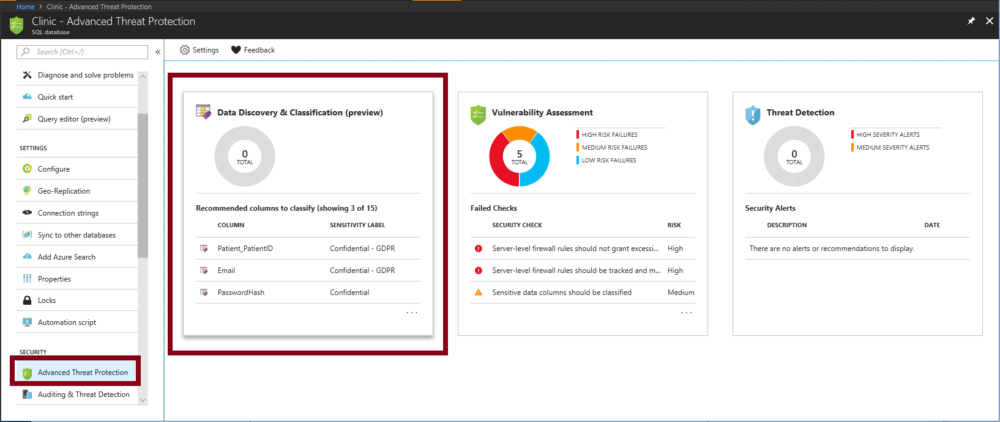
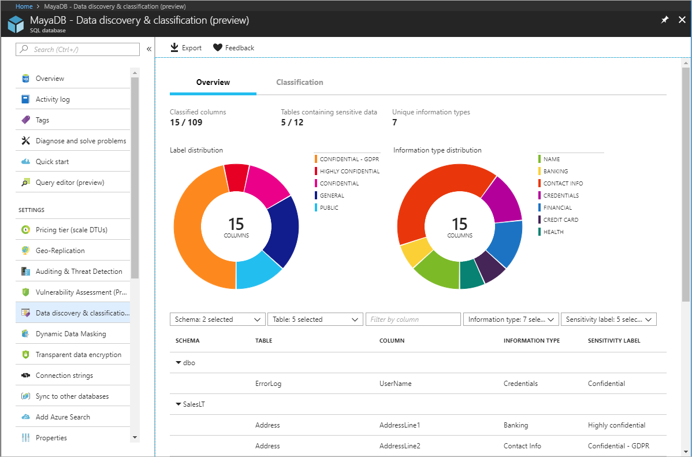
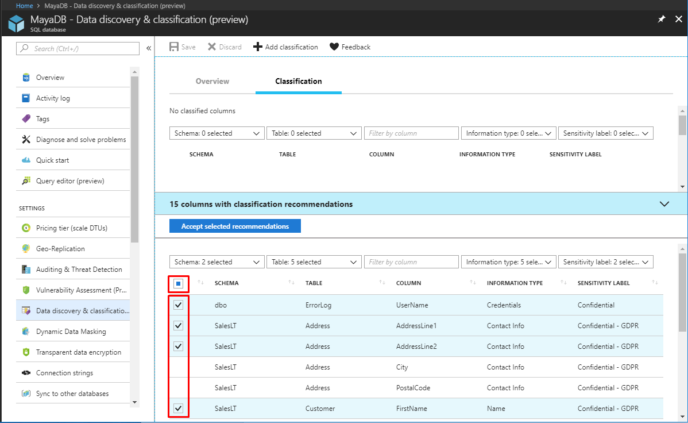
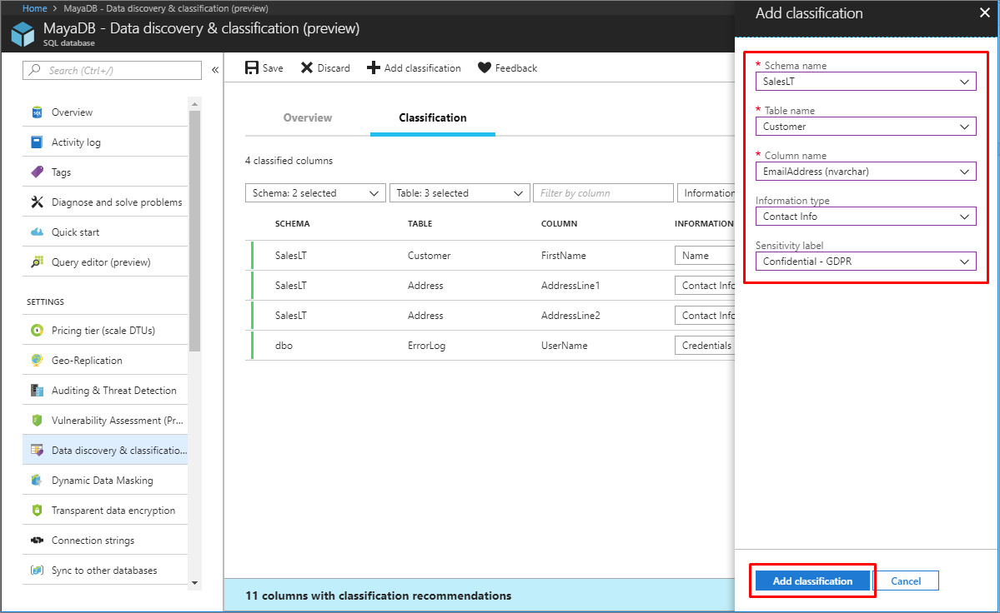

# Azure SQL Database Data Discovery and Classification

Data Discovery & Classification (currently in preview) provides advanced capabilities built into Azure SQL Database for **discovering**, **classifying**, **labeling** & **protecting** the sensitive data in your databases.
Discovering and classifying your most sensitive data (business, financial, healthcare, personally identifiable data (PII), and so on.) can play a pivotal role in your organizational information protection stature. It can serve as infrastructure for:

- Helping meet data privacy standards and regulatory compliance requirements.
- Various security scenarios, such as monitoring (auditing) and alerting on anomalous access to sensitive data.
- Controlling access to and hardening the security of databases containing highly sensitive data.

Data Discovery & Classification is part of the [SQL Advanced Threat Protection](sql-advanced-threat-protection.md) (ATP) offering, which is a unified package for advanced SQL security capabilities. Data Discovery & Classification can be accessed and managed via the central SQL ATP portal.

> [!NOTE]
> This document relates to Azure SQL Database only. For SQL Server (on-prem), see [SQL Data Discovery and Classification](https://go.microsoft.com/fwlink/?linkid=866999).

## What is Data Discovery and Classification

Data Discovery & Classification introduces a set of advanced services and new SQL capabilities, forming a new SQL Information Protection paradigm aimed at protecting the data, not just the database:

- **Discovery & recommendations**

  The classification engine scans your database and identifies columns containing potentially sensitive data. It then provides you an easy way to review and apply the appropriate classification recommendations via the Azure portal.

- **Labeling**

  Sensitivity classification labels can be persistently tagged on columns using new classification metadata attributes introduced into the SQL Engine. This metadata can then be utilized for advanced sensitivity-based auditing and protection scenarios.

- **Query result set sensitivity**

  The sensitivity of query result set is calculated in real time for auditing purposes.

- **Visibility**

  The database classification state can be viewed in a detailed dashboard in the portal. Additionally, you can download a report (in Excel format) to be used for compliance & auditing purposes, as well as other needs.

## Discover, classify & label sensitive columns

The following section describes the steps for discovering, classifying, and labeling columns containing sensitive data in your database, as well as viewing the current classification state of your database and exporting reports.

The classification includes two metadata attributes:

- Labels – The main classification attributes, used to define the sensitivity level of the data stored in the column.  
- Information Types – Provide additional granularity into the type of data stored in the column.

## Define and customize your classification taxonomy

SQL Data Discovery & Classification comes with a built-in set of sensitivity labels and a built-in set of information types and discovery logic. You now have the ability to customize this taxonomy and define a set and ranking of classification constructs specifically for your environment.

Definition and customization of your classification taxonomy is done in one central place for your entire Azure tenant. That location is in [Azure Security Center](https://docs.microsoft.com/azure/security-center/security-center-intro), as part of your Security Policy. Only someone with administrative rights on the Tenant root management group can perform this task.

As part of the Information Protection policy management, you can define custom labels, rank them, and associate them with a selected set of information types. You can also add your own custom information types and configure them with string patterns, which are added to the discovery logic for identifying this type of data in your databases.
Learn more about customizing and managing your policy in the [Information Protection policy how-to guide](https://go.microsoft.com/fwlink/?linkid=2009845&clcid=0x409).

Once the tenant-wide policy has been defined, you can continue with the classification of individual databases using your customized policy.

## Classify your SQL Database

1. Go to the [Azure portal](https://portal.azure.com).

2. Navigate to **Advanced Threat Protection** under the Security heading in your Azure SQL Database pane. Click to enable Advanced Threat Protection, and then click on the **Data discovery & classification (preview)** card.

   

3. The **Overview** tab includes a summary of the current classification state of the database, including a detailed list of all classified columns, which you can also filter to view only specific schema parts, information types and labels. If you haven’t yet classified any columns, [skip to step 5](#step-5).

   

4. To download a report in Excel format, click on the **Export** option in the top menu of the window.

   

5. To begin classifying your data, click on the **Classification tab** at the top of the window.

    

6. The classification engine scans your database for columns containing potentially sensitive data and provides a list of **recommended column classifications**. To view and apply classification recommendations:

   - To view the list of recommended column classifications, click on the recommendations panel at the bottom of the window:

      

   - Review the list of recommendations – to accept a recommendation for a specific column, check the checkbox in the left column of the relevant row. You can also mark *all recommendations* as accepted by checking the checkbox in the recommendations table header.

       

   - To apply the selected recommendations, click on the blue **Accept selected recommendations** button.

      

7. You can also **manually classify** columns as an alternative, or in addition, to the recommendation-based classification:

   - Click on **Add classification** in the top menu of the window.

      

   - In the context window that opens, select the schema > table > column that you want to classify, and the information type and sensitivity label. Then click on the blue **Add classification** button at the bottom of the context window.

      

8. To complete your classification and persistently label (tag) the database columns with the new classification metadata, click on **Save** in the top menu of the window.

   

## Auditing access to sensitive data

An important aspect of the information protection paradigm is the ability to monitor access to sensitive data. [Azure SQL Database Auditing](https://docs.microsoft.com/azure/sql-database/sql-database-auditing) has been enhanced to include a new field in the audit log called *data_sensitivity_information*, which logs the sensitivity classifications (labels) of the actual data that was returned by the query.

## Automated/Programmatic classification

You can use T-SQL to add/remove column classifications, as well as retrieve all classifications for the entire database.

> [!NOTE]
> When using T-SQL to manage labels, there is no validation that labels added to a column exist in the organizational information protection policy (the set of labels that appear in the portal recommendations). It is therefore up to you to validate this.

- Add/update the classification of one or more columns: [ADD SENSITIVITY CLASSIFICATION](https://docs.microsoft.com/sql/t-sql/statements/add-sensitivity-classification-transact-sql)
- Remove the classification from one or more columns: [DROP SENSITIVITY CLASSIFICATION](https://docs.microsoft.com/sql/t-sql/statements/drop-sensitivity-classification-transact-sql)
- View all classifications on the database: [sys.sensitivity_classifications](https://docs.microsoft.com/sql/relational-databases/system-catalog-views/sys-sensitivity-classifications-transact-sql)

You can also use REST APIs to programmatically manage classifications. The published REST APIs support the following operations:

- [Create Or Update](https://docs.microsoft.com/rest/api/sql/sensitivitylabels/createorupdate)  - Creates or updates the sensitivity label of a given column
- [Delete](https://docs.microsoft.com/rest/api/sql/sensitivitylabels/delete) - Deletes the sensitivity label of a given column
- [Get](https://docs.microsoft.com/rest/api/sql/sensitivitylabels/get)  - Gets the sensitivity label of a given column
- [List By Database](https://docs.microsoft.com/rest/api/sql/sensitivitylabels/listbydatabase) - Gets the sensitivity labels of a given database

## Next steps

- Learn more about [SQL Advanced Threat Protection](sql-advanced-threat-protection.md).
- Consider configuring [Azure SQL Database Auditing](https://docs.microsoft.com/azure/sql-database/sql-database-auditing) for monitoring and auditing access to your classified sensitive data.

<!--Anchors-->
[SQL Data Discovery & Classification overview]: #subheading-1
[Discovering, classifying & labeling sensitive columns]: #subheading-2
[Auditing access to sensitive data]: #subheading-3
[Automated/Programmatic classification]: #subheading-4
[Next Steps]: #subheading-5
