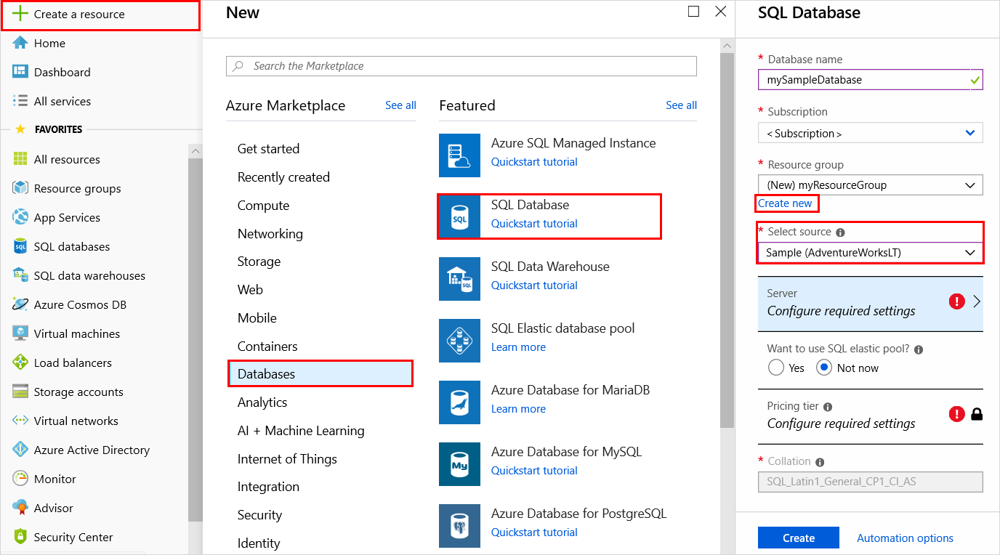
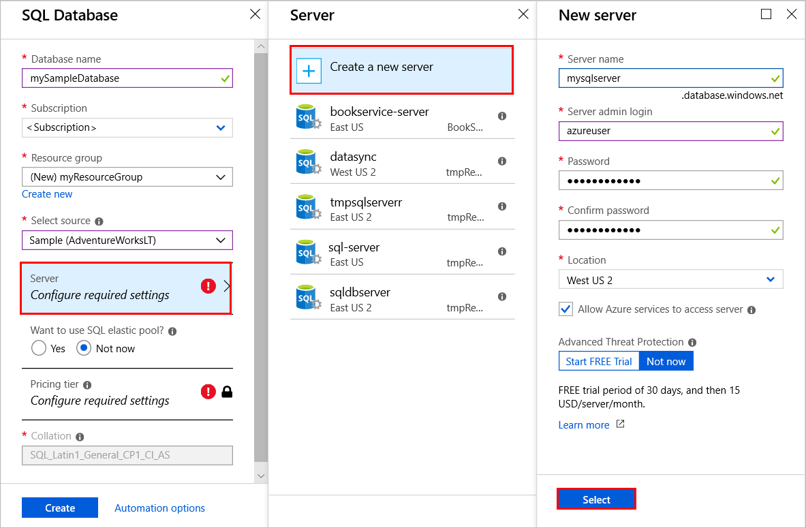
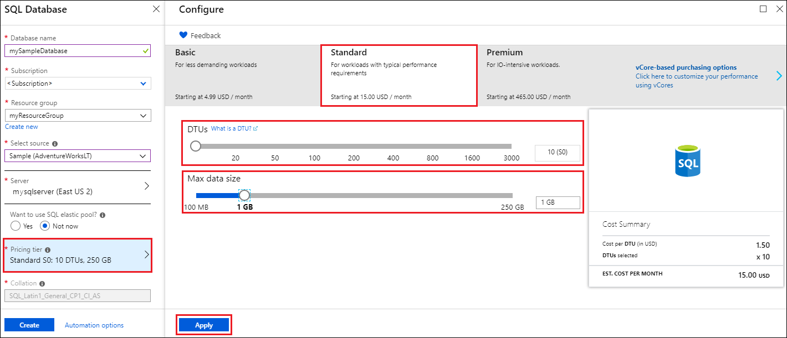
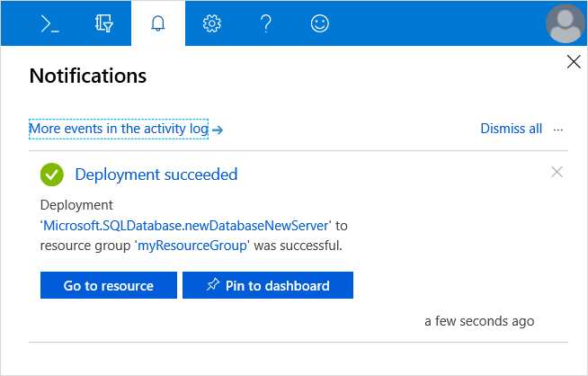
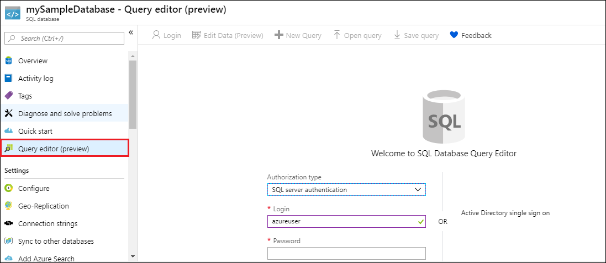

# Quickstart: Create an Azure SQL database in the Azure portal

Azure SQL Database is a *Database-as-a-Service* that lets you run and scale highly available SQL Server databases in the cloud. This quickstart shows you how to get started by creating and then querying an Azure SQL database using the Azure portal. 

If you don't have an Azure subscription, [create a free account](https://azure.microsoft.com/free/).

For all steps in this quickstart, sign in to the [Azure portal](https://portal.azure.com/).

## Create a SQL database

An Azure SQL database has a defined set of [compute and storage resources](sql-database-service-tiers-dtu.md). You create the database in an [Azure SQL Database logical server](sql-database-features.md) within an [Azure resource group](../azure-resource-manager/resource-group-overview.md).

To create a SQL database containing the AdventureWorksLT sample data:

1. Select **Create a resource** in the upper left-hand corner of the Azure portal.
   
1. Select **Databases** and then select **SQL Database**.
   
1. In the **Create SQL Database** form, type or select the following values: 
   
   - **Database name**: Enter *mySampleDatabase*.
   - **Subscription**: Drop down and select the correct subscription, if it doesn't appear.
   - **Resource group**: Select **Create new**, type *myResourceGroup*, and select **OK**. 
   - **Select source**: Drop down and select **Sample (AdventureWorksLT)**.
    
    >[!IMPORTANT]
    >Make sure to select the **Sample (AdventureWorksLT)** data so you can follow this and other Azure SQL Database quickstarts that use this data.
  
   
   
1. Under **Server**, select **Create new**. 
   
1. In the **New server** form, type or select the following values: 
   
   - **Server name**: Enter *mysqlserver*.
   - **Server admin login**: Type *azureuser*. 
   - **Password**: Enter *Azure1234567*. 
   - **Confirm Password**: Retype the password.
   - **Location**: Drop down and select any valid location.  
   
   >[!IMPORTANT]
   >Remember to record the server admin login and password so you can log in to the server and databases for this and other quickstarts. If you forget your login or password, you can get the login name or reset the password on the **SQL server** page. To open the **SQL server** page, select the server name on the database **Overview** page after database creation.
   
    

1. Choose **Select**.
   
1. On the **SQL Database** form, select **Pricing tier**. Explore the amount of DTUs and storage available for each service tier.
   
   >[!NOTE]
   >This quickstart uses the [DTU-based purchasing model](sql-database-service-tiers-dtu.md), but the [vCore-based purchasing model](sql-database-service-tiers-vcore.md) is also available.
   
   >[!NOTE]
   >More than 1 TB of storage in the Premium tier is currently available in all regions except: UK North, West Central US, UK South2, China East, USDoDCentral, Germany Central, USDoDEast, US Gov Southwest, US Gov South Central, Germany Northeast, China North, and US Gov East. In these regions, the storage max in the Premium tier is limited to 1 TB. For more information, see [P11-P15 current limitations](sql-database-dtu-resource-limits-single-databases.md#single-database-limitations-of-p11-and-p15-when-the-maximum-size-greater-than-1-tb).  
   
1. For this quickstart, select the **Standard** service tier, and then use the slider to select **10 DTUs (S0)** and **1** GB of storage.
   
1. Select **Apply**.  
   
   
   
1. On the **SQL Database** form, select **Create** to deploy and provision the resource group, server, and database. 
   
   Deployment takes a few minutes. You can select **Notifications** on the toolbar to monitor deployment progress.

   

## Query the SQL database

Now that you've created an Azure SQL database, use the built-in query tool in the Azure portal to connect to the database and query the data.

1. On the **SQL Database** page for your database, select **Query editor (preview)** in the left menu. 
   
   
   
1. Enter your login information, and select **OK**.
   
1. Enter the following query in the **Query editor** pane.
   
   ```sql
   SELECT TOP 20 pc.Name as CategoryName, p.name as ProductName
   FROM SalesLT.ProductCategory pc
   JOIN SalesLT.Product p
   ON pc.productcategoryid = p.productcategoryid;
   ```
   
1. Select **Run**, and then review the query results in the **Results** pane.

   
   
1. Close the **Query editor** page, and select **OK** when prompted to discard your unsaved edits.

## Clean up resources

Keep this resource group, SQL server, and SQL database if you want to go to the [Next steps](#next-steps). The next steps show you how to connect and query your database using different methods. 

When you're finished using these resources, you can delete them as follows:

1. From the left menu in the Azure portal, select **Resource groups**, and then select **myResourceGroup**.
1. On your resource group page, select **Delete resource group**. 
1. Enter *myResourceGroup* in the field, and then select **Delete**.

## Next steps

- Create a server-level firewall rule to connect to your Azure SQL database from on-premises or remote tools. For more information, see [Create a server-level firewall rule](sql-database-get-started-portal-firewall.md).
- After you create a server-level firewall rule, [connect and query](sql-database-connect-query.md) your database using several different tools and languages. 
  - [Connect and query using SQL Server Management Studio](sql-database-connect-query-ssms.md)
  - [Connect and query using Azure Data Studio](https://docs.microsoft.com/sql/azure-data-studio/quickstart-sql-database?toc=/azure/sql-database/toc.json)
- To create Azure SQL databases using Azure CLI, see [Azure CLI samples](sql-database-cli-samples.md).
- To create Azure SQL databases using Azure PowerShell, see [Azure PowerShell samples](sql-database-powershell-samples.md).
