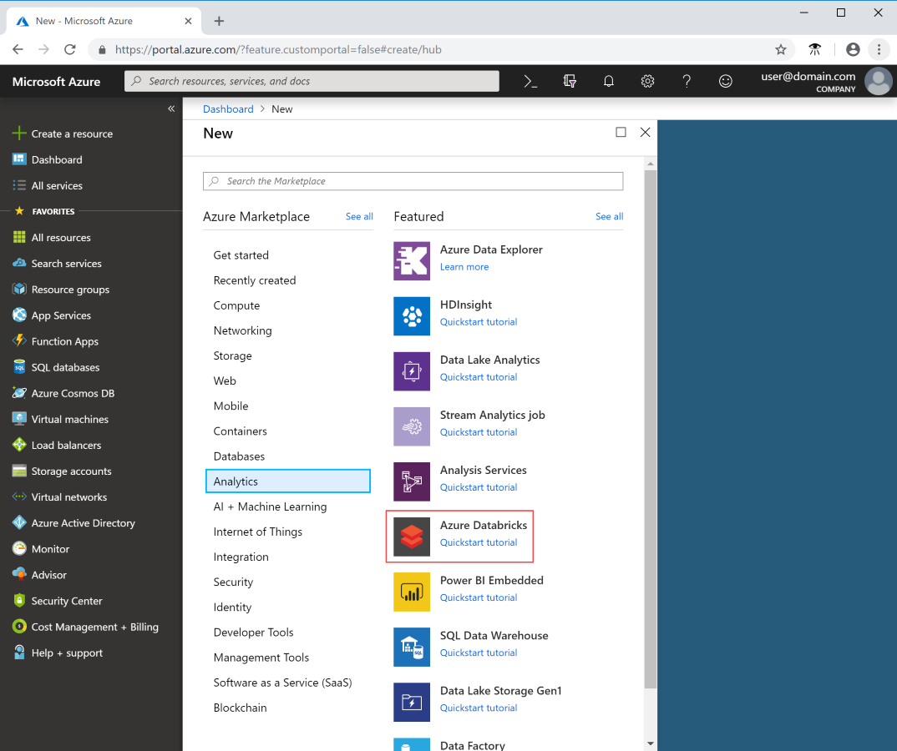
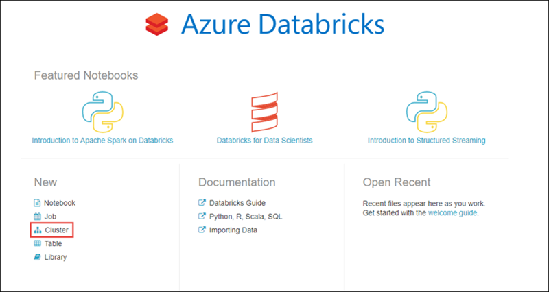
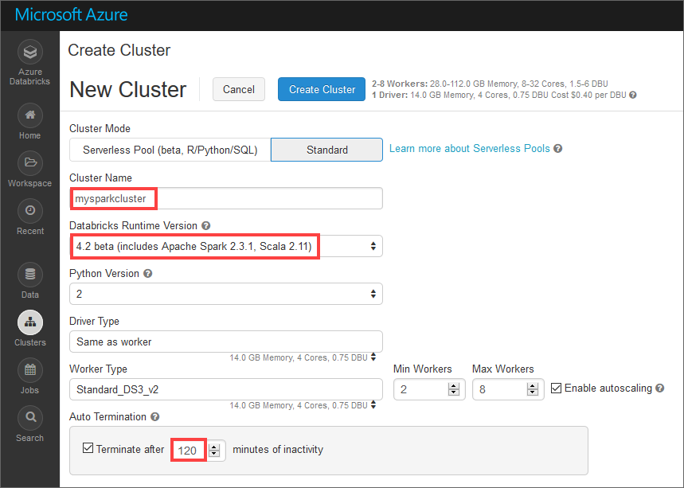
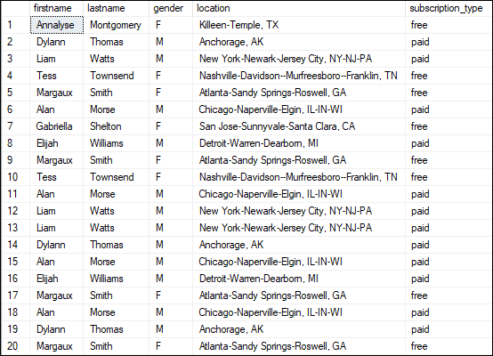

# Tutorial: Extract, transform, and load data by using Azure Databricks

In this tutorial, you use Azure Databricks to perform an ETL (extract, transform, and load data) operation. You move data from an Azure Storage account with Azure Data Lake Storage Gen2 enabled to Azure SQL Data Warehouse.

In this tutorial, you learn how to:

> [!div class="checklist"]
> * Create an Azure Databricks workspace.
> * Create a Spark cluster in Azure Databricks.
> * Create an Azure Data Lake Storage Gen2 capable account.
> * Upload data to Azure Data Lake Storage Gen2.
> * Create a notebook in Azure Databricks.
> * Extract data from Data Lake Storage Gen2.
> * Transform data in Azure Databricks.
> * Load data into Azure SQL Data Warehouse.

If you don’t have an Azure subscription, create a [free account](https://azure.microsoft.com/free/?WT.mc_id=A261C142F) before you begin.

## Prerequisites

To complete this tutorial:

* Create an Azure SQL data warehouse, create a server-level firewall rule, and connect to the server as a server admin. Follow the instructions in the [Quickstart: Create an Azure SQL data warehouse](../../sql-data-warehouse/create-data-warehouse-portal.md) article.
* Create a database master key for the Azure SQL data warehouse. Follow the instructions in the [Create a database master key](https://docs.microsoft.com/sql/relational-databases/security/encryption/create-a-database-master-key) article.
* [Create a Azure Data Lake Storage Gen2 account](data-lake-storage-quickstart-create-account.md).
* Download (**small_radio_json.json**) from the [U-SQL Examples and Issue Tracking](https://github.com/Azure/usql/blob/master/Examples/Samples/Data/json/radiowebsite/small_radio_json.json) repo and make note of the path where you save the file.
* Sign in to the [Azure portal](https://portal.azure.com/).

## Set aside storage account configuration

You'll need the name of your storage account, and a file system endpoint URI.

To get the name of your storage account in the Azure portal, choose **All Services** and filter on the term *storage*. Then, select **Storage accounts** and locate your storage account.

To get the file system endpoint URI, choose **Properties**, and in the properties pane find the value of the **Primary ADLS FILE SYSTEM ENDPOINT** field.

Paste both of these values into a text file. You'll need them soon.

<a id="service-principal"/>

## Create a service principal

Create a service principal by following the guidance in this topic: [How to: Use the portal to create an Azure AD application and service principal that can access resources](https://docs.microsoft.com/azure/active-directory/develop/howto-create-service-principal-portal).

There's a few specific things that you'll have to do as you perform the steps in that article.

:heavy_check_mark: When performing the steps in the [Create an Azure Active Directory application](https://docs.microsoft.com/azure/active-directory/develop/howto-create-service-principal-portal#create-an-azure-active-directory-application) section of the article,  make sure to set the **Sign-on URL** field of the **Create** dialog box to the endpoint URI that you just collected.

:heavy_check_mark: When performing the steps in the [Assign the application to a role](https://docs.microsoft.com/azure/active-directory/develop/howto-create-service-principal-portal#assign-the-application-to-a-role) section of the article, make sure to assign your application to the **Blob Storage Contributor Role**.

:heavy_check_mark: When performing the steps in the [Get values for signing in](https://docs.microsoft.com/azure/active-directory/develop/howto-create-service-principal-portal#get-values-for-signing-in) section of the article, paste the tenant ID, application ID, and authentication key values into a text file. You'll need those soon.

## Create the workspace

In this section, you create an Azure Databricks workspace by using the Azure portal.

1. In the Azure portal, select **Create a resource** > **Analytics** > **Azure Databricks**.

    

1. Under **Azure Databricks Service**, provide the following values to create a Databricks workspace:

    |Property  |Description  |
    |---------|---------|
    |**Workspace name**     | Provide a name for your Databricks workspace.        |
    |**Subscription**     | From the drop-down, select your Azure subscription.        |
    |**Resource group**     | Specify whether you want to create a new resource group or use an existing one. A resource group is a container that holds related resources for an Azure solution. For more information, see [Azure Resource Group overview](../../azure-resource-manager/resource-group-overview.md). |
    |**Location**     | Select **West US 2**.        |
    |**Pricing Tier**     |  Select **Standard**.     |

    

1. Select **Pin to dashboard** and then select **Create**.

1. The account creation takes a few minutes. During account creation, the portal displays the **Submitting deployment for Azure Databricks** tile on the right. To monitor the operation status, view the progress bar at the top.

    

## Create the Spark cluster

To perform the operations in this tutorial, you need a Spark cluster. Use the following steps to create the Spark cluster.

1. In the Azure portal, go to the Databricks workspace that you created, and select **Launch Workspace**.

1. You're redirected to the Azure Databricks portal. From the portal, select **Cluster**.

    

1. In the **New cluster** page, provide the values to create a cluster.

    

1. Fill in values for the following fields, and accept the default values for the other fields:

    * Enter a name for the cluster.
    * For this article, create a cluster with the **5.1** runtime.
    * Make sure you select the **Terminate after \_\_ minutes of inactivity** check box. If the cluster isn't being used, provide a duration (in minutes) to terminate the cluster.

1. Select **Create cluster**.

After the cluster is running, you can attach notebooks to the cluster and run Spark jobs.

## Create a file system

To store data in your Data Lake Storage Gen2 storage account, you need to create a file system.

First, you create a notebook in your Azure Databricks workspace and then run code snippets to create the file system in your storage account.

1. In the [Azure portal](https://portal.azure.com), go to the Azure Databricks workspace that you created, and select **Launch Workspace**.

2. On the left, select **Workspace**. From the **Workspace** drop-down, select **Create** > **Notebook**.

    

3. In the **Create Notebook** dialog box, enter a name for the notebook. Select **Scala** as the language, and then select the Spark cluster that you created earlier.

    

    Select **Create**.

4. Copy and paste the following code block into the first cell, but don't run this code yet.

    ```scala
    val configs = Map(
    "fs.azure.account.auth.type" -> "OAuth",
    "fs.azure.account.oauth.provider.type" -> "org.apache.hadoop.fs.azurebfs.oauth2.ClientCredsTokenProvider",
    "fs.azure.account.oauth2.client.id" -> "<application-id>",
    "fs.azure.account.oauth2.client.secret" -> "<authentication-key>"),
    "fs.azure.account.oauth2.client.endpoint" -> "https://login.microsoftonline.com/<tenant-id>/oauth2/token",
    "fs.azure.createRemoteFileSystemDuringInitialization"->"true")

    dbutils.fs.mount(
    source = "abfss://<file-system-name>@<storage-account-name>.dfs.core.windows.net/<directory-name>",
    mountPoint = "/mnt/<mount-name>",
    extraConfigs = configs)
    ```

5. In this code block, replace the `storage-account-name`, `application-id`, `authentication-id`, and `tenant-id` placeholder values in this code block with the values that you collected when you completed the steps in the [Set aside storage account configuration](#config) and [Create a service principal](#service-principal) sections of this article. Set the `file-system-name`, `directory-name`, and `mount-name` placeholder values to whatever names you want to give the file system, directory, and mount point.

6. Press the **SHIFT + ENTER** keys to run the code in this block.

## Upload the sample data

The next step is to upload a sample data file to the storage account to transform later in Azure Databricks.

Upload the sample data that you downloaded into your storage account. The method that you use to upload the data into your storage account differs depending on whether you have the hierarchical namespace enabled.

You can use Azure Data Factory, distp, or AzCopy (version 10) to do the upload. AzCopy version 10 is currently only available via preview. To use AzCopy, paste in the following code into a command window:

```bash
set ACCOUNT_NAME=<ACCOUNT_NAME>
set ACCOUNT_KEY=<ACCOUNT_KEY>
azcopy cp "<DOWNLOAD_PATH>\small_radio_json.json" https://<ACCOUNT_NAME>.dfs.core.windows.net/data --recursive 
```

## Extract the data

To work with the sample data in Databricks, you need to extract the data from your storage account.

Return to your Databricks notebook and enter the following code in a new cell in your notebook.

Add the following snippet in an empty code cell. Replace the placeholders shown in brackets with the values that you saved earlier from the storage account.

```scala
dbutils.widgets.text("storage_account_name", "STORAGE_ACCOUNT_NAME", "<YOUR_STORAGE_ACCOUNT_NAME>")
dbutils.widgets.text("storage_account_access_key", "YOUR_ACCESS_KEY", "<YOUR_STORAGE_ACCOUNT_SHARED_KEY>")
```

Select the Shift+Enter keys to run the code.

You can now load the sample json file as a dataframe in Azure Databricks. Paste the following code in a new cell. Replace the placeholders shown in brackets with your values.

```scala
val df = spark.read.json("abfs://<FILE_SYSTEM_NAME>@<ACCOUNT_NAME>.dfs.core.windows.net/data/small_radio_json.json")
```

Select the Shift+Enter keys to run the code.

Run the following code to see the contents of the data frame:

```scala
df.show()
```

You see an output similar to the following snippet:

```bash
+---------------------+---------+---------+------+-------------+----------+---------+-------+--------------------+------+--------+-------------+---------+--------------------+------+-------------+------+
|               artist|     auth|firstName|gender|itemInSession|  lastName|   length|  level|            location|method|    page| registration|sessionId|                song|status|           ts|userId|
+---------------------+---------+---------+------+-------------+----------+---------+-------+--------------------+------+--------+-------------+---------+--------------------+------+-------------+------+
| El Arrebato         |Logged In| Annalyse|     F|            2|Montgomery|234.57914| free  |  Killeen-Temple, TX|   PUT|NextSong|1384448062332|     1879|Quiero Quererte Q...|   200|1409318650332|   309|
| Creedence Clearwa...|Logged In|   Dylann|     M|            9|    Thomas|340.87138| paid  |       Anchorage, AK|   PUT|NextSong|1400723739332|       10|        Born To Move|   200|1409318653332|    11|
| Gorillaz            |Logged In|     Liam|     M|           11|     Watts|246.17751| paid  |New York-Newark-J...|   PUT|NextSong|1406279422332|     2047|                DARE|   200|1409318685332|   201|
...
...
```

You have now extracted the data from Azure Data Lake Storage Gen2 into Azure Databricks.

## Transform the data

The raw sample data **small_radio_json.json** file captures the audience for a radio station and has a variety of columns. In this section, you transform the data to only retrieve specific columns from the dataset.

First, retrieve only the columns **firstName**, **lastName**, **gender**, **location**, and **level** from the dataframe that you created.

```scala
val specificColumnsDf = df.select("firstname", "lastname", "gender", "location", "level")
```

You receive output as shown in the following snippet:

```bash
+---------+----------+------+--------------------+-----+
|firstname|  lastname|gender|            location|level|
+---------+----------+------+--------------------+-----+
| Annalyse|Montgomery|     F|  Killeen-Temple, TX| free|
|   Dylann|    Thomas|     M|       Anchorage, AK| paid|
|     Liam|     Watts|     M|New York-Newark-J...| paid|
|     Tess|  Townsend|     F|Nashville-Davidso...| free|
|  Margaux|     Smith|     F|Atlanta-Sandy Spr...| free|
|     Alan|     Morse|     M|Chicago-Napervill...| paid|
|Gabriella|   Shelton|     F|San Jose-Sunnyval...| free|
|   Elijah|  Williams|     M|Detroit-Warren-De...| paid|
|  Margaux|     Smith|     F|Atlanta-Sandy Spr...| free|
|     Tess|  Townsend|     F|Nashville-Davidso...| free|
|     Alan|     Morse|     M|Chicago-Napervill...| paid|
|     Liam|     Watts|     M|New York-Newark-J...| paid|
|     Liam|     Watts|     M|New York-Newark-J...| paid|
|   Dylann|    Thomas|     M|       Anchorage, AK| paid|
|     Alan|     Morse|     M|Chicago-Napervill...| paid|
|   Elijah|  Williams|     M|Detroit-Warren-De...| paid|
|  Margaux|     Smith|     F|Atlanta-Sandy Spr...| free|
|     Alan|     Morse|     M|Chicago-Napervill...| paid|
|   Dylann|    Thomas|     M|       Anchorage, AK| paid|
|  Margaux|     Smith|     F|Atlanta-Sandy Spr...| free|
+---------+----------+------+--------------------+-----+
```

You can further transform this data to rename the column **level** to **subscription_type**.

```scala
val renamedColumnsDF = specificColumnsDf.withColumnRenamed("level", "subscription_type")
renamedColumnsDF.show()
```

You receive output as shown in the following snippet.

```bash
+---------+----------+------+--------------------+-----------------+
|firstname|  lastname|gender|            location|subscription_type|
+---------+----------+------+--------------------+-----------------+
| Annalyse|Montgomery|     F|  Killeen-Temple, TX|             free|
|   Dylann|    Thomas|     M|       Anchorage, AK|             paid|
|     Liam|     Watts|     M|New York-Newark-J...|             paid|
|     Tess|  Townsend|     F|Nashville-Davidso...|             free|
|  Margaux|     Smith|     F|Atlanta-Sandy Spr...|             free|
|     Alan|     Morse|     M|Chicago-Napervill...|             paid|
|Gabriella|   Shelton|     F|San Jose-Sunnyval...|             free|
|   Elijah|  Williams|     M|Detroit-Warren-De...|             paid|
|  Margaux|     Smith|     F|Atlanta-Sandy Spr...|             free|
|     Tess|  Townsend|     F|Nashville-Davidso...|             free|
|     Alan|     Morse|     M|Chicago-Napervill...|             paid|
|     Liam|     Watts|     M|New York-Newark-J...|             paid|
|     Liam|     Watts|     M|New York-Newark-J...|             paid|
|   Dylann|    Thomas|     M|       Anchorage, AK|             paid|
|     Alan|     Morse|     M|Chicago-Napervill...|             paid|
|   Elijah|  Williams|     M|Detroit-Warren-De...|             paid|
|  Margaux|     Smith|     F|Atlanta-Sandy Spr...|             free|
|     Alan|     Morse|     M|Chicago-Napervill...|             paid|
|   Dylann|    Thomas|     M|       Anchorage, AK|             paid|
|  Margaux|     Smith|     F|Atlanta-Sandy Spr...|             free|
+---------+----------+------+--------------------+-----------------+
```

## Load the data

In this section, you upload the transformed data into Azure SQL Data Warehouse. You use the Azure SQL Data Warehouse connector for Azure Databricks to directly upload a dataframe as a table in a SQL data warehouse.

The SQL Data Warehouse connector uses Azure Blob storage as temporary storage to upload data between Azure Databricks and Azure SQL Data Warehouse. So, you start by providing the configuration to connect to the storage account. You must already have created the account as part of the prerequisites for this article.

Provide the configuration to access the Azure Storage account from Azure Databricks.

```scala
val storageURI = "<STORAGE_ACCOUNT_NAME>.dfs.core.windows.net"
val fileSystemName = "<FILE_SYSTEM_NAME>"
val accessKey =  "<ACCESS_KEY>"
```

Specify a temporary folder to use while moving data between Azure Databricks and Azure SQL Data Warehouse.

```scala
val tempDir = "abfs://" + fileSystemName + "@" + storageURI +"/tempDirs"
```

Run the following snippet to store Azure Blob storage access keys in the configuration. This action ensures that you don't have to keep the access key in the notebook in plain text.

```scala
val acntInfo = "fs.azure.account.key."+ storageURI
sc.hadoopConfiguration.set(acntInfo, accessKey)
```

Provide the values to connect to the Azure SQL Data Warehouse instance. You must have created a SQL data warehouse as a prerequisite.

```scala
//SQL Data Warehouse related settings
val dwDatabase = "<DATABASE NAME>"
val dwServer = "<DATABASE SERVER NAME>" 
val dwUser = "<USER NAME>"
val dwPass = "<PASSWORD>"
val dwJdbcPort =  "1433"
val dwJdbcExtraOptions = "encrypt=true;trustServerCertificate=true;hostNameInCertificate=*.database.windows.net;loginTimeout=30;"
val sqlDwUrl = "jdbc:sqlserver://" + dwServer + ".database.windows.net:" + dwJdbcPort + ";database=" + dwDatabase + ";user=" + dwUser+";password=" + dwPass + ";$dwJdbcExtraOptions"
val sqlDwUrlSmall = "jdbc:sqlserver://" + dwServer + ".database.windows.net:" + dwJdbcPort + ";database=" + dwDatabase + ";user=" + dwUser+";password=" + dwPass
```

Run the following snippet to load the transformed dataframe, **renamedColumnsDF**, as a table in a SQL data warehouse. This snippet creates a table called **SampleTable** in the SQL database.

```scala
spark.conf.set(
    "spark.sql.parquet.writeLegacyFormat",
    "true")
    
renamedColumnsDF.write
    .format("com.databricks.spark.sqldw")
    .option("url", sqlDwUrlSmall) 
    .option("dbtable", "SampleTable")
    .option( "forward_spark_azure_storage_credentials","True")
    .option("tempdir", tempDir)
    .mode("overwrite")
    .save()
```

Connect to the SQL database and verify that you see a database named **SampleTable**.


Run a select query to verify the contents of the table. The table should have the same data as the **renamedColumnsDF** dataframe.



## Clean up resources

After you finish the tutorial, you can terminate the cluster. From the Azure Databricks workspace, select **Clusters** on the left. For the cluster to terminate, under **Actions**, point to the ellipsis (...) and select the **Terminate** icon.


If you don't manually terminate the cluster, it automatically stops, provided you selected the **Terminate after \_\_ minutes of inactivity** check box when you created the cluster. In such a case, the cluster automatically stops if it's been inactive for the specified time.

## Next steps

Advance to the next tutorial to learn how to stream real-time data into Azure Databricks by using Azure Event Hubs.

> [!div class="nextstepaction"]
>[Stream data into Azure Databricks by using Event Hubs](../../azure-databricks/databricks-stream-from-eventhubs.md)
